# RocketMQ消息发送

​		RocketMQ发送普通消息有3种实现方式：可靠同步发送、可靠异步发送和单向发送

## 漫谈RocketMQ消息发送

​		RocketMQ支持3种消息发送方式：同步（sync）、异步（async）和单向（one way）。

- **同步**：发送者向RocketMQ执行发送消息API时，同步等待，直到消息服务器返回发送结果。
- **异步**：发送者向RocketMQ执行发送消息API时，指定消息发送成功后的回调函数，调用消息发送API后，立即返回，消息发送者线程不阻塞，直到运行结束，消息发送成功或失败的回调任务在一个新的线程中执行。
- **单向**：消息发送者向RocketMQ执行发送消息API时，直接返回，不等待消息服务器的结果，也不注册回调函数。简单地说，就是只管发，不在乎消息是否成功存储在消息服务器上。

​		RocketMQ消息发送需要考虑以下3个问题。

- 消息队列如何进行负载？
- 消息发送如何实现高可用？
- 批量消息发送如何实现一致性？

### topic路由机制

​		消息发送者向某一个topic发送消息时，需要查询topic的路由信息。初次发送时会根据topic的名称向NameServer集群查询topic的路由信息，然后将其存储在本地内存缓存中，并且每隔30s依次遍历缓存
中的topic，向NameServer查询最新的路由信息。如果成功查询到路由信息，会将这些信息更新至本地缓存，实现topic路由信息的动态感知。

​		RocketMQ提供了自动创建主题（topic）的机制，消息发送者向一个不存在的主题发送消息时，向NameServer查询该主题的路由信息会先返回空，如果开启了自动创建主题机制，会使用一个默认的主题名
再次从NameServer查询路由信息，然后消息发送者会使用默认主题的路由信息进行负载均衡，但不会直接使用默认路由信息为新主题创建对应的路由信息

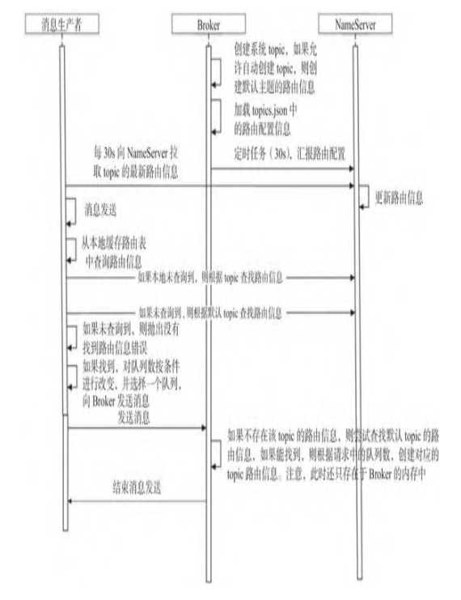

​		RocketMQ中的路由消息是持久化在Broker中的，NameServer中的路由信息来自Broker的心跳包并存储在内存中

### 消息发送高可用设计

​		发送端在自动发现主题的路由信息后，RocketMQ默认使用轮询算法进行路由的负载均衡。RocketMQ在消息发送时支持自定义的队列负载算法，需要特别注意的是，使用自定义的路由负载算法后，RocketMQ的重试机制将失效。

​		RocketMQ为了实现消息发送高可用，引入了两个非常重要的特性。

- **消息发送重试机制**：RocketMQ在消息发送时如果出现失败，默认会重试两次。
- **故障规避机制**：当消息第一次发送失败时，如果下一次消息还是发送到刚刚失败的Broker上，其消息发送大概率还是会失败，因此为了保证重试的可靠性，在重试时会尽量避开刚刚接收失败的Broker，而是选择其他
  Broker上的队列进行发送，从而提高消息发送的成功率

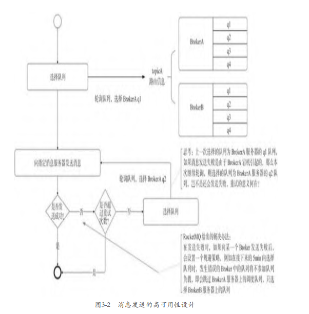

​		**消息发送的流程**


## 认识RocketMQ消息

​		RocketMQ消息封装类是org.apache.rocketmq.common.message.Message。

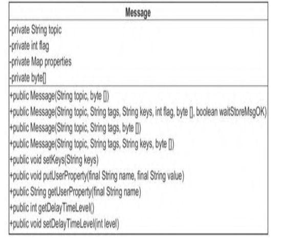

​		消息的基础属性主要包括消息所属主题（topic）、消息标记（RocketMQ不做处理）、扩展属性、消息体

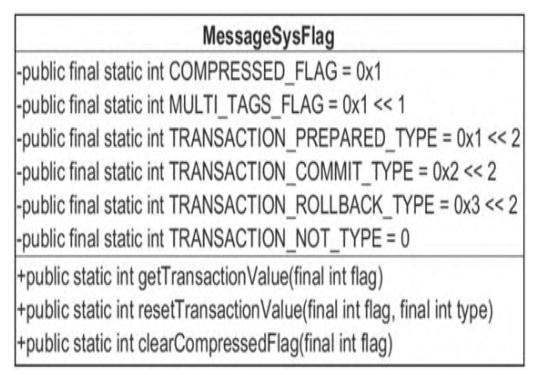

​		**Message全属性构造函数**

```java
	public Message(String topic, String tags, String keys, int flag, byte[] body, boolean waitStoreMsgOK) {
        this.topic = topic;
        this.flag = flag;
        this.body = body;

        if (tags != null && tags.length() > 0)
            this.setTags(tags);

        if (keys != null && keys.length() > 0)
            this.setKeys(keys);

        this.setWaitStoreMsgOK(waitStoreMsgOK);
    }

	public void setTags(String tags) {
        this.putProperty(MessageConst.PROPERTY_TAGS, tags);
    }

	public void setKeys(Collection<String> keys) {
        StringBuffer sb = new StringBuffer();
        for (String k : keys) {
            sb.append(k);
            sb.append(MessageConst.KEY_SEPARATOR);
        }

        this.setKeys(sb.toString().trim());
    }
```

- tags：消息tag，用于消息过滤。
- keys：消息索引键，用空格隔开，RocketMQ可以根据这些key（键）快速检索消息。
- waitStoreMsgOK：消息发送时是否等消息存储完成后再返回。

## 生产者启动流程

​		消息生产者的代码都在client模块中，对于RocketMQ来说，它既是客户端，也是消息的提供者，我们在应用系统中初始化生产者的一个实例即可使用它来发消息

### 初识DefaultMQProducer

​		DefaultMQProducer是默认的消息生产者实现类，实现了MQAdmin的接口

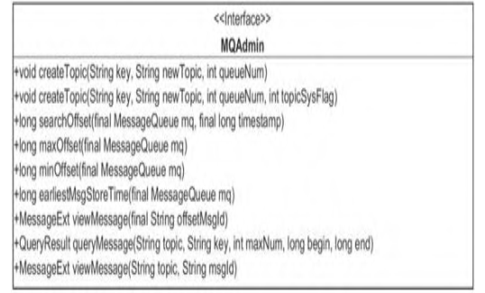

- void createTopic(String key, String newTopic, int queueNum, int topicSysFlag)：创建主题。
  - key：目前无实际作用，可以与newTopic相同。
  - newTopic：主题名称。
  - queueNum：队列数量。
  - topicSysFlag：主题系统标签，默认为0。
- long searchOffset(final MessageQueue mq, final long timestamp)：根据时间戳从队列中查找其偏移量。
- long maxOffset(final MessageQueue mq)：查找该消息队列中最大的物理偏移量。
- long minOffset(final MessageQueue mq)：查找该消息队列中的最小物理偏移量
- MessageExt viewMessage(final String offsetMsgId)：根据消息偏移量查找消息。
- QueryResult queryMessage(String topic, String key, int maxNum, long begin, long end)：根据条件查询消息。
  - topic：消息主题。
  - key：消息索引字段。
  - maxNum：本次最多取出的消息条数。
  - begin：开始时间。
  - end：结束时间。
- MessageExt viewMessage(String topic,String msgId)：根据主题与消息ID查找消息。

#### DefaultMQProducer

​		**核心属性**

```java
	private String producerGroup;
    private String createTopicKey = MixAll.AUTO_CREATE_TOPIC_KEY_TOPIC;
    private volatile int defaultTopicQueueNums = 4;
    private int sendMsgTimeout = 3000;
    private int compressMsgBodyOverHowmuch = 1024 * 4;
    private int retryTimesWhenSendFailed = 2;
    private int retryTimesWhenSendAsyncFailed = 2;
    private boolean retryAnotherBrokerWhenNotStoreOK = false;
    private int maxMessageSize = 1024 * 1024 * 4; // 4M
```

- producerGroup：生产者所属组，消息服务器在回查事务状态时会随机选择该组中任何一个生产者发起的事务回查请求。
- createTopicKey：默认topicKey。
- defaultTopicQueueNums：默认主题在每一个Broker队列的数量。
- sendMsgTimeout：发送消息的超时时间，默认为3s。
- compressMsgBodyOverHowmuch：消息体超过该值则启用压缩，默认为4KB。
- retryTimesWhenSendFailed：同步方式发送消息重试次数，默认为2，总共执行3次。
- retryTimesWhenSendAsyncFailed：异步方式发送消息的重试次数，默认为2。
- retryAnotherBrokerWhenNotStoreOK：消息重试时选择另外一个Broker，是否不等待存储结果就返回，默认为false。
- maxMessageSize：允许发送的最大消息长度，默认为4MB，最大值为$2^{32}-1$。

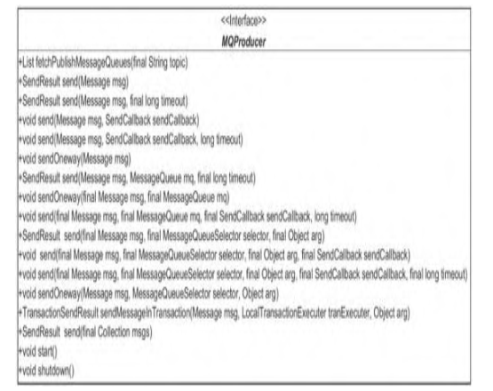

- List fetchPublishMessageQueues(final String topic)：查找该主题下所有的消息队列。
- SendResult send(Message msg)：同步发送消息，具体发送到主题中的哪个消息队列由负载算法决定。
- SendResult send(Message msg, final long timeout)：同步发送消息，如果发送超过timeout则抛出超时异常。
- void send(Message msg, SendCallback sendCallback)：异步发送消息，sendCallback参数是消息发送成功后的回调方法。
- void send(Message msg, SendCallback sendCallback, long timeout)：异步发送消息，如果发送超过timeout则抛出超时异常。
- void sendOneway(Message msg)：单向消息发送，即不在乎发送结果，消息发送出去后该方法立即返回。
- SendResult send(Message msg, MessageQueue mq, final long timeout)：同步方式发送消息，且发送到指定的消息队列。
- void send(final Message msg, final MessageQueue mq, final SendCallback sendCallback, long timeout)：异步方式发送消息，且发送到指定的消息队列。
- void sendOneway(Message msg, MessageQueue Selector selector, Object arg)：单向方式发送消息，且发送到指定的消息队列。
- SendResult send(final Message msg, final MessageQueueSelector selector, final Object arg)：消息发送，指定消息选择算法，覆盖消息生产者默认的消息队列负载。
- SendResult send(final Collection msgs)：同步批量消息发送。

### 消息生产者启动流程

​		消息生产者是如何一步一步启动的呢？我们可以从DefaultMQProducerImpl的start方法来跟踪

​		**DefaultMQProducerImpl#start**

```java
	public void start() throws MQClientException {
        this.start(true);
    }

	public void start(final boolean startFactory) throws MQClientException {
        switch (this.serviceState) {
            case CREATE_JUST:
                this.serviceState = ServiceState.START_FAILED;

                this.checkConfig();

                if (!this.defaultMQProducer.getProducerGroup().equals(MixAll.CLIENT_INNER_PRODUCER_GROUP)) {
                    this.defaultMQProducer.changeInstanceNameToPID();
                }

                this.mQClientFactory = MQClientManager.getInstance().getOrCreateMQClientInstance(this.defaultMQProducer, rpcHook);

                boolean registerOK = mQClientFactory.registerProducer(this.defaultMQProducer.getProducerGroup(), this);
                if (!registerOK) {
                    this.serviceState = ServiceState.CREATE_JUST;
                    throw new MQClientException("The producer group[" + this.defaultMQProducer.getProducerGroup()
                        + "] has been created before, specify another name please." + FAQUrl.suggestTodo(FAQUrl.GROUP_NAME_DUPLICATE_URL),
                        null);
                }

                this.topicPublishInfoTable.put(this.defaultMQProducer.getCreateTopicKey(), new TopicPublishInfo());

                if (startFactory) {
                    mQClientFactory.start();
                }

                log.info("the producer [{}] start OK. sendMessageWithVIPChannel={}", this.defaultMQProducer.getProducerGroup(),
                    this.defaultMQProducer.isSendMessageWithVIPChannel());
                this.serviceState = ServiceState.RUNNING;
                break;
            case RUNNING:
            case START_FAILED:
            case SHUTDOWN_ALREADY:
                throw new MQClientException("The producer service state not OK, maybe started once, "
                    + this.serviceState
                    + FAQUrl.suggestTodo(FAQUrl.CLIENT_SERVICE_NOT_OK),
                    null);
            default:
                break;
        }

        this.mQClientFactory.sendHeartbeatToAllBrokerWithLock();

        this.timer.scheduleAtFixedRate(new TimerTask() {
            @Override
            public void run() {
                try {
                    RequestFutureTable.scanExpiredRequest();
                } catch (Throwable e) {
                    log.error("scan RequestFutureTable exception", e);
                }
            }
        }, 1000 * 3, 1000);
    }
```

1. 检查producerGroup是否符合要求，改变生产者的instanceName为进程ID

2. 创建MQClientInstance实例。整个JVM实例中只存在一个MQClientManager实例，维护一个MQClientInstance缓存表ConcurrentMap<String/* clientId */, MQClientInstance> factoryTable =new ConcurrentHashMap<String, MQClientInstance>()，即同一个clientId只会创建一个MQClientInstance实例

   **ClientConfig#buildMQClientId**

   ```java
   	public String buildMQClientId() {
           StringBuilder sb = new StringBuilder();
           sb.append(this.getClientIP());
   
           sb.append("@");
           sb.append(this.getInstanceName());
           if (!UtilAll.isBlank(this.unitName)) {
               sb.append("@");
               sb.append(this.unitName);
           }
   
           return sb.toString();
       }
   ```

   clientId为客户端IP+instance+unitname（可选），如果在同一台物理服务器部署两个应用程序，应用程序的clientId岂不是相同，这样是不是会造成混乱。

   - 为了避免出现这个问题，如果instance为默认值DEFAULT，RocketMQ会自动将instance设置为进程ID，这样就避免了不同进程相互影响，但同一个JVM中相同clientId的消费者和生产者在启动时获取的MQClientInstane实例都是同一个
   - MQClientInstance封装了RocketMQ的网络处理API，是消息生产者、消息消费者与NameServer、Broker打交道的网络通道。

3. 向MQClientInstance注册服务，将当前生产者加入MQClientInstance管理，方便后续调用网络请求、进行心跳检测等。

4. 启动MQClientInstance，如果MQClientInstance已经启动，则本次启动不会真正执行。

### 消息发送基本流程

​		**RocketMQ消息发送的关键点**

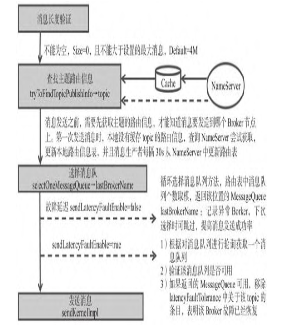

​		消息发送流程主要的步骤为验证消息、查找路由、消息发送（包含异常处理机制）

​		**同步消息发送入口DefaultMQProducer#send**

```java
	@Override
    public SendResult send(
        Message msg) throws MQClientException, RemotingException, MQBrokerException, InterruptedException {
        Validators.checkMessage(msg, this);
        msg.setTopic(withNamespace(msg.getTopic()));
        return this.defaultMQProducerImpl.send(msg);
    }
```

​		**DefaultMQProducerImpl#send**

```java
	public void send(Message msg,
        SendCallback sendCallback) throws MQClientException, RemotingException, InterruptedException {
        send(msg, sendCallback, this.defaultMQProducer.getSendMsgTimeout());
    }

	public SendResult send(Message msg, MessageQueueSelector selector, Object arg, long timeout)
        throws MQClientException, RemotingException, MQBrokerException, InterruptedException {
        return this.sendSelectImpl(msg, selector, arg, CommunicationMode.SYNC, null, timeout);
    }
```

​		默认消息以同步方式发送，默认超时时间为3s。本节主要以SendResult sendMessage(Messsage message)方法为突破口，介绍消息发送的基本实现流程。

### 消息长度验证

​		在消息发送之前，首先确保生产者处于运行状态，然后验证消息是否符合相应的规范。具体的规范要求是主题名称、消息体不能为空，消息长度不能等于0且默认不能超过允许发送消息的最大长度4MB（maxMessageSize=1024×1024×4）。

### 查找主题路由信息

​		在消息发送之前，还需要获取主题的路由信息，只有获取了这些信息我们才能知道消息具体要发送到哪个Broker节点上

​		**DefaultMQProducerImpl#tryToFindTopicPublishInfo**

```java
	private TopicPublishInfo tryToFindTopicPublishInfo(final String topic) {
        TopicPublishInfo topicPublishInfo = this.topicPublishInfoTable.get(topic);
        if (null == topicPublishInfo || !topicPublishInfo.ok()) {
            this.topicPublishInfoTable.putIfAbsent(topic, new TopicPublishInfo());
            this.mQClientFactory.updateTopicRouteInfoFromNameServer(topic);
            topicPublishInfo = this.topicPublishInfoTable.get(topic);
        }

        if (topicPublishInfo.isHaveTopicRouterInfo() || topicPublishInfo.ok()) {
            return topicPublishInfo;
        } else {
            this.mQClientFactory.updateTopicRouteInfoFromNameServer(topic, true, this.defaultMQProducer);
            topicPublishInfo = this.topicPublishInfoTable.get(topic);
            return topicPublishInfo;
        }
    }
```

​		tryToFindTopicPublishInfo是查找主题的路由信息的方法。如果生产者中缓存了topic的路由信息，且该路由信息包含消息队列，则直接返回该路由信息。如果没有缓存或没有包含消息队列，则向NameServer查询该topic的路由信息。如果最终未找到路由信息，则抛出异常，表示无法找到主题相关路由信息异常。先看一下
TopicPublishInfo的属性

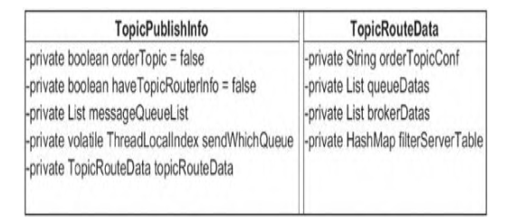

- orderTopic：是否是顺序消息。
- List messageQueueList：该主题队列的消息队列。
- sendWhichQueue：每选择一次消息队列，该值会自增1，如果超过Integer.MAX_VALUE，则重置为0，用于选择消息队列。
- List queueDatas：topic队列元数据。
- List brokerDatas：topic分布的broker元数据。
- HashMapfilterServerTable：broker上过滤服务器的地址列表。

​		第一次发送消息时，本地没有缓存topic的路由信息，查询NameServer尝试获取路由信息，如果路由信息未找到，再次尝试用默认主题DefaultMQProducerImpl#createTopicKey去查询。如果BrokerConfig#autoCreateTopicEnable为true，NameServer将返回路由信息；如果autoCreateTopicEnable为false，将抛出无法找到topic路由异常。MQClientInstance#updateTopicRouteInfoFromNameServer方法的功能是更新消息生产者和维护路由缓存

​		**MQClientInstance#updateTopicRouteInfoFromNameServer**

```java
		public boolean updateTopicRouteInfoFromNameServer(final String topic, boolean isDefault,
        DefaultMQProducer defaultMQProducer) {
        try {
            if (this.lockNamesrv.tryLock(LOCK_TIMEOUT_MILLIS, TimeUnit.MILLISECONDS)) {
                try {
                    TopicRouteData topicRouteData;
                    if (isDefault && defaultMQProducer != null) {
                        topicRouteData = this.mQClientAPIImpl.getDefaultTopicRouteInfoFromNameServer(defaultMQProducer.getCreateTopicKey(),
                            1000 * 3);
                        if (topicRouteData != null) {
                            for (QueueData data : topicRouteData.getQueueDatas()) {
                                int queueNums = Math.min(defaultMQProducer.getDefaultTopicQueueNums(), data.getReadQueueNums());
                                data.setReadQueueNums(queueNums);
                                data.setWriteQueueNums(queueNums);
                            }
                        }
                    } else {
                        topicRouteData = this.mQClientAPIImpl.getTopicRouteInfoFromNameServer(topic, 1000 * 3);
                    }
                    if (topicRouteData != null) {
                        TopicRouteData old = this.topicRouteTable.get(topic);
                        boolean changed = topicRouteDataIsChange(old, topicRouteData);
                        if (!changed) {
                            changed = this.isNeedUpdateTopicRouteInfo(topic);
                        } else {
                            log.info("the topic[{}] route info changed, old[{}] ,new[{}]", topic, old, topicRouteData);
                        }

                        if (changed) {
                            TopicRouteData cloneTopicRouteData = topicRouteData.cloneTopicRouteData();

                            for (BrokerData bd : topicRouteData.getBrokerDatas()) {
                                this.brokerAddrTable.put(bd.getBrokerName(), bd.getBrokerAddrs());
                            }

                            // Update Pub info
                            {
                                TopicPublishInfo publishInfo = topicRouteData2TopicPublishInfo(topic, topicRouteData);
                                publishInfo.setHaveTopicRouterInfo(true);
                                Iterator<Entry<String, MQProducerInner>> it = this.producerTable.entrySet().iterator();
                                while (it.hasNext()) {
                                    Entry<String, MQProducerInner> entry = it.next();
                                    MQProducerInner impl = entry.getValue();
                                    if (impl != null) {
                                        impl.updateTopicPublishInfo(topic, publishInfo);
                                    }
                                }
                            }

                            // Update sub info
                            {
                                Set<MessageQueue> subscribeInfo = topicRouteData2TopicSubscribeInfo(topic, topicRouteData);
                                Iterator<Entry<String, MQConsumerInner>> it = this.consumerTable.entrySet().iterator();
                                while (it.hasNext()) {
                                    Entry<String, MQConsumerInner> entry = it.next();
                                    MQConsumerInner impl = entry.getValue();
                                    if (impl != null) {
                                        impl.updateTopicSubscribeInfo(topic, subscribeInfo);
                                    }
                                }
                            }
                            log.info("topicRouteTable.put. Topic = {}, TopicRouteData[{}]", topic, cloneTopicRouteData);
                            this.topicRouteTable.put(topic, cloneTopicRouteData);
                            return true;
                        }
                    } else {
                        log.warn("updateTopicRouteInfoFromNameServer, getTopicRouteInfoFromNameServer return null, Topic: {}", topic);
                    }
                } catch (MQClientException e) {
                    if (!topic.startsWith(MixAll.RETRY_GROUP_TOPIC_PREFIX) && !topic.equals(MixAll.AUTO_CREATE_TOPIC_KEY_TOPIC)) {
                        log.warn("updateTopicRouteInfoFromNameServer Exception", e);
                    }
                } catch (RemotingException e) {
                    log.error("updateTopicRouteInfoFromNameServer Exception", e);
                    throw new IllegalStateException(e);
                } finally {
                    this.lockNamesrv.unlock();
                }
            } else {
                log.warn("updateTopicRouteInfoFromNameServer tryLock timeout {}ms", LOCK_TIMEOUT_MILLIS);
            }
        } catch (InterruptedException e) {
            log.warn("updateTopicRouteInfoFromNameServer Exception", e);
        }

        return false;
    }
```

1. 如果isDefault为true，则使用默认主题查询，如果查询到路由信息，则将路由信息中读写队列的个数替换为消息生产者默认的队列个数（defaultTopicQueueNums）；如果isDefault为false，则使用参数topic查询，如果未查询到路由信息，则返回false，表示路由信息未变化

2. 如果找到路由信息，则与本地缓存中的路由信息进行对比，判断路由信息是否发生了改变，如果未发生变化，则直接返回false。

3. 更新MQClientInstance Broker地址缓存表

4. 将topicRouteData中的List<QueueData> 转换成topicPublishInfo的List <MessageQueue>列表，具体实现在topicRouteData2TopicPublishInfo中。然后更新该MQClientInstance管辖的所有消息，发送关于topic的路由信息

   **MQClientInstance#TopicRouteData2TopicPublishInfo**

   ```java
   		public static TopicPublishInfo topicRouteData2TopicPublishInfo(final String topic, final TopicRouteData route) {
           TopicPublishInfo info = new TopicPublishInfo();
           info.setTopicRouteData(route);
           if (route.getOrderTopicConf() != null && route.getOrderTopicConf().length() > 0) {
               String[] brokers = route.getOrderTopicConf().split(";");
               for (String broker : brokers) {
                   String[] item = broker.split(":");
                   int nums = Integer.parseInt(item[1]);
                   for (int i = 0; i < nums; i++) {
                       MessageQueue mq = new MessageQueue(topic, item[0], i);
                       info.getMessageQueueList().add(mq);
                   }
               }
   
               info.setOrderTopic(true);
           } else {
               List<QueueData> qds = route.getQueueDatas();
               Collections.sort(qds);
               for (QueueData qd : qds) {
                   if (PermName.isWriteable(qd.getPerm())) {
                       BrokerData brokerData = null;
                       for (BrokerData bd : route.getBrokerDatas()) {
                           if (bd.getBrokerName().equals(qd.getBrokerName())) {
                               brokerData = bd;
                               break;
                           }
                       }
   
                       if (null == brokerData) {
                           continue;
                       }
   
                       if (!brokerData.getBrokerAddrs().containsKey(MixAll.MASTER_ID)) {
                           continue;
                       }
   
                       for (int i = 0; i < qd.getWriteQueueNums(); i++) {
                           MessageQueue mq = new MessageQueue(topic, qd.getBrokerName(), i);
                           info.getMessageQueueList().add(mq);
                       }
                   }
               }
   
               info.setOrderTopic(false);
           }
   
           return info;
       }
   ```

   - 循环遍历路由信息的QueueData信息，如果队列没有写权限，则继续遍历下一个QueueData。根据brokerName找到brokerData信息，如果找不到或没有找到主节点，则遍历下一个QueueData。根据写队列个数，topic+序号创建MessageQueue，填充topicPublishInfo的List<MessageQueue>，完成消息发送的路由查找

​		在生产环境中不建议开启自动创建主题，因为这会导致新创建的主题只存在于集群中的部分节点上，具体原因建议大家结合路由寻址机制进行思考，关于该问题的详细分析可参考笔者“中间件兴趣圈”公众号中的博文：
https://mp.weixin.qq.com/s/GbSlS3hi8IE0kznTynV4ZQ。

### 选择消息队列

​		根据路由信息选择消息队列，返回的消息队列按照broker序号进行排序。举例说明，如果topicA在broker-a、broker-b上分别创建了4个队列，那么返回的消息队列为

[{"brokerName":"brokera"、"queueId":0}、

{"brokerName":"broker-a"、"queueId":1}、

{"brokerName":"broker-a"、"queueId":2}、

{"brokerName":"broker-a"、"queueId":3}、

{"brokerName":"broker-b"、"queueId":0}、

{"brokerName":"broker-b"、"queueId":1}、

{"brokerName":"broker-b"、"queueId":2}、

{"brokerName":"broker-b"、"queueId":3}]，

那么RocketMQ如何选择消息队列

​		首先消息发送端采用重试机制，由retryTimesWhenSendFailed指定同步方式重试次数，异步重试机制在收到消息发送结果执行回调之前进行重试，由retryTimesWhenSend AsyncFailed指定异常重试次数。接下来就是循环执行，选择消息队列、发送消息，发送成功则返回，收到异常则重试。选择消息队列有两种方式。

- sendLatencyFaultEnable=false，默认不启用Broker故障延迟机制。
- sendLatencyFaultEnable=true，启用Broker故障延迟机制。

#### 默认机制

​		如果sendLatencyFaultEnable=false，则调用TopicPublishInfo#selectOneMessageQueue

​		**TopicPublishInfo#selectOneMessageQueue**

```java
	public MessageQueue selectOneMessageQueue(final String lastBrokerName) {
        if (lastBrokerName == null) {
            return selectOneMessageQueue();
        } else {
            int index = this.sendWhichQueue.getAndIncrement();
            for (int i = 0; i < this.messageQueueList.size(); i++) {
                int pos = Math.abs(index++) % this.messageQueueList.size();
                if (pos < 0)
                    pos = 0;
                MessageQueue mq = this.messageQueueList.get(pos);
                if (!mq.getBrokerName().equals(lastBrokerName)) {
                    return mq;
                }
            }
            return selectOneMessageQueue();
        }
    }

    public MessageQueue selectOneMessageQueue() {
        int index = this.sendWhichQueue.getAndIncrement();
        int pos = Math.abs(index) % this.messageQueueList.size();
        if (pos < 0)
            pos = 0;
        return this.messageQueueList.get(pos);
    }
```

​		在消息发送过程中，可能会多次执行选择消息队列这个方法，lastBrokerName就是上一次选择的执行发送消息失败的Broker。第一次执行消息队列选择时，lastBrokerName为null，此时直接用sendWhichQueue自增再获取值，与当前路由表中消息队列的个数取模，返回该位置的MessageQueue(selectOneMessageQueue()方法，如
果消息发送失败，下次进行消息队列选择时规避上次MesageQueue所在的Broker，否则有可能再次失败。

​		或许有读者会问，Broker不可用后，路由信息中为什么还会包含该Broker的路由信息呢？其实这不难解释：首先，NameServer检测Broker是否可用是有延迟的，最短为一次心跳检测间隔（10s）；其次，NameServer不是检测到Broker宕机后马上推送消息给消息生产者，而是消息生产者每隔30s更新一次路由信息，因此消息生产者最快感知Broker最新的路由信息也需要30s。这就需要引入一种机制，在Broker宕机期间，一次消息发送失败后，将该Broker暂时排除在消息队列的选择范围中。

#### Broker故障延迟机制

​		**MQFaultStrategy#selectOneMessageQueue**

```java
	public MessageQueue selectOneMessageQueue(final TopicPublishInfo tpInfo, final String lastBrokerName) {
        if (this.sendLatencyFaultEnable) {
            try {
                int index = tpInfo.getSendWhichQueue().getAndIncrement();
                for (int i = 0; i < tpInfo.getMessageQueueList().size(); i++) {
                    int pos = Math.abs(index++) % tpInfo.getMessageQueueList().size();
                    if (pos < 0)
                        pos = 0;
                    MessageQueue mq = tpInfo.getMessageQueueList().get(pos);
                    if (latencyFaultTolerance.isAvailable(mq.getBrokerName())) {
                        if (null == lastBrokerName || mq.getBrokerName().equals(lastBrokerName))
                            return mq;
                    }
                }

                final String notBestBroker = latencyFaultTolerance.pickOneAtLeast();
                int writeQueueNums = tpInfo.getQueueIdByBroker(notBestBroker);
                if (writeQueueNums > 0) {
                    final MessageQueue mq = tpInfo.selectOneMessageQueue();
                    if (notBestBroker != null) {
                        mq.setBrokerName(notBestBroker);
                        mq.setQueueId(tpInfo.getSendWhichQueue().getAndIncrement() % writeQueueNums);
                    }
                    return mq;
                } else {
                    latencyFaultTolerance.remove(notBestBroker);
                }
            } catch (Exception e) {
                log.error("Error occurred when selecting message queue", e);
            }

            return tpInfo.selectOneMessageQueue();
        }

        return tpInfo.selectOneMessageQueue(lastBrokerName);
    }
```

1. 轮询获取一个消息队列。
2. 验证该消息队列是否可用，latencyFaultTolerance.isAvailable(mq.getBrokerName())是关键。
3. 如果返回的MessageQueue可用，则移除latencyFaultTolerance关于该topic的条目，表明该Broker故障已经修复。

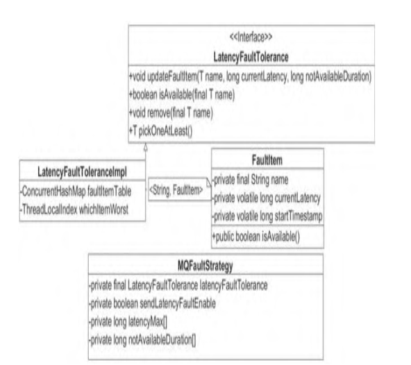

##### LatencyFaultTolerance：延迟机制接口规范

- void updateFaultItem(T name, long currentLatency, long notAvailable Duration)：更新失败条目。
  - name：Broker名称。
  - currentLatency：消息发送故障的延迟时间。
  - notAvailableDuration：不可用持续时长，在这个时间内，Broker将被规避。
- boolean isAvailable(final T name)：判断Broker是否可用。
- void remove(final T name)：移除失败条目，意味着Broker重新参与路由计算。
- T pickOneAtLeast()：尝试从规避的Broker中选择一个可用的Broker，如果没有找到，则返回null。

##### FaultItem：失败条目（规避规则条目）

- private final String name：条目唯一键，这里为brokerName。
- private volatile long currentLatency：本次消息发送的延迟时间。
- private volatile long startTimestamp：故障规避的开始时间。

##### MQFaultStrategy：消息失败策略，延迟实现的门面类

- long[] latencyMax = {50L, 100L, 550L, 1000L, 2000L, 3000L, 15000L}。
- long[] notAvailableDuration = {0L, 0L, 30000L, 60000L, 120000L, 180000L, 600000L}。

​		根据currentLatency本次消息发送的延迟时间，从latencyMax尾部向前找到第一个比currentLatency小的索引index，如果没有找到，则返回0。然后根据这个索引从notAvailable-Duration数组中取出对应的时间，在这个时长内，Broker将设置为不可用。

​		从源码的角度分析updateFaultItem、isAvailable方法的实现原理

​		**DefaultMQProducerImpl#sendDefaultImp**

```java
	private SendResult sendDefaultImpl(
        Message msg,
        final CommunicationMode communicationMode,
        final SendCallback sendCallback,
        final long timeout
    ) throws MQClientException, RemotingException, MQBrokerException, InterruptedException {
        this.makeSureStateOK();
        Validators.checkMessage(msg, this.defaultMQProducer);
        final long invokeID = random.nextLong();
        long beginTimestampFirst = System.currentTimeMillis();
        long beginTimestampPrev = beginTimestampFirst;
        long endTimestamp = beginTimestampFirst;
        TopicPublishInfo topicPublishInfo = this.tryToFindTopicPublishInfo(msg.getTopic());
        if (topicPublishInfo != null && topicPublishInfo.ok()) {
            boolean callTimeout = false;
            MessageQueue mq = null;
            Exception exception = null;
            SendResult sendResult = null;
            int timesTotal = communicationMode == CommunicationMode.SYNC ? 1 + this.defaultMQProducer.getRetryTimesWhenSendFailed() : 1;
            int times = 0;
            String[] brokersSent = new String[timesTotal];
            for (; times < timesTotal; times++) {
                String lastBrokerName = null == mq ? null : mq.getBrokerName();
                MessageQueue mqSelected = this.selectOneMessageQueue(topicPublishInfo, lastBrokerName);
                if (mqSelected != null) {
                    mq = mqSelected;
                    brokersSent[times] = mq.getBrokerName();
                    try {
                        beginTimestampPrev = System.currentTimeMillis();
                        if (times > 0) {
                            //Reset topic with namespace during resend.
                            msg.setTopic(this.defaultMQProducer.withNamespace(msg.getTopic()));
                        }
                        long costTime = beginTimestampPrev - beginTimestampFirst;
                        if (timeout < costTime) {
                            callTimeout = true;
                            break;
                        }

                        sendResult = this.sendKernelImpl(msg, mq, communicationMode, sendCallback, topicPublishInfo, timeout - costTime);
                        endTimestamp = System.currentTimeMillis();
                        this.updateFaultItem(mq.getBrokerName(), endTimestamp - beginTimestampPrev, false);
                        switch (communicationMode) {
                            case ASYNC:
                                return null;
                            case ONEWAY:
                                return null;
                            case SYNC:
                                if (sendResult.getSendStatus() != SendStatus.SEND_OK) {
                                    if (this.defaultMQProducer.isRetryAnotherBrokerWhenNotStoreOK()) {
                                        continue;
                                    }
                                }

                                return sendResult;
                            default:
                                break;
                        }
                    } catch (RemotingException e) {
                        endTimestamp = System.currentTimeMillis();
                        this.updateFaultItem(mq.getBrokerName(), endTimestamp - beginTimestampPrev, true);
                        log.warn(String.format("sendKernelImpl exception, resend at once, InvokeID: %s, RT: %sms, Broker: %s", invokeID, endTimestamp - beginTimestampPrev, mq), e);
                        log.warn(msg.toString());
                        exception = e;
                        continue;
                    } catch (MQClientException e) {
                        endTimestamp = System.currentTimeMillis();
                        this.updateFaultItem(mq.getBrokerName(), endTimestamp - beginTimestampPrev, true);
                        log.warn(String.format("sendKernelImpl exception, resend at once, InvokeID: %s, RT: %sms, Broker: %s", invokeID, endTimestamp - beginTimestampPrev, mq), e);
                        log.warn(msg.toString());
                        exception = e;
                        continue;
                    } catch (MQBrokerException e) {
                        endTimestamp = System.currentTimeMillis();
                        this.updateFaultItem(mq.getBrokerName(), endTimestamp - beginTimestampPrev, true);
                        log.warn(String.format("sendKernelImpl exception, resend at once, InvokeID: %s, RT: %sms, Broker: %s", invokeID, endTimestamp - beginTimestampPrev, mq), e);
                        log.warn(msg.toString());
                        exception = e;
                        switch (e.getResponseCode()) {
                            case ResponseCode.TOPIC_NOT_EXIST:
                            case ResponseCode.SERVICE_NOT_AVAILABLE:
                            case ResponseCode.SYSTEM_ERROR:
                            case ResponseCode.NO_PERMISSION:
                            case ResponseCode.NO_BUYER_ID:
                            case ResponseCode.NOT_IN_CURRENT_UNIT:
                                continue;
                            default:
                                if (sendResult != null) {
                                    return sendResult;
                                }

                                throw e;
                        }
                    } catch (InterruptedException e) {
                        endTimestamp = System.currentTimeMillis();
                        this.updateFaultItem(mq.getBrokerName(), endTimestamp - beginTimestampPrev, false);
                        log.warn(String.format("sendKernelImpl exception, throw exception, InvokeID: %s, RT: %sms, Broker: %s", invokeID, endTimestamp - beginTimestampPrev, mq), e);
                        log.warn(msg.toString());

                        log.warn("sendKernelImpl exception", e);
                        log.warn(msg.toString());
                        throw e;
                    }
                } else {
                    break;
                }
            }

            if (sendResult != null) {
                return sendResult;
            }

            String info = String.format("Send [%d] times, still failed, cost [%d]ms, Topic: %s, BrokersSent: %s",
                times,
                System.currentTimeMillis() - beginTimestampFirst,
                msg.getTopic(),
                Arrays.toString(brokersSent));

            info += FAQUrl.suggestTodo(FAQUrl.SEND_MSG_FAILED);

            MQClientException mqClientException = new MQClientException(info, exception);
            if (callTimeout) {
                throw new RemotingTooMuchRequestException("sendDefaultImpl call timeout");
            }

            if (exception instanceof MQBrokerException) {
                mqClientException.setResponseCode(((MQBrokerException) exception).getResponseCode());
            } else if (exception instanceof RemotingConnectException) {
                mqClientException.setResponseCode(ClientErrorCode.CONNECT_BROKER_EXCEPTION);
            } else if (exception instanceof RemotingTimeoutException) {
                mqClientException.setResponseCode(ClientErrorCode.ACCESS_BROKER_TIMEOUT);
            } else if (exception instanceof MQClientException) {
                mqClientException.setResponseCode(ClientErrorCode.BROKER_NOT_EXIST_EXCEPTION);
            }

            throw mqClientException;
        }

        validateNameServerSetting();

        throw new MQClientException("No route info of this topic: " + msg.getTopic() + FAQUrl.suggestTodo(FAQUrl.NO_TOPIC_ROUTE_INFO),
            null).setResponseCode(ClientErrorCode.NOT_FOUND_TOPIC_EXCEPTION);
    }
```

​		如果在发送过程中抛出了异常，则调用DefaultMQProducerImpl#updateFaultItem方法，该方法直接调用
**MQFaultStrategy#updateFaultItem**方法

```java
	public void updateFaultItem(final String brokerName, final long currentLatency, boolean isolation) {
        if (this.sendLatencyFaultEnable) {
            long duration = computeNotAvailableDuration(isolation ? 30000 : currentLatency);
            this.latencyFaultTolerance.updateFaultItem(brokerName, currentLatency, duration);
        }
    }

	private long computeNotAvailableDuration(final long currentLatency) {
        for (int i = latencyMax.length - 1; i >= 0; i--) {
            if (currentLatency >= latencyMax[i])
                return this.notAvailableDuration[i];
        }

        return 0;
    }
```

- brokerName：Broker名称。
- currentLatency：本次消息发送的延迟时间。
- isolation：是否规避Broker，该参数如果为true，则使用默认时长30s来计算Broker故障规避时长，如果为false，则使用本次消息发送延迟时间来计算Broker故障规避时长。

​		如果isolation为true，则使用30s作为computeNotAvailableDuration方法的参数。如果isolation为false，
则使用本次消息发送时延作为computeNotAvailableDuration方法的参数

​		computeNotAvailableDuration的作用是计算因本次消息发送故障需要规避Broker的时长，也就是接下来多长的时间内，该Broker将不参与消息发送队列负载。具体算法是，从latencyMax数组尾部开始寻
找，找到第一个比currentLatency小的下标，然后从notAvailableDuration数组中获取需要规避的时长，该方法最终调用LatencyFaultTolerance的updateFaultItem()方法

​		**LatencyFaultToleranceImpl#updateFaultItem**

```java
	public void updateFaultItem(final String name, final long currentLatency, final long notAvailableDuration) {
        FaultItem old = this.faultItemTable.get(name);
        if (null == old) {
            final FaultItem faultItem = new FaultItem(name);
            faultItem.setCurrentLatency(currentLatency);
            faultItem.setStartTimestamp(System.currentTimeMillis() + notAvailableDuration);

            old = this.faultItemTable.putIfAbsent(name, faultItem);
            if (old != null) {
                old.setCurrentLatency(currentLatency);
                old.setStartTimestamp(System.currentTimeMillis() + notAvailableDuration);
            }
        } else {
            old.setCurrentLatency(currentLatency);
            old.setStartTimestamp(System.currentTimeMillis() + notAvailableDuration);
        }
    }
```

​		根据Broker名称从缓存表中获取FaultItem，如果找到则更新FaultItem，否则创建FaultItem。这里有两个关键点。

- currentLatency、startTimeStamp被volatile修饰。
- startTimeStamp为当前系统时间加上需要规避的时长。startTimeStamp是判断Broker当前是否可用的直接依据，请看FaultItem#isAvailable方法

​		**FaultItem#isAvailable**

```java
		public boolean isAvailable() {
            return (System.currentTimeMillis() - startTimestamp) >= 0;
        }
```

​		**开启与不开启sendLatencyFaultEnable机制在消息发送时都能规避故障的Broker，那么这两种机制有何区别**

​		开启所谓的故障延迟机制，即设置sendLatencyFaultEnable为ture，其实是一种较为悲观的做法。当消息发送者遇到一次消息发送失败后，就会悲观地认为Broker不可用，在接下来的一段时间内就不再向其发送消息，直接避开该Broker。而不开启延迟规避机制，就只会在本次消息发送的重试过程中规避该Broker，下一次消息发送还是会继续尝试。

### 消息发送

​		消息发送API核心入口**DefaultMQProducerImpl#sendKernelImpl**

```java
	private SendResult sendKernelImpl(final Message msg,
        final MessageQueue mq,
        final CommunicationMode communicationMode,
        final SendCallback sendCallback,
        final TopicPublishInfo topicPublishInfo,
        final long timeout) throws MQClientException, RemotingException, MQBrokerException, InterruptedException {
        long beginStartTime = System.currentTimeMillis();
        String brokerAddr = this.mQClientFactory.findBrokerAddressInPublish(mq.getBrokerName());
        if (null == brokerAddr) {
            tryToFindTopicPublishInfo(mq.getTopic());
            brokerAddr = this.mQClientFactory.findBrokerAddressInPublish(mq.getBrokerName());
        }

        SendMessageContext context = null;
        if (brokerAddr != null) {
            brokerAddr = MixAll.brokerVIPChannel(this.defaultMQProducer.isSendMessageWithVIPChannel(), brokerAddr);

            byte[] prevBody = msg.getBody();
            try {
                //for MessageBatch,ID has been set in the generating process
                if (!(msg instanceof MessageBatch)) {
                    MessageClientIDSetter.setUniqID(msg);
                }

                boolean topicWithNamespace = false;
                if (null != this.mQClientFactory.getClientConfig().getNamespace()) {
                    msg.setInstanceId(this.mQClientFactory.getClientConfig().getNamespace());
                    topicWithNamespace = true;
                }

                int sysFlag = 0;
                boolean msgBodyCompressed = false;
                if (this.tryToCompressMessage(msg)) {
                    sysFlag |= MessageSysFlag.COMPRESSED_FLAG;
                    msgBodyCompressed = true;
                }

                final String tranMsg = msg.getProperty(MessageConst.PROPERTY_TRANSACTION_PREPARED);
                if (tranMsg != null && Boolean.parseBoolean(tranMsg)) {
                    sysFlag |= MessageSysFlag.TRANSACTION_PREPARED_TYPE;
                }

                if (hasCheckForbiddenHook()) {
                    CheckForbiddenContext checkForbiddenContext = new CheckForbiddenContext();
                    checkForbiddenContext.setNameSrvAddr(this.defaultMQProducer.getNamesrvAddr());
                    checkForbiddenContext.setGroup(this.defaultMQProducer.getProducerGroup());
                    checkForbiddenContext.setCommunicationMode(communicationMode);
                    checkForbiddenContext.setBrokerAddr(brokerAddr);
                    checkForbiddenContext.setMessage(msg);
                    checkForbiddenContext.setMq(mq);
                    checkForbiddenContext.setUnitMode(this.isUnitMode());
                    this.executeCheckForbiddenHook(checkForbiddenContext);
                }

                if (this.hasSendMessageHook()) {
                    context = new SendMessageContext();
                    context.setProducer(this);
                    context.setProducerGroup(this.defaultMQProducer.getProducerGroup());
                    context.setCommunicationMode(communicationMode);
                    context.setBornHost(this.defaultMQProducer.getClientIP());
                    context.setBrokerAddr(brokerAddr);
                    context.setMessage(msg);
                    context.setMq(mq);
                    context.setNamespace(this.defaultMQProducer.getNamespace());
                    String isTrans = msg.getProperty(MessageConst.PROPERTY_TRANSACTION_PREPARED);
                    if (isTrans != null && isTrans.equals("true")) {
                        context.setMsgType(MessageType.Trans_Msg_Half);
                    }

                    if (msg.getProperty("__STARTDELIVERTIME") != null || msg.getProperty(MessageConst.PROPERTY_DELAY_TIME_LEVEL) != null) {
                        context.setMsgType(MessageType.Delay_Msg);
                    }
                    this.executeSendMessageHookBefore(context);
                }

                SendMessageRequestHeader requestHeader = new SendMessageRequestHeader();
                requestHeader.setProducerGroup(this.defaultMQProducer.getProducerGroup());
                requestHeader.setTopic(msg.getTopic());
                requestHeader.setDefaultTopic(this.defaultMQProducer.getCreateTopicKey());
                requestHeader.setDefaultTopicQueueNums(this.defaultMQProducer.getDefaultTopicQueueNums());
                requestHeader.setQueueId(mq.getQueueId());
                requestHeader.setSysFlag(sysFlag);
                requestHeader.setBornTimestamp(System.currentTimeMillis());
                requestHeader.setFlag(msg.getFlag());
                requestHeader.setProperties(MessageDecoder.messageProperties2String(msg.getProperties()));
                requestHeader.setReconsumeTimes(0);
                requestHeader.setUnitMode(this.isUnitMode());
                requestHeader.setBatch(msg instanceof MessageBatch);
                if (requestHeader.getTopic().startsWith(MixAll.RETRY_GROUP_TOPIC_PREFIX)) {
                    String reconsumeTimes = MessageAccessor.getReconsumeTime(msg);
                    if (reconsumeTimes != null) {
                        requestHeader.setReconsumeTimes(Integer.valueOf(reconsumeTimes));
                        MessageAccessor.clearProperty(msg, MessageConst.PROPERTY_RECONSUME_TIME);
                    }

                    String maxReconsumeTimes = MessageAccessor.getMaxReconsumeTimes(msg);
                    if (maxReconsumeTimes != null) {
                        requestHeader.setMaxReconsumeTimes(Integer.valueOf(maxReconsumeTimes));
                        MessageAccessor.clearProperty(msg, MessageConst.PROPERTY_MAX_RECONSUME_TIMES);
                    }
                }

                SendResult sendResult = null;
                switch (communicationMode) {
                    case ASYNC:
                        Message tmpMessage = msg;
                        boolean messageCloned = false;
                        if (msgBodyCompressed) {
                            //If msg body was compressed, msgbody should be reset using prevBody.
                            //Clone new message using commpressed message body and recover origin massage.
                            //Fix bug:https://github.com/apache/rocketmq-externals/issues/66
                            tmpMessage = MessageAccessor.cloneMessage(msg);
                            messageCloned = true;
                            msg.setBody(prevBody);
                        }

                        if (topicWithNamespace) {
                            if (!messageCloned) {
                                tmpMessage = MessageAccessor.cloneMessage(msg);
                                messageCloned = true;
                            }
                            msg.setTopic(NamespaceUtil.withoutNamespace(msg.getTopic(), this.defaultMQProducer.getNamespace()));
                        }

                        long costTimeAsync = System.currentTimeMillis() - beginStartTime;
                        if (timeout < costTimeAsync) {
                            throw new RemotingTooMuchRequestException("sendKernelImpl call timeout");
                        }
                        sendResult = this.mQClientFactory.getMQClientAPIImpl().sendMessage(
                            brokerAddr,
                            mq.getBrokerName(),
                            tmpMessage,
                            requestHeader,
                            timeout - costTimeAsync,
                            communicationMode,
                            sendCallback,
                            topicPublishInfo,
                            this.mQClientFactory,
                            this.defaultMQProducer.getRetryTimesWhenSendAsyncFailed(),
                            context,
                            this);
                        break;
                    case ONEWAY:
                    case SYNC:
                        long costTimeSync = System.currentTimeMillis() - beginStartTime;
                        if (timeout < costTimeSync) {
                            throw new RemotingTooMuchRequestException("sendKernelImpl call timeout");
                        }
                        sendResult = this.mQClientFactory.getMQClientAPIImpl().sendMessage(
                            brokerAddr,
                            mq.getBrokerName(),
                            msg,
                            requestHeader,
                            timeout - costTimeSync,
                            communicationMode,
                            context,
                            this);
                        break;
                    default:
                        assert false;
                        break;
                }

                if (this.hasSendMessageHook()) {
                    context.setSendResult(sendResult);
                    this.executeSendMessageHookAfter(context);
                }

                return sendResult;
            } catch (RemotingException e) {
                if (this.hasSendMessageHook()) {
                    context.setException(e);
                    this.executeSendMessageHookAfter(context);
                }
                throw e;
            } catch (MQBrokerException e) {
                if (this.hasSendMessageHook()) {
                    context.setException(e);
                    this.executeSendMessageHookAfter(context);
                }
                throw e;
            } catch (InterruptedException e) {
                if (this.hasSendMessageHook()) {
                    context.setException(e);
                    this.executeSendMessageHookAfter(context);
                }
                throw e;
            } finally {
                msg.setBody(prevBody);
                msg.setTopic(NamespaceUtil.withoutNamespace(msg.getTopic(), this.defaultMQProducer.getNamespace()));
            }
        }

        throw new MQClientException("The broker[" + mq.getBrokerName() + "] not exist", null);
    }
```

**参数**

- Message msg：待发送消息。
- MessageQueue mq：消息将发送到该消息队列上。
- CommunicationMode communicationMode：消息发送模式，包括SYNC、ASYNC、ONEWAY。
- SendCallback sendCallback：异步消息回调函数。
- TopicPublishInfo topicPublishInfo：主题路由信息。
- long timeout：消息发送超时时间。

**步骤**

1. 根据MessageQueue获取Broker的网络地址。如果MQClientInstance的brokerAddrTable未缓存该Broker的信息，则从NameServer主动更新topic的路由信息。如果路由更新后还是找不到Broker信息，则抛出MQClientException，提示Broker不存在

2. 为消息分配全局唯一ID，如果消息体默认超过4KB（compressMsgBody-OverHowmuch），则对消息体采用zip压缩，并设置消息的系统标记为MessageSysFlag.COMPRESSED_FLAG。如果是事务Prepared消息，则设置消息的系统标记为MessageSysFlag.TRANSACTION_PREPARED_TYPE

3. 如果注册了消息发送钩子函数，则执行消息发送之前的增强逻辑。通过DefaultMQProducerImpl#registerSendMessageHook注册钩子处理类，并且可以注册多个。简单看一下钩子处理类接口

4. 构建消息发送请求包。

   - 主要包含如下重要信息：生产者组、主题名称、默认创建主题key、该主题在单个Broker上的默认队列数、队列ID（队列序号）、消息系统标记（MessageSysFlag）、消息发送时间、消息标记
     （RocketMQ对消息中的标记不做任何处理，供应用程序使用）、消息扩展属性、消息重试次数、是否是批量消息等

   - **MQClientAPIImpl#sendMessage**

     ```java
     	public SendResult sendMessage(
             final String addr,
             final String brokerName,
             final Message msg,
             final SendMessageRequestHeader requestHeader,
             final long timeoutMillis,
             final CommunicationMode communicationMode,
             final SendCallback sendCallback,
             final TopicPublishInfo topicPublishInfo,
             final MQClientInstance instance,
             final int retryTimesWhenSendFailed,
             final SendMessageContext context,
             final DefaultMQProducerImpl producer
         ) throws RemotingException, MQBrokerException, InterruptedException {
             long beginStartTime = System.currentTimeMillis();
             RemotingCommand request = null;
             String msgType = msg.getProperty(MessageConst.PROPERTY_MESSAGE_TYPE);
             boolean isReply = msgType != null && msgType.equals(MixAll.REPLY_MESSAGE_FLAG);
             if (isReply) {
                 if (sendSmartMsg) {
                     SendMessageRequestHeaderV2 requestHeaderV2 = SendMessageRequestHeaderV2.createSendMessageRequestHeaderV2(requestHeader);
                     request = RemotingCommand.createRequestCommand(RequestCode.SEND_REPLY_MESSAGE_V2, requestHeaderV2);
                 } else {
                     request = RemotingCommand.createRequestCommand(RequestCode.SEND_REPLY_MESSAGE, requestHeader);
                 }
             } else {
                 if (sendSmartMsg || msg instanceof MessageBatch) {
                     SendMessageRequestHeaderV2 requestHeaderV2 = SendMessageRequestHeaderV2.createSendMessageRequestHeaderV2(requestHeader);
                     request = RemotingCommand.createRequestCommand(msg instanceof MessageBatch ? RequestCode.SEND_BATCH_MESSAGE : RequestCode.SEND_MESSAGE_V2, requestHeaderV2);
                 } else {
                     request = RemotingCommand.createRequestCommand(RequestCode.SEND_MESSAGE, requestHeader);
                 }
             }
             request.setBody(msg.getBody());
     
             switch (communicationMode) {
                 case ONEWAY:
                     this.remotingClient.invokeOneway(addr, request, timeoutMillis);
                     return null;
                 case ASYNC:
                     final AtomicInteger times = new AtomicInteger();
                     long costTimeAsync = System.currentTimeMillis() - beginStartTime;
                     if (timeoutMillis < costTimeAsync) {
                         throw new RemotingTooMuchRequestException("sendMessage call timeout");
                     }
                     this.sendMessageAsync(addr, brokerName, msg, timeoutMillis - costTimeAsync, request, sendCallback, topicPublishInfo, instance,
                         retryTimesWhenSendFailed, times, context, producer);
                     return null;
                 case SYNC:
                     long costTimeSync = System.currentTimeMillis() - beginStartTime;
                     if (timeoutMillis < costTimeSync) {
                         throw new RemotingTooMuchRequestException("sendMessage call timeout");
                     }
                     return this.sendMessageSync(addr, brokerName, msg, timeoutMillis - costTimeSync, request);
                 default:
                     assert false;
                     break;
             }
     
             return null;
         }
     ```

5. 根据消息发送方式（同步、异步、单向）进行网络传输

6. 如果注册了消息发送钩子函数，则执行after逻辑。注意，就算消息发送过程中发生RemotingException、MQBrokerException、InterruptedException操作，该方法也会执行。

#### 同步发送

​		RocketMQ客户端发送消息的入口是MQClientAPIImpl#sendMessage。请求命令是Request
Code.SEND_MESSAGE，我们可以找到该命令的处理类org.apache.rocketmq.broker.processor. SendMessageProcessor。入口方法在SendMessageProcessor#sendMessage中

​		**AbstractSendMessageProcessor#msgCheck**

```java
	protected RemotingCommand msgCheck(final ChannelHandlerContext ctx,
        final SendMessageRequestHeader requestHeader, final RemotingCommand response) {
        if (!PermName.isWriteable(this.brokerController.getBrokerConfig().getBrokerPermission())
            && this.brokerController.getTopicConfigManager().isOrderTopic(requestHeader.getTopic())) {
            response.setCode(ResponseCode.NO_PERMISSION);
            response.setRemark("the broker[" + this.brokerController.getBrokerConfig().getBrokerIP1()
                + "] sending message is forbidden");
            return response;
        }
        if (!this.brokerController.getTopicConfigManager().isTopicCanSendMessage(requestHeader.getTopic())) {
            String errorMsg = "the topic[" + requestHeader.getTopic() + "] is conflict with system reserved words.";
            log.warn(errorMsg);
            response.setCode(ResponseCode.SYSTEM_ERROR);
            response.setRemark(errorMsg);
            return response;
        }

        TopicConfig topicConfig =
            this.brokerController.getTopicConfigManager().selectTopicConfig(requestHeader.getTopic());
        if (null == topicConfig) {
            int topicSysFlag = 0;
            if (requestHeader.isUnitMode()) {
                if (requestHeader.getTopic().startsWith(MixAll.RETRY_GROUP_TOPIC_PREFIX)) {
                    topicSysFlag = TopicSysFlag.buildSysFlag(false, true);
                } else {
                    topicSysFlag = TopicSysFlag.buildSysFlag(true, false);
                }
            }

            log.warn("the topic {} not exist, producer: {}", requestHeader.getTopic(), ctx.channel().remoteAddress());
            topicConfig = this.brokerController.getTopicConfigManager().createTopicInSendMessageMethod(
                requestHeader.getTopic(),
                requestHeader.getDefaultTopic(),
                RemotingHelper.parseChannelRemoteAddr(ctx.channel()),
                requestHeader.getDefaultTopicQueueNums(), topicSysFlag);

            if (null == topicConfig) {
                if (requestHeader.getTopic().startsWith(MixAll.RETRY_GROUP_TOPIC_PREFIX)) {
                    topicConfig =
                        this.brokerController.getTopicConfigManager().createTopicInSendMessageBackMethod(
                            requestHeader.getTopic(), 1, PermName.PERM_WRITE | PermName.PERM_READ,
                            topicSysFlag);
                }
            }

            if (null == topicConfig) {
                response.setCode(ResponseCode.TOPIC_NOT_EXIST);
                response.setRemark("topic[" + requestHeader.getTopic() + "] not exist, apply first please!"
                    + FAQUrl.suggestTodo(FAQUrl.APPLY_TOPIC_URL));
                return response;
            }
        }

        int queueIdInt = requestHeader.getQueueId();
        int idValid = Math.max(topicConfig.getWriteQueueNums(), topicConfig.getReadQueueNums());
        if (queueIdInt >= idValid) {
            String errorInfo = String.format("request queueId[%d] is illegal, %s Producer: %s",
                queueIdInt,
                topicConfig.toString(),
                RemotingHelper.parseChannelRemoteAddr(ctx.channel()));

            log.warn(errorInfo);
            response.setCode(ResponseCode.SYSTEM_ERROR);
            response.setRemark(errorInfo);

            return response;
        }
        return response;
    }
```

1. 检查消息发送是否合理，这里完成了以下几件事
   - 检查Broker是否有写权限。
   - 检查topic是否可以进行消息发送。主要针对默认主题，默认主题不能发送消息，仅供路由查找。
   - 在NameServer端存储主题的配置信息，默认路径为${ROCKET_HOME}/store/ config/ topic.json。下面是主题存储信息。
     - order：是否是顺序消息。
     - perm：权限码。
     - readQueueNums：读队列数量。
     - writeQueueNums：写队列数量。
     - topicName：主题名称。
     - topicSysFlag：topic Flag，当前版本暂为保留。
     - topicFilterType：主题过滤方式，当前版本仅支持SINGLE_TAG。
   - 检查队列，如果队列不合法，则返回错误码。
2. 如果消息重试次数超过允许的最大重试次数，消息将进入DLQ死信队列。死信队列主题为%DLQ%+消费组名。
3. 调用DefaultMessageStore#putMessage进行消息存储。

#### 异步发送

​		异步发送是指消息生产者调用发送的API后，无须等待消息服务器返回本次消息发送的结果，只需要提供一个回调函数，供消息发送客户端在收到响应结果后回调。异步发送方式相比于同步发送方式，虽然消息发送端的发送性能会显著提高，但是为了降低消息服务器的负载压力，RocketMQ对消息发送的异步消息进行了并发控制，通过参数clientAsyncSemaphoreValue实现，默认为65535。异步消息发送虽然也可以通过DefaultMQProducer#retryTimesWhenSendAsyncFailed属性来控制消息的发送重试次数，但是重试的调用入口是在收到服务端响应包时进行的，如果出现网络异常、网络超时等情况将不会重试。

#### 单向发送

​		单向发送是指消息生产者调用消息发送的API后，无须等待消息服务器返回本次消息发送的结果，并且无须提供回调函数，这表示压根就不关心本次消息发送是否成功，其实现原理与异步消息发送相同，只是消息发送客户端在收到响应结果后什么都不做了，并且没有重试机制。

## 批量消息发送

​		批量消息发送是将同一主题的多条消息一起打包发送到消息服务端，减少网络调用次数，提高网络传输效率。当然，并不是在同一批次中发送的消息数量越多，性能就越好，判断依据是单条消息的长度，如果单条消息内容比较长，则打包发送多条消息会影响其他线程发送消息的响应时间，并且单批次消息发送总长度不能超过DefaultMQProducer#maxMessageSize。批量发送消息要解决的是如何将这些消息编码，以便服务端能够正确解码每条消息的内容。

​		那么RocketMQ如何编码多条消息呢？我们首先梳理一下RocketMQ网络请求命令的设计

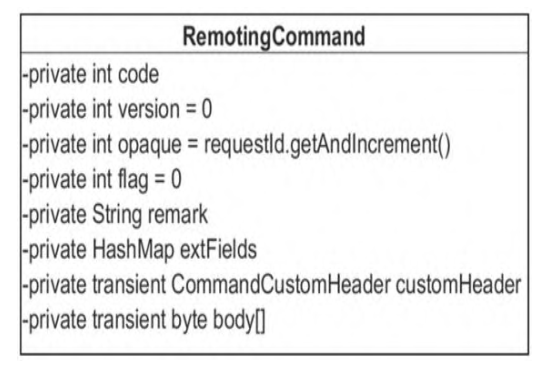

- code：请求命令编码，请求命令类型。
- version：版本号。
- opaque：客户端请求序号。
- flag：标记。倒数第一位表示请求类型，0表示请求；1表示返回。倒数第二位，1表示单向发送。
- remark：描述。
- extFields：扩展属性。
- customeHeader：每个请求对应的请求头信息。
- byte[] body：消息体内容。

​		发送单条消息时，消息体的内容将保存在body中。发送批量消息时，需要将多条消息体的内容存储在body中。如何存储更便于服务端正确解析每条消息呢？RocketMQ采取的方式是，对单条消息内容使用固定格式进行存储

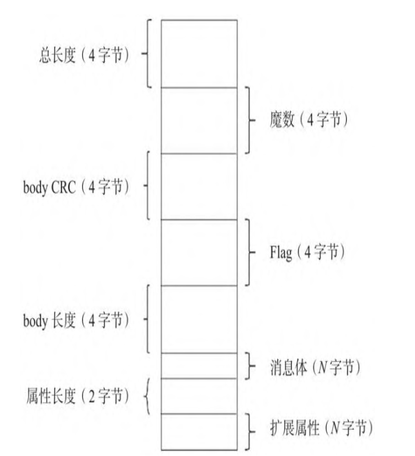

### 批量消息发送的核心流程

​		**DefaultMQProducer#send消息批量发送**

```java
	@Override
    public SendResult send(
        Collection<Message> msgs) throws MQClientException, RemotingException, MQBrokerException, InterruptedException {
        return this.defaultMQProducerImpl.send(batch(msgs));
    }
```

​		首先在消息发送端，调用batch()方法，将一批消息封装成MessageBatch对象。Message-Batch继承自Message对象，内部持有List<Message> messages。这样一来，批量消息发送与单条消息发送
的处理流程就完全一样了。MessageBatch只需要将该集合中每条消息的消息体聚合成一个byte[]数组，在消息服务端能够从该byte[]数组中正确解析出消息

​		**MessageBatch#encode**

```java
	public byte[] encode() {
        return MessageDecoder.encodeMessages(messages);
    }
```

​		在创建RemotingCommand对象时，调用messageBatch#encode方法填充到Remoting Command的body域中。多条消息编码格式可参考==图-RocetMQ消息封装格式==

​		**MessageDecoder#encodeMessage	**z

```java
	public static byte[] encodeMessage(Message message) {
        //only need flag, body, properties
        byte[] body = message.getBody();
        int bodyLen = body.length;
        String properties = messageProperties2String(message.getProperties());
        byte[] propertiesBytes = properties.getBytes(CHARSET_UTF8);
        //note properties length must not more than Short.MAX
        short propertiesLength = (short) propertiesBytes.length;
        int sysFlag = message.getFlag();
        int storeSize = 4 // 1 TOTALSIZE
            + 4 // 2 MAGICCOD
            + 4 // 3 BODYCRC
            + 4 // 4 FLAG
            + 4 + bodyLen // 4 BODY
            + 2 + propertiesLength;
        ByteBuffer byteBuffer = ByteBuffer.allocate(storeSize);
        // 1 TOTALSIZE
        byteBuffer.putInt(storeSize);

        // 2 MAGICCODE
        byteBuffer.putInt(0);

        // 3 BODYCRC
        byteBuffer.putInt(0);

        // 4 FLAG
        int flag = message.getFlag();
        byteBuffer.putInt(flag);

        // 5 BODY
        byteBuffer.putInt(bodyLen);
        byteBuffer.put(body);

        // 6 properties
        byteBuffer.putShort(propertiesLength);
        byteBuffer.put(propertiesBytes);

        return byteBuffer.array();
    }
```

​		在消息发送端将会按照上述结构进行解码，整个发送流程与单个消息发送没有差异

### 本章小结

​		本章剖析了消息发送的整个流程。对于消息发送的核心流程，本章并没有过多介绍消息发送方面出现的异常，特别是RocketMQ消息发送到“明星异常”之broker busy，关于broker busy的产生原因以及解决方案，可以参考笔者微信公众号中的文章：https://mp.weixin.qq.com/s/N_ttVjBpqVUA0CGrOybNLA。