# RocketMQ消息存储

​		从存储模型来看，目前MQ中间件分为需要持久化和不需要持久化两种，大多数MQ都支持持久化存储，比如ActiveMQ、RabbitMQ、Kafka、RocketMQ，而ZeroMQ则不需要支持持久化存储

​		然而业务系统大多需要MQ具有持久存储的能力，以增加系统的高可用性。从存储方式和效率来看，文件系统高于KV存储，KV存储又高于关系型数据库，直接操作文件系统肯定是最快的，但可靠性是最低的，而关系型数据库的性能和可靠性与文件系统恰恰相反

## 存储概要设计

​		RocketMQ存储的文件主要包括CommitLog文件、ConsumeQueue文件、Index文件。RocketMQ将所有主题的消息存储在同一个文件中，确保消息发送时按顺序写文件，尽最大的能力确保消息发送的高性能与
高吞吐量。因为消息中间件一般是基于消息主题的订阅机制，所以给按照消息主题检索消息带来了极大的不便。为了提高消息消费的效率，RocketMQ引入了ConsumeQueue消息消费队列文件，每个消息主题包含多个消息消费队列，每一个消息队列有一个消息文件。Index索引文件的设计理念是为了加速消息的检索性能，根据消息的属性从CommitLog文件中快速检索消息。

​		RocketMQ是一款高性能的消息中间件，存储部分的设计是重点，存储的核心是I/O访问性能。先看一下RocketMQ数据流向

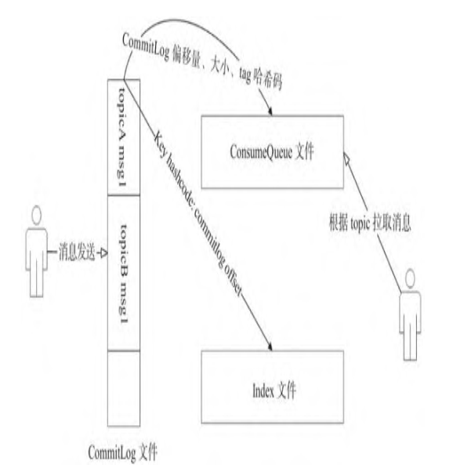

- **CommitLog**：消息存储，所有消息主题的消息都存储在CommitLog文件中。
- **ConsumeQueue**：消息消费队列，消息到达CommitLog文件后，将异步转发到ConsumeQuene文件中，供消息消费者消费。
- **Index**：消息索引，主要存储消息key与offset的对应关系。

### RocketMQ存储文件的组织方式

​		RocketMQ在消息写入过程中追求极致的磁盘顺序写，所有主题的消息全部写入一个文件，即CommitLog文件。所有消息按抵达顺序依次追加到CommitLog文件中，消息一旦写入，不支持修改。CommitLog文件的布局如下

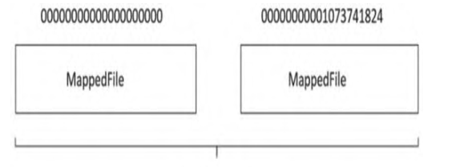

​		基于文件编程与基于内存编程一个很大的不同是基于内存编程时我们有现成的数据结构，例如List、HashMap，对数据的读写非常方便，那么一条一条消息存入CommitLog文件后，该如何查找呢

​		正如关系型数据库会为每条数据引入一个ID字段，基于文件编程也会为每条消息引入一个身份标志：消息物理偏移量，即消息存储在文件的起始位置。

​		正是有了物理偏移量的概念，CommitLog文件的命名方式也是极具技巧性，使用存储在该文件的第一条消息在整个CommitLog文件组中的偏移量来命名，例如第一个CommitLog文件为0000000000000000000，第二个CommitLog文件为00000000001073741824，依次类推。

​		这样做的好处是给出任意一个消息的物理偏移量，可以通过二分法进行查找，快速定位这个文件的位置，然后用消息物理偏移量减去所在文件的名称，得到的差值就是在该文件中的绝对地址。

​		CommitlLog文件的设计理念是追求极致的消息写，但我们知道消息消费模型是基于主题订阅机制的，即一个消费组是消费特定主题的消息。根据主题从CommitlLog文件中检索消息，这绝不是一个好主意，这样只能从文件的第一条消息逐条检索，其性能可想而知，为了解决基于topic的消息检索问题，RocketMQ引入了ConsumeQueue文件，ConsumeQueue文件的结构如下。

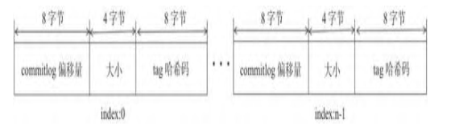

​		ConsumeQueue文件是消息消费队列文件，是CommitLog文件基于topic的索引文件，主要用于消费者根据topic消费消息，其组织方式为/topic/queue，同一个队列中存在多个消息文件。ConsumeQueue的
设计极具技巧，每个条目长度固定（8字节CommitLog物理偏移量、4字节消息长度、8字节tag哈希码）。这里不是存储tag的原始字符串，而是存储哈希码，目的是确保每个条目的长度固定，可以使用访问类似数组下标的方式快速定位条目，极大地提高了ConsumeQueue文件的读取性能。消息消费者根据topic、消息消费进度（ConsumeQueue逻辑偏移量），即第几个ConsumeQueue条目，这样的消费进度去访问消息，通过逻辑偏移量logicOffset×20，即可找到该条目的起始偏移量（ConsumeQueue文件中的偏移量），然后读取该偏移量后20个字节即可得到一个条目，无须遍历ConsumeQueue文件

​		RocketMQ与Kafka相比具有一个强大的优势，就是支持按消息属性检索消息，引入ConsumeQueue文件解决了基于topic查找消息的问题，但如果想基于消息的某一个属性进行查找，ConsumeQueue文件就无能为力了。故RocketMQ又引入了Index索引文件，实现基于文件的哈希索引。Index文件的存储结构如下


​		Index文件基于物理磁盘文件实现哈希索引。Index文件由40字节的文件头、500万个哈希槽、2000万个Index条目组成，每个哈希槽4字节、每个Index条目含有20个字节，分别为4字节索引key的哈希码、8字节消息物理偏移量、4字节时间戳、4字节的前一个Index条目（哈希冲突的链表结构）。

​		ConsumeQueue、Index文件都是根据CommitLog文件异步转发的，其转发实现如下图

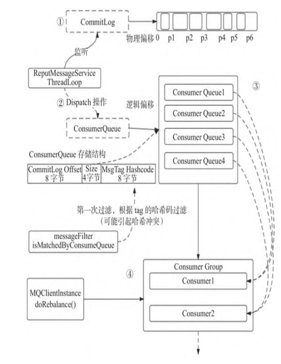

#### CommitLog

​		消息主体以及元数据的存储主体，存储消息生产端写入的消息主体内容，消息内容不是定长的。单个文件大小默认1GB，文件名长度为20位，左边补零，剩余为起始偏移量，比如00000000000000000000代表了第一个文件，起始偏移量为0，文件大小为1G=1073741824。第二个文件为00000000001073741824，起始偏移量为1073741824，以此类推。消息主要是顺序写入日志文件，当文件满了，写入下一个文件。

#### Dispatch操作

​		短轮询：longPollingEnable=false，第一次未拉取到消息后等待shortPollingTimeMills时间后再试。shortPollingTimeMills默认为1s。

​		长轮询：longPollingEnable=true，以消费者端设置的挂起超时时间为依据，受Default MQPullConsumer的
brokerSuspendMaxTimeMillis控制，默认20s，长轮询有两个线程来相互实现。PullRequestHoldService默认每隔5s重试一次。DefaultMessageStore#ReputMessageService方法在每当有消息到达后，转发消息，然后调用PullRequestHoldService线程中的拉取任务，尝试拉取，每处理一次，线程休眠1ms，继续下一次检查。

#### ConsumerQueue

​		消息消费队列引入的目的是提高消息消费的性能，由于RocketMQ是基于topic的订阅模式，消息消费是针对topic进行的，如果要根据topic遍历CommitLog文件中的消息是非常低效的。消息消费端可根据ConsumeQueue来查找待消费的消息。其中，ConsumeQueue作为消费消息的索引，保存了指定topic下的队列消息在CommitLog中的起始物理偏移量，消息大小和消息tag的哈希码。ConsumeQueue文件可以看作基于topic的CommitLog索引文件，故ConsumeQueue文件夹的组织方式为topic/queue/file三层组织结构，具体存储路径为
$HOME/store/consumequeue/{topic}/{queueId}/{fileName}。同样，ConsumeQueue文件采取定长设计，每一个条目20字节，分别为8字节的CommitLog物理偏移量、4字节的消息长度、8字节tag哈希码，单个文件由30万个条目组成，可以像数组一样随机访问每一个条目，每个ConsumeQueue文件大小约5.72MB。

####  Consumer

​		先从rebalanceImpl实例的本地缓存变量topicSubscribeInfoTable中，获取该topic主题下的消息消费队列集
合mqSet。

​		然后以topic和consumerGroup为参数调用mQClientFactory.findConsumerIdList()方法向Broker端发送获取该消费组下消费者ID列表的RPC通信请求（Broker端基于前面消息消费端上报的心跳包数据构建的consumerTable做出响应返回，业务请求码为GET_CONSUMER_LIST_BY_GROUP）。

​		接着对topic下的消息消费队列、消费者ID进行排序，然后用消息队列分配策略算法（默认为消息队列的平均分配算法），计算待拉取的消息队列。这里的平均分配算法类似于分页算法，求出每一页需要包含的平均大小和每个页面记录的范围，遍历整个范围，计算当前消息消费端应该分配到的记录（这里即为MessageQueue）。

​		最后调用updateProcessQueueTableInRebalance()方法，具体的做法是先将分配到的消息队列集合与processQueueTable做一个过滤比对，为过滤后的消息队列集合中的每个MessageQueue创建一个ProcessQueue对象并存入RebalanceImpl的processQueueTable队列中，其中调用RebalanceImpl实例的
computePullFromWhere(MessageQueue mq)方法获取该MessageQueue对象的下一个进度消费值offset，随后填充至接下来要创建的pullRequest对象属性中。创建拉取请求对象pullRequest添加到拉取列表pullRequestList中，最后执行dispatchPullRequest()方法，将PullRequest依次放入PullMessageService服务线程的阻塞队列
pullRequestQueue中，待服务线程取出后向Broker端发起拉取消息的请求。

### 内存映射

​		虽然基于磁盘的顺序写消息可以极大提高I/O的写效率，但如果基于文件的存储采用常规的Java文件操作API，例如FileOutputStream等，将性能提升会很有限，故RocketMQ又引入了内存映射，将磁盘文件映射到内存中，以操作内存的方式操作磁盘，将性能又提升了一个档次。

​		在Java中可通过FileChannel的map方法创建内存映射文件。在Linux服务器中由该方法创建的文件使用的就是操作系统的页缓存（pagecache）。Linux操作系统中内存使用策略时会尽可能地利用机器的物理内存，并常驻内存中，即页缓存。在操作系统的内存不够的情况下，采用缓存置换算法，例如LRU将不常用的页缓存回收，即操作
系统会自动管理这部分内存。

​		如果RocketMQ Broker进程异常退出，存储在页缓存中的数据并不会丢失，操作系统会定时将页缓存中的数据持久化到磁盘，实现数据安全可靠。不过如果是机器断电等异常情况，存储在页缓存中的数据也有可能丢失。

### 灵活多变的刷盘策略

​		有了顺序写和内存映射的加持，RocketMQ的写入性能得到了极大的保证，但凡事都有利弊，引入了内存映射和页缓存机制，消息会先写入页缓存，此时消息并没有真正持久化到磁盘。那么Broker收到客户端的消息后，是存储到页缓存中就直接返回成功，还是要持久化到磁盘中才返回成功呢

​		这是一个“艰难”的选择，是在性能与消息可靠性方面进行权衡。为此，RocketMQ提供了两种策略：同步刷盘、异步刷盘。

#### 同步刷盘

​		同步刷盘在RocketMQ的实现中称作组提交，其设计理念如下图

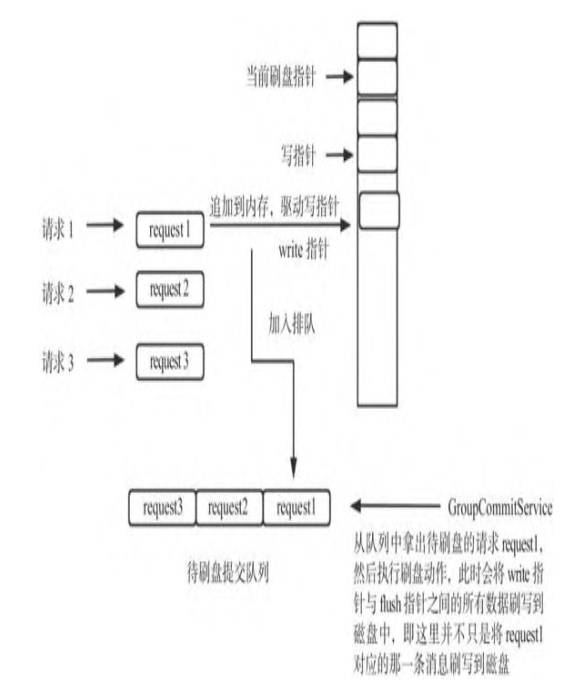

#### 异步刷盘

​		同步刷盘的优点是能保证消息不丢失，即向客户端返回成功就代表这条消息已被持久化到磁盘，但这是以牺牲写入性能为代价的，不过因为RocketMQ的消息是先写入pagecache，所以消息丢失的可能性较小，如果能容忍一定概率的消息丢失或者在丢失后能够低成本的快速重推，可以考虑使用异步刷盘策略

​		异步刷盘指的是broker将消息存储到pagecache后就立即返回成功，然后开启一个异步线程定时执行FileChannel的force方法，将内存中的数据定时写入磁盘，默认间隔时间为500ms。

### transientStorePoolEnable机制

​		RocketMQ为了降低pagecache的使用压力，引入了transientStorePoolEnable机制，即内存级别的读写分离机制。

​		默认情况下，RocketMQ将消息写入pagecache，消息消费时从pagecache中读取，这样在高并发时pagecache的压力会比较大，容易出现瞬时broker busy的异常。RocketMQ通过transientStorePoolEnable机制，将消息先写入堆外内存并立即返回，然后异步将堆外内存中的数据提交到pagecache，再异步刷盘到磁
盘中。因为堆外内存中的数据并未提交，所以认为是不可信的数据，消息在消费时不会从堆外内存中读取，而是从pagecache中读取，这样就形成了内存级别的读写分离，即写入消息时主要面对堆外内存，而读取消息时主要面对pagecache。

​		该机制使消息直接写入堆外内存，然后异步写入pagecache，相比每条消息追加直接写入pagechae，最大的优势是实现了批量化消息写入。

​		该机制的缺点是如果由于某些意外操作导致broker进程异常退出，已经放入pagecache的数据不会丢失，而存储在堆外内存的数据会丢失。

### 文件恢复机制

​		RocketMQ主要的数据存储文件包括CommitLog、ConsumeQueue和Index，而ConsumeQueue、Index文件是根据CommitLog文件异步构建的。既然是异步操作，这两者之间的数据就不可能始终保持一致，那么，重启broker时需要如何恢复数据

- 消息采用同步刷盘方式写入CommitLog文件，准备转发给ConsumeQueue文件时由于断电等异常，导致存储失败。
- 在刷盘的时候，突然记录了100MB消息，准备将这100MB消息写入磁盘，由于机器突然断电，只写入50MB消息到CommitLog文件。
- 在RocketMQ存储目录下有一个检查点（Checkpoint）文件，用于记录CommitLog等文件的刷盘点。但将数据写入CommitLog文件后才会将刷盘点记录到检查点文件中，有可能在从刷盘点写入检查点文件前数据就丢失了。

​		在RocketMQ中有broker异常停止恢复和正常停止恢复两种场景。这两种场景的区别是定位从哪个文件开始恢复的逻辑不一样，大致思路如下。

1. 尝试恢复ConsumeQueue文件，根据文件的存储格式（8字节物理偏移量、4字节长度、8字节tag哈希码），找到最后一条完整的消息格式所对应的物理偏移量，用maxPhysical OfConsumequeue表示。
2. 尝试恢复CommitLog文件，先通过文件的魔数判断该文件是否为ComitLog文件，然后按照消息的存储格式寻找最后一条合格的消息，拿到其物理偏移量，如果CommitLog文件的有效偏移量小于ConsumeQueue文件存储的最大物理偏移量，将会删除ConsumeQueue中多余的内容，如果大于，说明ConsuemQueue文件存储的内容少于CommitLog文件，则会重推数据。

#### 如何定位要恢复的文件

​		正常停止刷盘的情况下，先从倒数第三个文件开始进行恢复，然后按照消息的存储格式进行查找，如果该文件中所有的消息都符合消息存储格式，则继续查找下一个文件，直到找到最后一条消息所在的位置。

​		异常停止刷盘的情况下，RocketMQ会借助检查点文件，即存储的刷盘点，定位恢复的文件。刷盘点记录的是CommitLog、ConsuemQueue、Index文件最后的刷盘时间戳，但并不是只认为该时间戳之前的消息是有效的，超过这个时间戳之后的消息就是不可靠的。

​		异常停止刷盘时，从最后一个文件开始寻找，在寻找时读取该文件第一条消息的存储时间，如果这个存储时间小于检查点文件中的刷盘时间，就可以从这个文件开始恢复，如果这个文件中第一条消息的存储时间大于刷盘点，说明不能从这个文件开始恢复，需要寻找上一个文件，因为检查点文件中的刷盘点代表的是100%可靠的消息。

## 初识消息存储

​		消息存储实现类org.apache.rocketmq.store.DefaultMessageStore是存储模块里面最重要的一个类，包含了很多对存储文件进行操作的API，其他模块对消息实体的操作都是通过DefaultMessageStore进行的

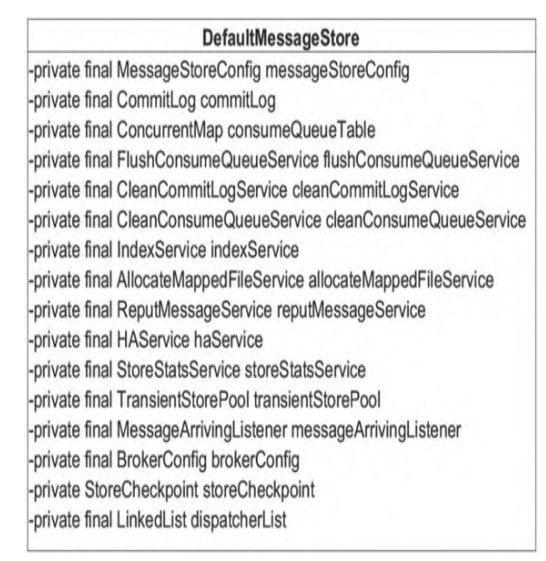

- MessageStoreConfig messageStoreConfig：消息存储配置属性。
- CommitLog commitLog：CommitLog文件的存储实现类。
- ConcurrentMap consumeQueueTable：消息队列存储缓存表，按消息主题分组。
- FlushConsumeQueueService flushConsumeQueueService：ConsumeQueue文件刷盘线程。
- CleanCommitLogService cleanCommitLogService：清除CommitLog文件服务。
- CleanConsumeQueueService cleanConsumeQueueService：清除ConsumeQueue文件服务。
- IndexService indexService：Index文件实现类。
- AllocateMappedFileService allocateMappedFileService：MappedFile分配服务。
- ReputMessageService reputMessageService：CommitLog消息分发，根据CommitLog文件构建ConsumeQueue、Index文件。
- HAService haService：存储高可用机制。
- TransientStorePool transientStorePool：消息堆内存缓存。
- MessageArrivingListener messageArrivingListener：在消息拉取长轮询模式下的消息达到监听器。
- BrokerConfig brokerConfig：Broker配置属性。
- StoreCheckpoint storeCheckpoint：文件刷盘检测点。
- LinkedList dispatcherList：CommitLog文件转发请求。

## 消息发送存储流程

​		以消息发送存储为突破点，层层揭开RocketMQ存储设计的神秘面纱。消息存储入口为org.apache.rocketmq.store.DefaultMessageStore#putMessage。

​		**CommitLog#putMessage**

```java
	public PutMessageResult putMessage(final MessageExtBrokerInner msg) {
        // Set the storage time
        msg.setStoreTimestamp(System.currentTimeMillis());
        // Set the message body BODY CRC (consider the most appropriate setting
        // on the client)
        msg.setBodyCRC(UtilAll.crc32(msg.getBody()));
        // Back to Results
        AppendMessageResult result = null;

        StoreStatsService storeStatsService = this.defaultMessageStore.getStoreStatsService();

        String topic = msg.getTopic();
        int queueId = msg.getQueueId();

        final int tranType = MessageSysFlag.getTransactionValue(msg.getSysFlag());
        if (tranType == MessageSysFlag.TRANSACTION_NOT_TYPE
            || tranType == MessageSysFlag.TRANSACTION_COMMIT_TYPE) {
            // Delay Delivery
            if (msg.getDelayTimeLevel() > 0) {
                if (msg.getDelayTimeLevel() > this.defaultMessageStore.getScheduleMessageService().getMaxDelayLevel()) {
                    msg.setDelayTimeLevel(this.defaultMessageStore.getScheduleMessageService().getMaxDelayLevel());
                }

                topic = ScheduleMessageService.SCHEDULE_TOPIC;
                queueId = ScheduleMessageService.delayLevel2QueueId(msg.getDelayTimeLevel());

                // Backup real topic, queueId
                MessageAccessor.putProperty(msg, MessageConst.PROPERTY_REAL_TOPIC, msg.getTopic());
                MessageAccessor.putProperty(msg, MessageConst.PROPERTY_REAL_QUEUE_ID, String.valueOf(msg.getQueueId()));
                msg.setPropertiesString(MessageDecoder.messageProperties2String(msg.getProperties()));

                msg.setTopic(topic);
                msg.setQueueId(queueId);
            }
        }

        InetSocketAddress bornSocketAddress = (InetSocketAddress) msg.getBornHost();
        if (bornSocketAddress.getAddress() instanceof Inet6Address) {
            msg.setBornHostV6Flag();
        }

        InetSocketAddress storeSocketAddress = (InetSocketAddress) msg.getStoreHost();
        if (storeSocketAddress.getAddress() instanceof Inet6Address) {
            msg.setStoreHostAddressV6Flag();
        }

        long eclipsedTimeInLock = 0;

        MappedFile unlockMappedFile = null;
        MappedFile mappedFile = this.mappedFileQueue.getLastMappedFile();

        putMessageLock.lock(); //spin or ReentrantLock ,depending on store config
        try {
            long beginLockTimestamp = this.defaultMessageStore.getSystemClock().now();
            this.beginTimeInLock = beginLockTimestamp;

            // Here settings are stored timestamp, in order to ensure an orderly
            // global
            msg.setStoreTimestamp(beginLockTimestamp);

            if (null == mappedFile || mappedFile.isFull()) {
                mappedFile = this.mappedFileQueue.getLastMappedFile(0); // Mark: NewFile may be cause noise
            }
            if (null == mappedFile) {
                log.error("create mapped file1 error, topic: " + msg.getTopic() + " clientAddr: " + msg.getBornHostString());
                beginTimeInLock = 0;
                return new PutMessageResult(PutMessageStatus.CREATE_MAPEDFILE_FAILED, null);
            }

            result = mappedFile.appendMessage(msg, this.appendMessageCallback);
            switch (result.getStatus()) {
                case PUT_OK:
                    break;
                case END_OF_FILE:
                    unlockMappedFile = mappedFile;
                    // Create a new file, re-write the message
                    mappedFile = this.mappedFileQueue.getLastMappedFile(0);
                    if (null == mappedFile) {
                        // XXX: warn and notify me
                        log.error("create mapped file2 error, topic: " + msg.getTopic() + " clientAddr: " + msg.getBornHostString());
                        beginTimeInLock = 0;
                        return new PutMessageResult(PutMessageStatus.CREATE_MAPEDFILE_FAILED, result);
                    }
                    result = mappedFile.appendMessage(msg, this.appendMessageCallback);
                    break;
                case MESSAGE_SIZE_EXCEEDED:
                case PROPERTIES_SIZE_EXCEEDED:
                    beginTimeInLock = 0;
                    return new PutMessageResult(PutMessageStatus.MESSAGE_ILLEGAL, result);
                case UNKNOWN_ERROR:
                    beginTimeInLock = 0;
                    return new PutMessageResult(PutMessageStatus.UNKNOWN_ERROR, result);
                default:
                    beginTimeInLock = 0;
                    return new PutMessageResult(PutMessageStatus.UNKNOWN_ERROR, result);
            }

            eclipsedTimeInLock = this.defaultMessageStore.getSystemClock().now() - beginLockTimestamp;
            beginTimeInLock = 0;
        } finally {
            putMessageLock.unlock();
        }

        if (eclipsedTimeInLock > 500) {
            log.warn("[NOTIFYME]putMessage in lock cost time(ms)={}, bodyLength={} AppendMessageResult={}", eclipsedTimeInLock, msg.getBody().length, result);
        }

        if (null != unlockMappedFile && this.defaultMessageStore.getMessageStoreConfig().isWarmMapedFileEnable()) {
            this.defaultMessageStore.unlockMappedFile(unlockMappedFile);
        }

        PutMessageResult putMessageResult = new PutMessageResult(PutMessageStatus.PUT_OK, result);

        // Statistics
        storeStatsService.getSinglePutMessageTopicTimesTotal(msg.getTopic()).incrementAndGet();
        storeStatsService.getSinglePutMessageTopicSizeTotal(topic).addAndGet(result.getWroteBytes());

        handleDiskFlush(result, putMessageResult, msg);
        handleHA(result, putMessageResult, msg);

        return putMessageResult;
    }
```

1. 如果当前broker停止工作或当前不支持写入，则拒绝消息写入。如果消息主题长度超过127个字符、消息属性长度超过32767个字符，同样拒绝该消息写入。如果日志中出现“message store is not writeable, so putMessage is forbidden”提示，最有可能是因为磁盘空间不足，在写入ConsumeQueue、Index文件出现错误时会拒绝消息再次写入。

2. 如果消息的延迟级别大于0，将消息的原主题名称与原消息队列ID存入消息属性中，用延迟消息主题SCHEDULE_TOPIC_XXXX、消息队列ID更新原先消息的主题与队列。这是并发消息消费重试关键的一步

3. 获取当前可以写入的CommitLog文件，RocketMQ物理文件的组织方式如下图

   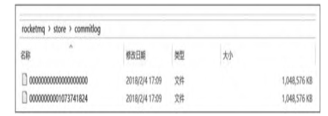

   CommitLog文件的存储目录为`${ROCKET_HOME}/store/commitlog`，每个文件默认1GB，一个文件写满后再创建另一个，以该文件中第一个偏移量为文件名，如果偏移量少于20位则用0补齐。图中第一个文件初始偏移量为0，第二个文件名中的“1073741824”代表该文件第一条消息的物理偏移量为1073741824，这样根据物理偏移量可以快速定位到消息。MappedFileQueue可以看作`${ROCKET_HOME}/store/commitlog`文件夹，而MappedFile则对应该文件夹下的文件。

4. 在将消息写入CommitLog之前，先申请putMessageLock

5. 设置消息的存储时间，如果mappedFile为空，表明${ROCKET_HOME}/store/commitlog目录下不存在任何文件，说明本次消息是第一次发送，用偏移量0创建第一个CommitLog文件，文件名为00000000000000000000，如果文件创建失败，抛出CREATE_MAPEDFILE_FAILED，这很有可能是磁盘空间不足或权限不够导致的

   **MappedFile#appendMessagesInner**

   ```java
   	public AppendMessageResult appendMessagesInner(final MessageExt messageExt, final AppendMessageCallback cb) {
           assert messageExt != null;
           assert cb != null;
   
           int currentPos = this.wrotePosition.get();
   
           if (currentPos < this.fileSize) {
               ByteBuffer byteBuffer = writeBuffer != null ? writeBuffer.slice() : this.mappedByteBuffer.slice();
               byteBuffer.position(currentPos);
               AppendMessageResult result;
               if (messageExt instanceof MessageExtBrokerInner) {
                   result = cb.doAppend(this.getFileFromOffset(), byteBuffer, this.fileSize - currentPos, (MessageExtBrokerInner) messageExt);
               } else if (messageExt instanceof MessageExtBatch) {
                   result = cb.doAppend(this.getFileFromOffset(), byteBuffer, this.fileSize - currentPos, (MessageExtBatch) messageExt);
               } else {
                   return new AppendMessageResult(AppendMessageStatus.UNKNOWN_ERROR);
               }
               this.wrotePosition.addAndGet(result.getWroteBytes());
               this.storeTimestamp = result.getStoreTimestamp();
               return result;
           }
           log.error("MappedFile.appendMessage return null, wrotePosition: {} fileSize: {}", currentPos, this.fileSize);
           return new AppendMessageResult(AppendMessageStatus.UNKNOWN_ERROR);
       }
   ```

6. 将消息追加到MappedFile中。首先获取MappedFile当前的写指针，如果currentPos大于或等于文件大小，表明文件已写满，抛出AppendMessageStatus.UNKNOWN_ERROR。如果currentPos小于文件大小，通过slice()方法创建一个与原ByteBuffer共享的内存区，且拥有独立的position、limit、capacity等指针，并设置position为当前指针

   **CommitLog$DefaultAppendMessageCallback#doAppend**

   ```java
   		public AppendMessageResult doAppend(final long fileFromOffset, final ByteBuffer byteBuffer, final int maxBlank,
               final MessageExtBrokerInner msgInner) {
               // STORETIMESTAMP + STOREHOSTADDRESS + OFFSET <br>
   
               // PHY OFFSET
               long wroteOffset = fileFromOffset + byteBuffer.position();
   
               int sysflag = msgInner.getSysFlag();
   
               int bornHostLength = (sysflag & MessageSysFlag.BORNHOST_V6_FLAG) == 0 ? 4 + 4 : 16 + 4;
               int storeHostLength = (sysflag & MessageSysFlag.STOREHOSTADDRESS_V6_FLAG) == 0 ? 4 + 4 : 16 + 4;
               ByteBuffer bornHostHolder = ByteBuffer.allocate(bornHostLength);
               ByteBuffer storeHostHolder = ByteBuffer.allocate(storeHostLength);
   
               this.resetByteBuffer(storeHostHolder, storeHostLength);
               String msgId;
               if ((sysflag & MessageSysFlag.STOREHOSTADDRESS_V6_FLAG) == 0) {
                   msgId = MessageDecoder.createMessageId(this.msgIdMemory, msgInner.getStoreHostBytes(storeHostHolder), wroteOffset);
               } else {
                   msgId = MessageDecoder.createMessageId(this.msgIdV6Memory, msgInner.getStoreHostBytes(storeHostHolder), wroteOffset);
               }
   
               // Record ConsumeQueue information
               keyBuilder.setLength(0);
               keyBuilder.append(msgInner.getTopic());
               keyBuilder.append('-');
               keyBuilder.append(msgInner.getQueueId());
               String key = keyBuilder.toString();
               Long queueOffset = CommitLog.this.topicQueueTable.get(key);
               if (null == queueOffset) {
                   queueOffset = 0L;
                   CommitLog.this.topicQueueTable.put(key, queueOffset);
               }
   
               // Transaction messages that require special handling
               final int tranType = MessageSysFlag.getTransactionValue(msgInner.getSysFlag());
               switch (tranType) {
                   // Prepared and Rollback message is not consumed, will not enter the
                   // consumer queuec
                   case MessageSysFlag.TRANSACTION_PREPARED_TYPE:
                   case MessageSysFlag.TRANSACTION_ROLLBACK_TYPE:
                       queueOffset = 0L;
                       break;
                   case MessageSysFlag.TRANSACTION_NOT_TYPE:
                   case MessageSysFlag.TRANSACTION_COMMIT_TYPE:
                   default:
                       break;
               }
   
               /**
                * Serialize message
                */
               final byte[] propertiesData =
                   msgInner.getPropertiesString() == null ? null : msgInner.getPropertiesString().getBytes(MessageDecoder.CHARSET_UTF8);
   
               final int propertiesLength = propertiesData == null ? 0 : propertiesData.length;
   
               if (propertiesLength > Short.MAX_VALUE) {
                   log.warn("putMessage message properties length too long. length={}", propertiesData.length);
                   return new AppendMessageResult(AppendMessageStatus.PROPERTIES_SIZE_EXCEEDED);
               }
   
               final byte[] topicData = msgInner.getTopic().getBytes(MessageDecoder.CHARSET_UTF8);
               final int topicLength = topicData.length;
   
               final int bodyLength = msgInner.getBody() == null ? 0 : msgInner.getBody().length;
   
               final int msgLen = calMsgLength(msgInner.getSysFlag(), bodyLength, topicLength, propertiesLength);
   
               // Exceeds the maximum message
               if (msgLen > this.maxMessageSize) {
                   CommitLog.log.warn("message size exceeded, msg total size: " + msgLen + ", msg body size: " + bodyLength
                       + ", maxMessageSize: " + this.maxMessageSize);
                   return new AppendMessageResult(AppendMessageStatus.MESSAGE_SIZE_EXCEEDED);
               }
   
               // Determines whether there is sufficient free space
               if ((msgLen + END_FILE_MIN_BLANK_LENGTH) > maxBlank) {
                   this.resetByteBuffer(this.msgStoreItemMemory, maxBlank);
                   // 1 TOTALSIZE
                   this.msgStoreItemMemory.putInt(maxBlank);
                   // 2 MAGICCODE
                   this.msgStoreItemMemory.putInt(CommitLog.BLANK_MAGIC_CODE);
                   // 3 The remaining space may be any value
                   // Here the length of the specially set maxBlank
                   final long beginTimeMills = CommitLog.this.defaultMessageStore.now();
                   byteBuffer.put(this.msgStoreItemMemory.array(), 0, maxBlank);
                   return new AppendMessageResult(AppendMessageStatus.END_OF_FILE, wroteOffset, maxBlank, msgId, msgInner.getStoreTimestamp(),
                       queueOffset, CommitLog.this.defaultMessageStore.now() - beginTimeMills);
               }
   
               // Initialization of storage space
               this.resetByteBuffer(msgStoreItemMemory, msgLen);
               // 1 TOTALSIZE
               this.msgStoreItemMemory.putInt(msgLen);
               // 2 MAGICCODE
               this.msgStoreItemMemory.putInt(CommitLog.MESSAGE_MAGIC_CODE);
               // 3 BODYCRC
               this.msgStoreItemMemory.putInt(msgInner.getBodyCRC());
               // 4 QUEUEID
               this.msgStoreItemMemory.putInt(msgInner.getQueueId());
               // 5 FLAG
               this.msgStoreItemMemory.putInt(msgInner.getFlag());
               // 6 QUEUEOFFSET
               this.msgStoreItemMemory.putLong(queueOffset);
               // 7 PHYSICALOFFSET
               this.msgStoreItemMemory.putLong(fileFromOffset + byteBuffer.position());
               // 8 SYSFLAG
               this.msgStoreItemMemory.putInt(msgInner.getSysFlag());
               // 9 BORNTIMESTAMP
               this.msgStoreItemMemory.putLong(msgInner.getBornTimestamp());
               // 10 BORNHOST
               this.resetByteBuffer(bornHostHolder, bornHostLength);
               this.msgStoreItemMemory.put(msgInner.getBornHostBytes(bornHostHolder));
               // 11 STORETIMESTAMP
               this.msgStoreItemMemory.putLong(msgInner.getStoreTimestamp());
               // 12 STOREHOSTADDRESS
               this.resetByteBuffer(storeHostHolder, storeHostLength);
               this.msgStoreItemMemory.put(msgInner.getStoreHostBytes(storeHostHolder));
               // 13 RECONSUMETIMES
               this.msgStoreItemMemory.putInt(msgInner.getReconsumeTimes());
               // 14 Prepared Transaction Offset
               this.msgStoreItemMemory.putLong(msgInner.getPreparedTransactionOffset());
               // 15 BODY
               this.msgStoreItemMemory.putInt(bodyLength);
               if (bodyLength > 0)
                   this.msgStoreItemMemory.put(msgInner.getBody());
               // 16 TOPIC
               this.msgStoreItemMemory.put((byte) topicLength);
               this.msgStoreItemMemory.put(topicData);
               // 17 PROPERTIES
               this.msgStoreItemMemory.putShort((short) propertiesLength);
               if (propertiesLength > 0)
                   this.msgStoreItemMemory.put(propertiesData);
   
               final long beginTimeMills = CommitLog.this.defaultMessageStore.now();
               // Write messages to the queue buffer
               byteBuffer.put(this.msgStoreItemMemory.array(), 0, msgLen);
   
               AppendMessageResult result = new AppendMessageResult(AppendMessageStatus.PUT_OK, wroteOffset, msgLen, msgId,
                   msgInner.getStoreTimestamp(), queueOffset, CommitLog.this.defaultMessageStore.now() - beginTimeMills);
   
               switch (tranType) {
                   case MessageSysFlag.TRANSACTION_PREPARED_TYPE:
                   case MessageSysFlag.TRANSACTION_ROLLBACK_TYPE:
                       break;
                   case MessageSysFlag.TRANSACTION_NOT_TYPE:
                   case MessageSysFlag.TRANSACTION_COMMIT_TYPE:
                       // The next update ConsumeQueue information
                       CommitLog.this.topicQueueTable.put(key, ++queueOffset);
                       break;
                   default:
                       break;
               }
               return result;
           }
   ```

7. 创建全局唯一消息ID，消息ID有16字节，其组成结构如下

   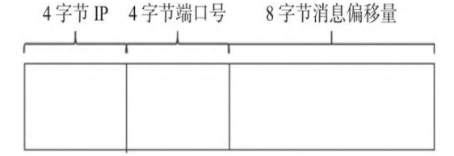

   为了消息ID具备可读性，返回给应用程序的msgId为字符类型，可以通过UtilAll. bytes2string方法将msgId字节数组转换成字符串，通过UtilAll.string2bytes方法将msgId字符串还原成16字节的数组，根据提取的消息物理偏移量，可以快速通过msgId找到消息内容

   ```java
   // CommitLog$DefaultAppendMessageCallback#doAppend
   
   keyBuilder.setLength(0);
   keyBuilder.append(msgInner.getTopic());
   keyBuilder.append(‘-’);
   keyBuilder.append(msgInner.getQueueId());
   String key = keyBuilder.toString();
   Long queueOffset = CommitLog.this.topicQueueTable.get(key);
   if (null == queueOffset) {
       queueOffset = 0L;
       CommitLog.this.topicQueueTable.put(key, queueOffset);
   }
   ```

8. 获取该消息在消息队列的物理偏移量。CommitLog中保存了当前所有消息队列的待写入物理偏移量

   **CommitLog#calMsgLength**

   ```java
   	protected static int calMsgLength(int sysFlag, int bodyLength, int topicLength, int propertiesLength) {
           int bornhostLength = (sysFlag & MessageSysFlag.BORNHOST_V6_FLAG) == 0 ? 8 : 20;
           int storehostAddressLength = (sysFlag & MessageSysFlag.STOREHOSTADDRESS_V6_FLAG) == 0 ? 8 : 20;
           final int msgLen = 4 //TOTALSIZE
               + 4 //MAGICCODE
               + 4 //BODYCRC
               + 4 //QUEUEID
               + 4 //FLAG
               + 8 //QUEUEOFFSET
               + 8 //PHYSICALOFFSET
               + 4 //SYSFLAG
               + 8 //BORNTIMESTAMP
               + bornhostLength //BORNHOST
               + 8 //STORETIMESTAMP
               + storehostAddressLength //STOREHOSTADDRESS
               + 4 //RECONSUMETIMES
               + 8 //Prepared Transaction Offset
               + 4 + (bodyLength > 0 ? bodyLength : 0) //BODY
               + 1 + topicLength //TOPIC
               + 2 + (propertiesLength > 0 ? propertiesLength : 0) //propertiesLength
               + 0;
           return msgLen;
       }
   ```

   - TOTALSIZE：消息条目总长度，4字节。
   - MAGICCODE：魔数，4字节。固定值0xdaa320a7。
   - BODYCRC：消息体的crc校验码，4字节。
   - QUEUEID：消息消费队列ID，4字节。
   - FLAG：消息标记，RocketMQ对其不做处理，供应用程序使用，默认4字节。
   - QUEUEOFFSET：消息在ConsumeQuene文件中的物理偏移量，8字节。
   - PHYSICALOFFSET：消息在CommitLog文件中的物理偏移量，8字节。
   - SYSFLAG：消息系统标记，例如是否压缩、是否是事务消息等，4字节。
   - BORNTIMESTAMP：消息生产者调用消息发送API的时间戳，8字节。
   - BORNHOST：消息发送者IP、端口号，8字节。
   - STORETIMESTAMP：消息存储时间戳，8字节。
   - STOREHOSTADDRESS：Broker服务器IP+端口号，8字节。
   - RECONSUMETIMES：消息重试次数，4字节。
   - Prepared Transaction Offset：事务消息的物理偏移量，8字节。
   - BodyLength：消息体长度，4字节。
   - Body：消息体内容，长度为bodyLenth中存储的值。
   - TopicLength：主题存储长度，1字节，表示主题名称不能超过255个字符。
   - Topic：主题，长度为TopicLength中存储的值。
   - PropertiesLength：消息属性长度，2字节，表示消息属性长度不能超过65536个字符。
   - Properties：消息属性，长度为PropertiesLength中存储的值。

   CommitLog条目是不定长的，每一个条目的长度存储在前4个字节中。

9. 根据消息体、主题和属性的长度，结合消息存储格式，计算消息的总长度

   ```java
   //CommitLog$DefaultAppendMessageCallback#doAppend
   if ((msgLen + END_FILE_MIN_BLANK_LENGTH) > maxBlank)
       { this.resetByteBuffer(this.msgStoreItemMemory, maxBlank);
       this.msgStoreItemMemory.putInt(maxBlank);
       this.msgStoreItemMemory.putInt(CommitLog.BLANK_MAGIC_CODE);
       final long beginTimeMills =
   CommitLog.this.defaultMessageStore.now();
       byteBuffer.put(this.msgStoreItemMemory.array(), 0, maxBlank);
       return new AppendMessageResult(AppendMessageStatus.END_OF_FILE,
   wroteOffset,
       	maxBlank, msgId, msgInner.getStoreTimestamp(),queueOffset,
       	CommitLog.this.defaultMessageStore.now() - beginTimeMills);
   ```

10. 如果消息长度+END_FILE_MIN_BLANK_LENGTH大于CommitLog文件的空闲空间，则返回
    AppendMessageStatus.END_OF_FILE，Broker会创建一个新的CommitLog文件来存储该消息。从这里可以看出，每个CommitLog文件最少空闲8字节，高4字节存储当前文件的剩余空间，低4字节存储魔数CommitLog.BLANK_MAGIC_CODE

    ```java
    //CommitLog$DefaultAppendMessageCallback#doAppend
    final long beginTimeMills =
    CommitLog.this.defaultMessageStore.now();
    byteBuffer.put(this.msgStoreItemMemory.array(), 0, msgLen);
    AppendMessageResult result = new
    	AppendMessageResult(AppendMessageStatus.PUT_OK, wroteOffset,
    msgLen,
    		msgId,msgInner.getStoreTimestamp(), queueOffset,
    CommitLog.this.defaultMessageStore.now() - beginTimeMills);
    ```

11. 将消息内容存储到ByteBuffer中，然后创建AppendMessageResult。这里只是将消息存储在MappedFile对应的内存映射Buffer中，并没有写入磁盘，追加结果如下图

    

    - AppendMessageStatus status：消息追加结果，取值为PUT_OK则代表追加成功、END_OF_FILE则代表超过文件大小、MESSAGE_SIZE_EXCEEDED则代表消息长度超过最大允许长度、PROPERTIES_SIZE_EXCEEDED则代表消息属性超过最大允许长度、UNKNOWN_ERROR则代表未知异常。
    - long wroteOffset：消息的物理偏移量。
    - String msgId：消息ID。
    - long storeTimestamp：消息存储时间戳。
    - long logicsOffset：消息消费队列的逻辑偏移量，类似于数组下标。
    - long pagecacheRT = 0：写入页缓存的响应时间。
    - int msgNum = 1：批量发送消息时的消息条数。

    ```java
    // CommitLog$DefaultAppendMessageCallback#doAppend
    case MessageSysFlag.TRANSACTION_NOT_TYPE:
    case MessageSysFlag.TRANSACTION_COMMIT_TYPE:
    	CommitLog.this.topicQueueTable.put(key, ++queueOffset);
    break;
    ```

12. 更新消息队列的逻辑偏移量。

13. 处理完消息追加逻辑后将释放putMessageLock

14. DefaultAppendMessageCallback#doAppend只是将消息追加到内存中，需要根据采取的是同步刷盘方式还是异步刷盘方式，将内存中的数据持久化到磁盘中。然后执行HA主从同步复制

## 存储文件组织与内存映射

​		RocketMQ通过使用内存映射文件来提高I/O访问性能，无论是CommitLog、Consume-Queue还是Index，单个文件都被设计为固定长度，一个文件写满以后再创建新文件，文件名就为该文件第一条消息对应的全局物理偏移量。

​		RocketMQ使用MappedFile、MappedFileQueue来封装存储文件。

### MappedFileQueue映射文件队列

​		MappedFileQueue是MappedFile的管理容器，MappedFileQueue对存储目录进行封装，例如CommitLog文件的存储路径为${ROCKET_HOME}/store/commitlog/，该目录下会存在多个内存映射文件MappedFile。

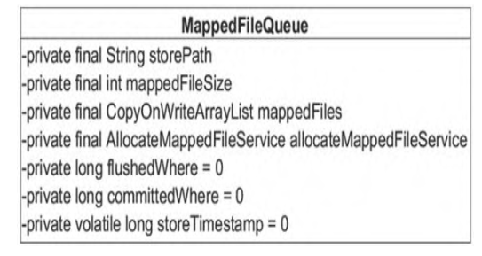

- String storePath：存储目录。
- int mappedFileSize：单个文件的存储大小。
- CopyOnWriteArrayList mappedFiles：MappedFile集合。
- AllocateMappedFileService allocateMappedFileService：创建MappedFile服务类。
- long flushedWhere = 0：当前刷盘指针，表示该指针之前的所有数据全部持久化到磁盘。
- long committedWhere = 0：当前数据提交指针，内存中ByteBuffer当前的写指针，该值大于、等于flushedWhere

​		分析根据不同维度查找MappedFile的方法，**MappedFileQueue#getMappedFileByTime**

```java
	public MappedFile getMappedFileByTime(final long timestamp) {
        Object[] mfs = this.copyMappedFiles(0);

        if (null == mfs)
            return null;

        for (int i = 0; i < mfs.length; i++) {
            MappedFile mappedFile = (MappedFile) mfs[i];
            if (mappedFile.getLastModifiedTimestamp() >= timestamp) {
                return mappedFile;
            }
        }

        return (MappedFile) mfs[mfs.length - 1];
    }
```

​		根据消息存储时间戳查找MappdFile。从MappedFile列表中第一个文件开始查找，找到第一个最后一次更新时间大于待查找时间戳的文件，如果不存在，则返回最后一个MappedFile。**MappedFileQueue#findMappedFileByOffset**

```java
	public MappedFile findMappedFileByOffset(final long offset, final boolean returnFirstOnNotFound) {
        try {
            MappedFile firstMappedFile = this.getFirstMappedFile();
            MappedFile lastMappedFile = this.getLastMappedFile();
            if (firstMappedFile != null && lastMappedFile != null) {
                if (offset < firstMappedFile.getFileFromOffset() || offset >= lastMappedFile.getFileFromOffset() + this.mappedFileSize) {
                    LOG_ERROR.warn("Offset not matched. Request offset: {}, firstOffset: {}, lastOffset: {}, mappedFileSize: {}, mappedFiles count: {}",
                        offset,
                        firstMappedFile.getFileFromOffset(),
                        lastMappedFile.getFileFromOffset() + this.mappedFileSize,
                        this.mappedFileSize,
                        this.mappedFiles.size());
                } else {
                    int index = (int) ((offset / this.mappedFileSize) - (firstMappedFile.getFileFromOffset() / this.mappedFileSize));
                    MappedFile targetFile = null;
                    try {
                        targetFile = this.mappedFiles.get(index);
                    } catch (Exception ignored) {
                    }

                    if (targetFile != null && offset >= targetFile.getFileFromOffset()
                        && offset < targetFile.getFileFromOffset() + this.mappedFileSize) {
                        return targetFile;
                    }

                    for (MappedFile tmpMappedFile : this.mappedFiles) {
                        if (offset >= tmpMappedFile.getFileFromOffset()
                            && offset < tmpMappedFile.getFileFromOffset() + this.mappedFileSize) {
                            return tmpMappedFile;
                        }
                    }
                }

                if (returnFirstOnNotFound) {
                    return firstMappedFile;
                }
            }
        } catch (Exception e) {
            log.error("findMappedFileByOffset Exception", e);
        }

        return null;
    }
```

​		根据消息偏移量offset查找MappedFile，但是不能直接使用offset%mappedFileSize。这是因为使用了内存映射，只要是存在于存储目录下的文件，都需要对应创建内存映射文件，如果不定时将已消费的消息从存储文件中删除，会造成极大的内存压力与资源浪费，所以RocketMQ采取定时删除存储文件的策略。也就是说，在存储文件
中，第一个文件不一定是00000000000000000000，因为该文件在某一时刻会被删除，所以根据offset定位MappedFile的算法为(int)((offset/this.mappedFileSize)(mappedFile.getFileFromOffset()/this.MappedFileSize))。**MappedFileQueue#getMinOffset**

```java
	public long getMinOffset() {

        if (!this.mappedFiles.isEmpty()) {
            try {
                return this.mappedFiles.get(0).getFileFromOffset();
            } catch (IndexOutOfBoundsException e) {
                //continue;
            } catch (Exception e) {
                log.error("getMinOffset has exception.", e);
            }
        }
        return -1;
    }
```

​		获取存储文件最小偏移量。从这里也可以看出，并不是直接返回0，而是返回MappedFile的getFileFormOffset()方法。**MappedFileQueue#getMaxOffset**

```java
	public long getMaxOffset() {
        MappedFile mappedFile = getLastMappedFile();
        if (mappedFile != null) {
            return mappedFile.getFileFromOffset() + mappedFile.getReadPosition();
        }
        return 0;
    }
```

​		获取存储文件的最大偏移量。返回最后一个MappedFile的fileFromOffset，加上MappedFile当前的写指针。**MappedFileQueue#getMaxWrotePosition**

```java
	public long getMaxWrotePosition() {
        MappedFile mappedFile = getLastMappedFile();
        if (mappedFile != null) {
            return mappedFile.getFileFromOffset() + mappedFile.getWrotePosition();
        }
        return 0;
    }
```

​		返回存储文件当前的写指针。返回最后一个文件的fileFromOffset，加上当前写指针位置。

### MappedFile内存映射文件

​		MappedFile是RocketMQ内存映射文件的具体实现


- int OS_PAGE_SIZE：操作系统每页大小，默认4KB。
- AtomicLong TOTAL_MAPPED_VIRTUAL_MEMORY：当前JVM实例中MappedFile的虚拟内存。
- AtomicInteger TOTAL_MAPPED_FILES：当前JVM实例中MappedFile对象个数。
- AtomicInteger wrotePosition：当前文件的写指针，从0开始（内存映射文件中的写指针）。
- AtomicInteger committedPosition：当前文件的提交指针，如果开启transientStore-PoolEnable，则数据会存储在TransientStorePool中，然后提交到内存映射ByteBuffer中，再写入磁盘。
- AtomicInteger flushedPosition：将该指针之前的数据持久化存储到磁盘中。
- int fileSize：文件大小。
- FileChannel fileChannel：文件通道。
- ByteBuffer writeBuffer：堆外内存ByteBuffer，如果不为空，数据首先将存储在该Buffer中，然后提交到MappedFile创建的FileChannel中。transientStorePoolEnable为true时不为空。
- TransientStorePool transientStorePool：堆外内存池，该内存池中的内存会提供内存锁机制。transientStorePoolEnable为true时启用。
- String fileName：文件名称。
- long fileFromOffset：该文件的初始偏移量。
- File file：物理文件。
- MappedByteBuffer mappedByteBuffer：物理文件对应的内存映射Buffer。
- volatile long storeTimestamp = 0：文件最后一次写入内容的时间。
- boolean firstCreateInQueue：是否是MappedFileQueue队列中第一个文件。

#### MappedFile初始化

1. 根据是否开启transientStorePoolEnable存在两种初始化情况。transientStorePool-Enable为true表示内容先存储在堆外内存，然后通过Commit线程将数据提交到FileChannel中，再通过Flush线程将数据持久化到磁盘中

   **MappedFile#init(final String fileName, final int fileSize)**

   ```java
   	private void init(final String fileName, final int fileSize) throws IOException {
           this.fileName = fileName;
           this.fileSize = fileSize;
           this.file = new File(fileName);
           this.fileFromOffset = Long.parseLong(this.file.getName());
           boolean ok = false;
   
           ensureDirOK(this.file.getParent());
   
           try {
               this.fileChannel = new RandomAccessFile(this.file, "rw").getChannel();
               this.mappedByteBuffer = this.fileChannel.map(MapMode.READ_WRITE, 0, fileSize);
               TOTAL_MAPPED_VIRTUAL_MEMORY.addAndGet(fileSize);
               TOTAL_MAPPED_FILES.incrementAndGet();
               ok = true;
           } catch (FileNotFoundException e) {
               log.error("Failed to create file " + this.fileName, e);
               throw e;
           } catch (IOException e) {
               log.error("Failed to map file " + this.fileName, e);
               throw e;
           } finally {
               if (!ok && this.fileChannel != null) {
                   this.fileChannel.close();
               }
           }
       }
   ```

2. 初始化fileFromOffset为文件名，也就是文件名代表该文件的起始偏移量，通过RandomAccessFile创建读写文件通道，并将文件内容使用NIO的内存映射Buffer将文件映射到内存中

   **MappedFile#init**

   ```java
   	public void init(final String fileName, final int fileSize,
           final TransientStorePool transientStorePool) throws IOException {
           init(fileName, fileSize);
           this.writeBuffer = transientStorePool.borrowBuffer();
           this.transientStorePool = transientStorePool;
       }
   ```

   如果transientStorePoolEnable为true，则初始化MappedFile的writeBuffer，该buffer从transientStorePool中获取

#### MappedFile提交

​		内存映射文件的提交动作由MappedFile的commit()方法实现。**MappedFile#commit**

```java
	public int commit(final int commitLeastPages) {
        if (writeBuffer == null) {
            //no need to commit data to file channel, so just regard wrotePosition as committedPosition.
            return this.wrotePosition.get();
        }
        if (this.isAbleToCommit(commitLeastPages)) {
            if (this.hold()) {
                commit0(commitLeastPages);
                this.release();
            } else {
                log.warn("in commit, hold failed, commit offset = " + this.committedPosition.get());
            }
        }

        // All dirty data has been committed to FileChannel.
        if (writeBuffer != null && this.transientStorePool != null && this.fileSize == this.committedPosition.get()) {
            this.transientStorePool.returnBuffer(writeBuffer);
            this.writeBuffer = null;
        }

        return this.committedPosition.get();
    }
```

​		执行提交操作，commitLeastPages为本次提交的最小页数，如果待提交数据不满足commitLeastPages，则不执行本次提交操作，等待下次提交。writeBuffer如果为空，直接返回wrotePosition指针，无须执行commit操作，这表明commit操作的主体是writeBuffer。**MappedFile#isAbleToCommit**

```java
	protected boolean isAbleToCommit(final int commitLeastPages) {
        int flush = this.committedPosition.get();
        int write = this.wrotePosition.get();

        if (this.isFull()) {
            return true;
        }

        if (commitLeastPages > 0) {
            return ((write / OS_PAGE_SIZE) - (flush / OS_PAGE_SIZE)) >= commitLeastPages;
        }

        return write > flush;
    }
```

​		判断是否执行commit操作。如果文件已满，返回true。如果commitLeastPages大于0，则计算wrotePosition（当前writeBuffe的写指针）与上一次提交的指针（committedPosition）的差值，将其除
以OS_PAGE_SIZE得到当前脏页的数量，如果大于commitLeastPages，则返回true。如果commitLeastPages小于0，表示只要存在脏页就提交。**// MappedFile#commit0**

```java
	protected void commit0(final int commitLeastPages) {
        int writePos = this.wrotePosition.get();
        int lastCommittedPosition = this.committedPosition.get();

        if (writePos - this.committedPosition.get() > 0) {
            try {
                ByteBuffer byteBuffer = writeBuffer.slice();
                byteBuffer.position(lastCommittedPosition);
                byteBuffer.limit(writePos);
                this.fileChannel.position(lastCommittedPosition);
                this.fileChannel.write(byteBuffer);
                this.committedPosition.set(writePos);
            } catch (Throwable e) {
                log.error("Error occurred when commit data to FileChannel.", e);
            }
        }
    }
```

​		下面介绍具体的MappedFile提交实现过程。首先创建writeBuffer的共享缓存区，然后将新创建的position回退到上一次提交的位置（committedPosition），设置limit为wrotePosition（当前最大有效数据指针），接着把committedPosition到wrotePosition的数据复制（写入）到FileChannel中，最后更新committedPosition指针为
wrotePosition。commit的作用是将MappedFile# writeBuffer中的数据提交到文件通道FileChannel中。

​		ByteBuffer使用技巧：调用slice()方法创建一个共享缓存区，与原先的ByteBuffer共享内存并维护一套独立的指针（position、mark、limit）。

####  MappedFile刷盘

​		刷盘指的是将内存中的数据写入磁盘，永久存储在磁盘中，由MappedFile的flush()方法实现

```java
	public int flush(final int flushLeastPages) {
        if (this.isAbleToFlush(flushLeastPages)) {
            if (this.hold()) {
                int value = getReadPosition();

                try {
                    //We only append data to fileChannel or mappedByteBuffer, never both.
                    if (writeBuffer != null || this.fileChannel.position() != 0) {
                        this.fileChannel.force(false);
                    } else {
                        this.mappedByteBuffer.force();
                    }
                } catch (Throwable e) {
                    log.error("Error occurred when force data to disk.", e);
                }

                this.flushedPosition.set(value);
                this.release();
            } else {
                log.warn("in flush, hold failed, flush offset = " + this.flushedPosition.get());
                this.flushedPosition.set(getReadPosition());
            }
        }
        return this.getFlushedPosition();
    }
```

​		直接调用mappedByteBuffer或fileChannel的force()方法将数据写入磁盘，将内存中的数据持久化到磁盘中，那么flushedPosition应该等于MappedByteBuffer中的写指针。如果writeBuffer不为空，则flushedPosition应等于上一次commit指针。因为上一次提交的数据就是进入MappedByteBuffer中的数据。如果writeBuffer为空，表示数据是直接进入MappedByteBuffer的，wrotePosition代表的是MappedByteBuffer中的指针，故设置flushedPosition为wrotePosition。

#### 获取MappedFile最大读指针

​		RocketMQ文件的一个组织方式是内存映射，预先申请一块连续且固定大小的内存，需要一套指针标识当前最大有效数据的位置，获取最大有效数据偏移量的方法由MappedFile的getReadPosition()方法实现。**MappedFile#getReadPosition**

```java
	public int getReadPosition() {
        return this.writeBuffer == null ? this.wrotePosition.get() : this.committedPosition.get();
    }
```

​		获取当前文件最大的可读指针。如果writeBuffer为空，则直接返回当前的写指针。如果writeBuffer不为
空，则返回上一次提交的指针。在MappedFile设计中，只有提交了的数据（写入MappedByteBuffer或FileChannel中的数据）才是安全的数据。**MappedFile#selectMappedBuffer**

```java
	public SelectMappedBufferResult selectMappedBuffer(int pos, int size) {
        int readPosition = getReadPosition();
        if ((pos + size) <= readPosition) {
            if (this.hold()) {
                ByteBuffer byteBuffer = this.mappedByteBuffer.slice();
                byteBuffer.position(pos);
                ByteBuffer byteBufferNew = byteBuffer.slice();
                byteBufferNew.limit(size);
                return new SelectMappedBufferResult(this.fileFromOffset + pos, byteBufferNew, size, this);
            } else {
                log.warn("matched, but hold failed, request pos: " + pos + ", fileFromOffset: "
                    + this.fileFromOffset);
            }
        } else {
            log.warn("selectMappedBuffer request pos invalid, request pos: " + pos + ", size: " + size
                + ", fileFromOffset: " + this.fileFromOffset);
        }

        return null;
    }
```

​		首先查找pos到当前最大可读指针之间的数据，因为在整个写入期间都未曾改变MappedByteBuffer的指针，所以mappedByteBuffer.slice()方法返回的共享缓存区空间为整个MappedFile。然后通过设置byteBuffer的position为待查找的值，读取字节为当前可读字节长度，最终返回的ByteBuffer的limit（可读最大长度）为size。整个共享缓存区的容量为MappedFile#fileSizepos，故在操作SelectMappedBufferResult时不能对包含在里面的ByteBuffer调用flip()方法。

​		操作ByteBuffer时如果使用了slice()方法，对其ByteBuffer进行读取时一般手动指定position和limit指针，而不是调用flip()方法切换读写状态。

#### MappedFile销毁

​		MappedFile文件销毁的实现方法为public boolean destroy(final long intervalForcibly)，intervalForcibly表示拒绝被销毁的最大存活时间。**MappedFile#shutdown**

```java
	public void shutdown(final long intervalForcibly) {
        if (this.available) {
            this.available = false;
            this.firstShutdownTimestamp = System.currentTimeMillis();
            this.release();
        } else if (this.getRefCount() > 0) {
            if ((System.currentTimeMillis() - this.firstShutdownTimestamp) >= intervalForcibly) {
                this.refCount.set(-1000 - this.getRefCount());
                this.release();
            }
        }
    }
```

1. 关闭MappedFile。初次调用时this.available为true，设置available为false，并设置初次关闭的时间戳
   （firstShutdownTimestamp）为当前时间戳。调用release()方法尝试释放资源，release只有在引用次数小于1的情况下才会释放资源。如果引用次数大于0，对比当前时间与firstShutdownTimestamp，如果已
   经超过了其最大拒绝存活期，则每执行一次引用操作，引用数减少1000，直到引用数小于0时通过执行realse()方法释放资源

   **MappedFile#isCleanupOver**

   ```java
   	public boolean isCleanupOver() {
           return this.refCount.get() <= 0 && this.cleanupOver;
       }
   ```

2. 判断是否清理完成，判断标准是引用次数小于、等于0并且cleanupOver为true，cleanupOver为true的触发条件是release成功将MappedByteBuffer资源释放了。**MappedFile#destroy**

   ```java
   	public boolean destroy(final long intervalForcibly) {
           this.shutdown(intervalForcibly);
   
           if (this.isCleanupOver()) {
               try {
                   this.fileChannel.close();
                   log.info("close file channel " + this.fileName + " OK");
   
                   long beginTime = System.currentTimeMillis();
                   boolean result = this.file.delete();
                   log.info("delete file[REF:" + this.getRefCount() + "] " + this.fileName
                       + (result ? " OK, " : " Failed, ") + "W:" + this.getWrotePosition() + " M:"
                       + this.getFlushedPosition() + ", "
                       + UtilAll.computeElapsedTimeMilliseconds(beginTime));
               } catch (Exception e) {
                   log.warn("close file channel " + this.fileName + " Failed. ", e);
               }
   
               return true;
           } else {
               log.warn("destroy mapped file[REF:" + this.getRefCount() + "] " + this.fileName
                   + " Failed. cleanupOver: " + this.cleanupOver);
           }
   
           return false;
       }
   ```

3. 关闭文件通道，删除物理文件。在整个MappedFile销毁的过程中，首先需要释放资源，释放资源
   的前提条件是该MappedFile的引用小于、等于0。接下来重点看一下release()方法的实现原理。**ReferenceResource#release**

   ```java
   	public void release() {
           long value = this.refCount.decrementAndGet();
           if (value > 0)
               return;
   
           synchronized (this) {
   
               this.cleanupOver = this.cleanup(value);
           }
       }
   ```

   将引用次数减1，如果引用数小于、等于0，则执行cleanup()方法，下面重点分析cleanup()方法的实现。**MappedFile#cleanup**

   ```java
   	@Override
       public boolean cleanup(final long currentRef) {
           if (this.isAvailable()) {
               log.error("this file[REF:" + currentRef + "] " + this.fileName
                   + " have not shutdown, stop unmapping.");
               return false;
           }
   
           if (this.isCleanupOver()) {
               log.error("this file[REF:" + currentRef + "] " + this.fileName
                   + " have cleanup, do not do it again.");
               return true;
           }
   
           clean(this.mappedByteBuffer);
           TOTAL_MAPPED_VIRTUAL_MEMORY.addAndGet(this.fileSize * (-1));
           TOTAL_MAPPED_FILES.decrementAndGet();
           log.info("unmap file[REF:" + currentRef + "] " + this.fileName + " OK");
           return true;
       }
   ```

   如果available为true，表示MappedFile当前可用，无须清理，返回false，如果资源已经被清除，返回true。如果是堆外内存，调用堆外内存的cleanup()方法进行清除，维护MappedFile类变量TOTAL_MAPPED_VIRTUAL_MEMORY、TOTAL_MAPPED_FILES并返回true，表示cleanupOver为true。

### TransientStorePool

​		TransientStorePool即短暂的存储池。RocketMQ单独创建了一个DirectByteBuffer内存缓存池，用来临时存储数据，数据先写入该内存映射中，然后由Commit线程定时将数据从该内存复制到与目标物理文件对应的内存映射中。RokcetMQ引入该机制是为了提供一种内存锁定，将当前堆外内存一直锁定在内存中，避免被进程将内存交换到磁盘中。

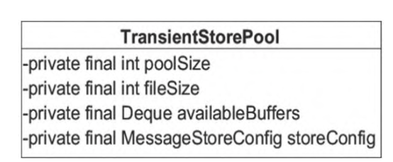

- int poolSize：avaliableBuffers个数，可在broker配置文件中通过transient StorePoolSize进行设置，默认为5。
- int fileSize：每个ByteBuffer的大小，默认为mapedFileSizeCommitLog，表明TransientStorePool为CommitLog文件服务。
- Deque availableBuffers：ByteBuffer容器，双端队列。

​		**TransientStorePool#init**

```java
	public void init() {
        for (int i = 0; i < poolSize; i++) {
            ByteBuffer byteBuffer = ByteBuffer.allocateDirect(fileSize);

            final long address = ((DirectBuffer) byteBuffer).address();
            Pointer pointer = new Pointer(address);
            LibC.INSTANCE.mlock(pointer, new NativeLong(fileSize));

            availableBuffers.offer(byteBuffer);
        }
    }
```

​		创建数量为poolSize的堆外内存，利用com.sun.jna.Library类库锁定该批内存，避免被置换到交换区，以便提高存储性能。

## RocketMQ存储文件

​		RocketMQ存储路径为${ROCKET_HOME}/store，主要存储文件如下图。

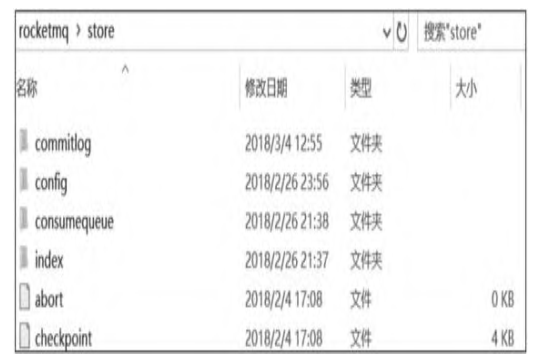

- commitlog：消息存储目录。
- config：运行期间的一些配置信息，主要包括下列信息。
  - consumerFilter.json：主题消息过滤信息。
  - consumerOffset.json：集群消费模式下的消息消费进度。
  - delayOffset.json：延时消息队列拉取进度。
  - subscriptionGroup.json：消息消费组的配置信息。
  - topics.json：topic配置属性。
- consumequeue：消息消费队列存储目录。
- index：消息索引文件存储目录。
- abort：如果存在abort文件，说明Broker非正常关闭，该文件默认在启动Broker时创建，在正常退出之前删除。
- checkpoint：检测点文件，存储CommitLog文件最后一次刷盘时间戳、ConsumeQueue最后一次刷盘时间、index文件最后一次刷盘时间戳

### CommitLog文件

​		CommitLog目录的结构已经详细介绍过了，该目录下的文件主要用于存储消息，其特点是每一条消息长度不相同。CommitLog文件存储格式如下图所示，每条消息的前面4个字节存储该条消息的总长度。

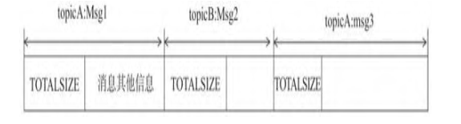

​		CommitLog文件的存储目录默认为${ROCKET_HOME}/store/commitlog，可以通过在broker配置文件中设
置storePathRootDir属性改变默认路径。CommitLog文件默认大小为1GB，可通过在broker配置文件中设置
mapedFileSizeCommitLog属性改变默认大小。本节将基于上述存储结构，重点分析消息的查找实现。

​		**CommitLog#getMinOffset**

```java
	public long getMinOffset() {
        MappedFile mappedFile = this.mappedFileQueue.getFirstMappedFile();
        if (mappedFile != null) {
            if (mappedFile.isAvailable()) {
                return mappedFile.getFileFromOffset();
            } else {
                return this.rollNextFile(mappedFile.getFileFromOffset());
            }
        }

        return -1;
    }
```

​		获取当前CommitLog目录的最小偏移量，首先获取目录下的第一个文件，如果该文件可用，则返回该文件的起始偏移量，否则返回下一个文件的起始偏移量

​		**CommitLog#rollNextFile**

```java
    public long rollNextFile(final long offset) {
        int mappedFileSize = this.defaultMessageStore.getMessageStoreConfig().getMappedFileSizeCommitLog();
        return offset + mappedFileSize - offset % mappedFileSize;
    }
```

​		根据offset返回下一个文件的起始偏移量。获取一个文件的大小，减去offset % mapped-FileSize，回到下一文件的起始偏移量

​		**CommitLog#getMessage**

```java
	public SelectMappedBufferResult getMessage(final long offset, final int size) {
        int mappedFileSize = this.defaultMessageStore.getMessageStoreConfig().getMappedFileSizeCommitLog();
        MappedFile mappedFile = this.mappedFileQueue.findMappedFileByOffset(offset, offset == 0);
        if (mappedFile != null) {
            int pos = (int) (offset % mappedFileSize);
            return mappedFile.selectMappedBuffer(pos, size);
        }
        return null;
    }
```

​		根据偏移量与消息长度查找消息。首先根据偏移找到文件所在的物理偏移量，然后用offset与文件长度取余，得到在文件内的偏移量，从该偏移量读取size长度的内容并返回。如果只根据消息偏移量查找消息，则首先找到文件内的偏移量，然后尝试读取4字节，获取消息的实际长度，最后读取指定字节

### ConsumeQueue文件

​		RocketMQ基于主题订阅模式实现消息消费，消费者关心的是一个主题下的所有消息，但同一主题的消息是不连续地存储在CommitLog文件中的。如果消息消费者直接从消息存储文件中遍历查找订阅主题下的消息，效率将极其低下。RocketMQ为了适应消息消费的检索需求，设计了ConsumeQueue文件，该文件可以看作CommitLog关于消息消费的“索引”文件，ConsumeQueue的第一级目录为消息主题，第二级目录为主题的消息队列

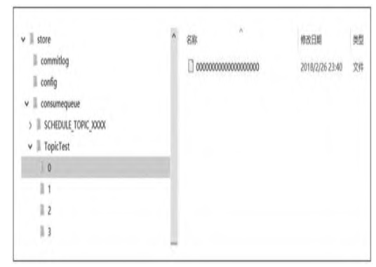

​		为了加速ConsumeQueue消息条目的检索速度并节省磁盘空间，每一个ConsumeQueue条目不会存储消息的全量信息

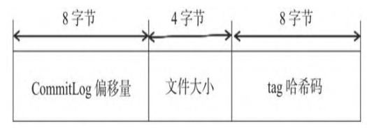

​		单个ConsumeQueue文件中默认包含30万个条目，单个文件的长度为3×$10^6$×20字节，单个ConsumeQueue文件可以看作一个ConsumeQueue条目的数组，其下标为ConsumeQueue的逻辑偏移量，消息消费进度存
储的偏移量即逻辑偏移量。ConsumeQueue即为CommitLog文件的索引文件，其构建机制是当消息到达CommitLog文件后，由专门的线程产生消息转发任务，从而构建ConsumeQueue文件与下文提到的Index文件。本节只分析如何根据消息逻辑偏移量、时间戳查找消息，4.6节将重点讨论消息消费队列的构建、恢复等内容。

​		**ConsumeQueue#getIndexBuffer**

```java
	public SelectMappedBufferResult getIndexBuffer(final long startIndex) {
        int mappedFileSize = this.mappedFileSize;
        long offset = startIndex * CQ_STORE_UNIT_SIZE;
        if (offset >= this.getMinLogicOffset()) {
            MappedFile mappedFile = this.mappedFileQueue.findMappedFileByOffset(offset);
            if (mappedFile != null) {
                SelectMappedBufferResult result = mappedFile.selectMappedBuffer((int) (offset % mappedFileSize));
                return result;
            }
        }
        return null;
    }
```

​		根据startIndex获取消息消费队列条目。通过startIndex×20得到在ConsumeQueue文件的物理偏移量，如果该偏移量小于minLogicOffset，则返回null，说明该消息已被删除，如果大于minLogicOffset，则根据偏移量定位到具体的物理文件。通过将该偏移量与物理文件的大小取模获取在该文件的偏移量，从偏移量开始连续读取20个字节即可

​		ConsumeQueue文件提供了根据消息存储时间来查找具体实现的算法getOffsetInQueue- ByTime(final long timestamp)，其具体实现如下。

1. 根据时间戳定位到物理文件，就是从第一个文件开始，找到第一个文件更新时间大于该时间戳的文件。

   **ConsumeQueue#getOffsetInQueueByTime**

   ```java
   	public long getOffsetInQueueByTime(final long timestamp) {
           MappedFile mappedFile = this.mappedFileQueue.getMappedFileByTime(timestamp);
           if (mappedFile != null) {
               long offset = 0;
               int low = minLogicOffset > mappedFile.getFileFromOffset() ? (int) (minLogicOffset - mappedFile.getFileFromOffset()) : 0;
               int high = 0;
               int midOffset = -1, targetOffset = -1, leftOffset = -1, rightOffset = -1;
               long leftIndexValue = -1L, rightIndexValue = -1L;
               long minPhysicOffset = this.defaultMessageStore.getMinPhyOffset();
               SelectMappedBufferResult sbr = mappedFile.selectMappedBuffer(0);
               if (null != sbr) {
                   ByteBuffer byteBuffer = sbr.getByteBuffer();
                   high = byteBuffer.limit() - CQ_STORE_UNIT_SIZE;
                   try {
                       while (high >= low) {
                           midOffset = (low + high) / (2 * CQ_STORE_UNIT_SIZE) * CQ_STORE_UNIT_SIZE;
                           byteBuffer.position(midOffset);
                           long phyOffset = byteBuffer.getLong();
                           int size = byteBuffer.getInt();
                           if (phyOffset < minPhysicOffset) {
                               low = midOffset + CQ_STORE_UNIT_SIZE;
                               leftOffset = midOffset;
                               continue;
                           }
   
                           long storeTime =
                               this.defaultMessageStore.getCommitLog().pickupStoreTimestamp(phyOffset, size);
                           if (storeTime < 0) {
                               return 0;
                           } else if (storeTime == timestamp) {
                               targetOffset = midOffset;
                               break;
                           } else if (storeTime > timestamp) {
                               high = midOffset - CQ_STORE_UNIT_SIZE;
                               rightOffset = midOffset;
                               rightIndexValue = storeTime;
                           } else {
                               low = midOffset + CQ_STORE_UNIT_SIZE;
                               leftOffset = midOffset;
                               leftIndexValue = storeTime;
                           }
                       }
   
                       if (targetOffset != -1) {
   
                           offset = targetOffset;
                       } else {
                           if (leftIndexValue == -1) {
   
                               offset = rightOffset;
                           } else if (rightIndexValue == -1) {
   
                               offset = leftOffset;
                           } else {
                               offset =
                                   Math.abs(timestamp - leftIndexValue) > Math.abs(timestamp
                                       - rightIndexValue) ? rightOffset : leftOffset;
                           }
                       }
   
                       return (mappedFile.getFileFromOffset() + offset) / CQ_STORE_UNIT_SIZE;
                   } finally {
                       sbr.release();
                   }
               }
           }
           return 0;
       }
   ```

2. 采用二分查找来加速检索。首先计算最低查找偏移量，取消息队列最小偏移量与该文件注销偏移量的差为最小偏移量low。获取当前存储文件中有效的最小消息物理偏移量minPhysicOffset，如果查找到的消息偏移量小于该物理偏移量，则结束该查找过程

   二分查找的常规退出循环为low>high，首先查找中间的偏移量midOffset，将ConsumeQueue文件对应的ByteBuffer定位到midOffset，然后读取4个字节，获取该消息的物理偏移量

   1. 如果得到的物理偏移量小于当前的最小物理偏移量，说明待查找消息的物理偏移量肯定大于midOffset，则将low设置为midOffset，继续折半查找。
   2. 如果得到的物理偏移量大于最小物理偏移量，说明该消息是有效消息，则根据消息偏移量和消息长度获取消息的存储时间戳。
   3. 如果存储时间小于0，则为无效消息，直接返回0。
   4. 如果存储时间戳等于待查找时间戳，说明查找到了匹配消息，则设置targetOffset并跳出循环。
   5. 如果存储时间戳大于待查找时间戳，说明待查找消息的物理偏移量小于midOffset，则设置high为midOffset，并设置rightIndexValue等于midOffset。
   6. 如果存储时间戳小于待查找时间戳，说明待查找消息的物理偏移量大于midOffset，则设置low为midOffset，并设置leftIndexValue等于midOffset。

3. 如果targetOffset不等于-1，表示找到了存储时间戳等于待查找时间戳的消息。如果leftIndexValue等于-1，表示返回当前时间戳大于待查找消息的时间戳，并且最接近待查找消息的偏移量。如果rightIndexValue等于-1，表示返回的时间戳比待查找消息的时间戳小，并且最接近待查找消息的偏移量

   ```java
   // ConsumeQueue#rollNextFile
   public long rollNextFile(final long index) {
       int mappedFileSize = this.mappedFileSize;
       int totalUnitsInFile = mappedFileSize / CQ_STORE_UNIT_SIZE;
       return index + totalUnitsInFile - index % totalUnitsInFile;
   }
   ```

   根据当前偏移量获取下一个文件的起始偏移量。首先获取文件包含多少个消息消费队列条目，减去index%totalUnitsInFile的目的是选中下一个文件的起始偏移量。

### Index文件

​		ConsumeQueue是RocketMQ专门为消息订阅构建的索引文件，目的是提高根据主题与消息队列检索消息的速度。另外，RocketMQ引入哈希索引机制为消息建立索引，HashMap的设计包含两个基本点：哈希槽与哈希冲突的链表结构。RocketMQ索引文件Index存储格式如图

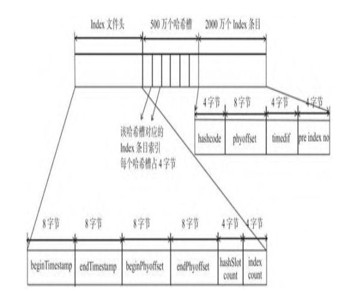

​		Index包含Index文件头、哈希槽、Index条目（数据）。Index文件头包含40字节，记录该Index的统计信息，其结构如下。

- beginTimestamp：Index文件中消息的最小存储时间。
- endTimestamp：Index文件中消息的最大存储时间。
- beginPhyoffset：Index文件中消息的最小物理偏移量（CommitLog文件偏移量）。
- endPhyoffset：Index文件中消息的最大物理偏移量（CommitLog文件偏移量）。
- hashslotCount：hashslot个数，并不是哈希槽使用的个数，在这里意义不大。
- indexCount：Index条目列表当前已使用的个数，Index条目在Index条目列表中按顺序存储。

​		一个Index默认包含500万个哈希槽。哈希槽存储的是落在该哈希槽的哈希码最新的Index索引。默认一个Index文件包含2000万个条目，每个Index条目结构如下。

- hashcode：key的哈希码。
- phyoffset：消息对应的物理偏移量。
- timedif：该消息存储时间与第一条消息的时间戳的差值，若小于0，则该消息无效。
- pre index no：该条目的前一条记录的Index索引，当出现哈希冲突时，构建链表结构

​		接下来重点分析如何将`Map<String/*消息索引key*/,long
phyOffset/*消息物理偏移量*/>`存入Index文件，以及如何根据消息索引key快速查找消息。

​		RocketMQ将消息索引键与消息偏移量的映射关系写入Index的实现方法为public boolean putKey（final String key, final long phyOffset, final long storeTimestamp），参数含义分别为消息索引、消息物理偏移量、消息存储时间

​		**IndexFile#putKey**

```java
	public boolean putKey(final String key, final long phyOffset, final long storeTimestamp) {
        if (this.indexHeader.getIndexCount() < this.indexNum) {
            int keyHash = indexKeyHashMethod(key);
            int slotPos = keyHash % this.hashSlotNum;
            int absSlotPos = IndexHeader.INDEX_HEADER_SIZE + slotPos * hashSlotSize;

            FileLock fileLock = null;

            try {

                // fileLock = this.fileChannel.lock(absSlotPos, hashSlotSize,
                // false);
                int slotValue = this.mappedByteBuffer.getInt(absSlotPos);
                if (slotValue <= invalidIndex || slotValue > this.indexHeader.getIndexCount()) {
                    slotValue = invalidIndex;
                }

                long timeDiff = storeTimestamp - this.indexHeader.getBeginTimestamp();

                timeDiff = timeDiff / 1000;

                if (this.indexHeader.getBeginTimestamp() <= 0) {
                    timeDiff = 0;
                } else if (timeDiff > Integer.MAX_VALUE) {
                    timeDiff = Integer.MAX_VALUE;
                } else if (timeDiff < 0) {
                    timeDiff = 0;
                }

                int absIndexPos =
                    IndexHeader.INDEX_HEADER_SIZE + this.hashSlotNum * hashSlotSize
                        + this.indexHeader.getIndexCount() * indexSize;

                this.mappedByteBuffer.putInt(absIndexPos, keyHash);
                this.mappedByteBuffer.putLong(absIndexPos + 4, phyOffset);
                this.mappedByteBuffer.putInt(absIndexPos + 4 + 8, (int) timeDiff);
                this.mappedByteBuffer.putInt(absIndexPos + 4 + 8 + 4, slotValue);

                this.mappedByteBuffer.putInt(absSlotPos, this.indexHeader.getIndexCount());

                if (this.indexHeader.getIndexCount() <= 1) {
                    this.indexHeader.setBeginPhyOffset(phyOffset);
                    this.indexHeader.setBeginTimestamp(storeTimestamp);
                }

                this.indexHeader.incHashSlotCount();
                this.indexHeader.incIndexCount();
                this.indexHeader.setEndPhyOffset(phyOffset);
                this.indexHeader.setEndTimestamp(storeTimestamp);

                return true;
            } catch (Exception e) {
                log.error("putKey exception, Key: " + key + " KeyHashCode: " + key.hashCode(), e);
            } finally {
                if (fileLock != null) {
                    try {
                        fileLock.release();
                    } catch (IOException e) {
                        log.error("Failed to release the lock", e);
                    }
                }
            }
        } else {
            log.warn("Over index file capacity: index count = " + this.indexHeader.getIndexCount()
                + "; index max num = " + this.indexNum);
        }

        return false;
    }
```

1. 当前已使用条目大于、等于允许最大条目数时，返回fasle，表示当前Index文件已写满。如果当前index文件未写满，则根据key算出哈希码。根据keyHash对哈希槽数量取余定位到哈希码对应的哈希槽下标，哈希码对应的哈希槽的物理地址为IndexHeader（40字节）加上下标乘以每个哈希槽的大小（4字节）

2. 读取哈希槽中存储的数据，如果哈希槽存储的数据小于0或大于当前Index文件中的索引条目，则将slotValue设置为0

3. 计算待存储消息的时间戳与第一条消息时间戳的差值，并转换成秒

4. 将条目信息存储在Index文件中

   1. 计算新添加条目的起始物理偏移量：头部字节长度+哈希槽数量×单个哈希槽大小（4个字节）+当前Index条目个数×单个Index条目大小（20个字节）。
   2. 依次将哈希码、消息物理偏移量、消息存储时间戳与Index文件时间戳、当前哈希槽的值存入MappedByteBuffer。
   3. 将当前Index文件中包含的条目数量存入哈希槽中，覆盖原先哈希槽的值。

   以上是哈希冲突链式解决方案的关键实现，哈希槽中存储的是该哈希码对应的最新Index条目的下标，新的Index条目最后4个字节存储该哈希码上一个条目的Index下标。如果哈希槽中存储的值为0或大于
   当前Index文件最大条目数或小于-1，表示该哈希槽当前并没有与之对应的Index条目。值得注意的是，Index文件条目中存储的不是消息索引key，而是消息属性key的哈希，在根据key查找时需要根据消息物理
   偏移量找到消息，进而验证消息key的值。之所以只存储哈希，而不存储具体的key，是为了将Index条目设计为定长结构，才能方便地检索与定位条目

5. 更新文件索引头信息。如果当前文件只包含一个条目，则更新beginPhyOffset、beginTimestamp、endPyhOffset、endTimestamp以及当前文件使用索引条目等信息

   **IndexFile#selectPhyOffset**

   ```java
   public void selectPhyOffset(final List<Long> phyOffsets, final String key, final int maxNum,
           final long begin, final long end, boolean lock) {
           if (this.mappedFile.hold()) {
               int keyHash = indexKeyHashMethod(key);
               int slotPos = keyHash % this.hashSlotNum;
               int absSlotPos = IndexHeader.INDEX_HEADER_SIZE + slotPos * hashSlotSize;
   
               FileLock fileLock = null;
               try {
                   if (lock) {
                       // fileLock = this.fileChannel.lock(absSlotPos,
                       // hashSlotSize, true);
                   }
   
                   int slotValue = this.mappedByteBuffer.getInt(absSlotPos);
                   // if (fileLock != null) {
                   // fileLock.release();
                   // fileLock = null;
                   // }
   
                   if (slotValue <= invalidIndex || slotValue > this.indexHeader.getIndexCount()
                       || this.indexHeader.getIndexCount() <= 1) {
                   } else {
                       for (int nextIndexToRead = slotValue; ; ) {
                           if (phyOffsets.size() >= maxNum) {
                               break;
                           }
   
                           int absIndexPos =
                               IndexHeader.INDEX_HEADER_SIZE + this.hashSlotNum * hashSlotSize
                                   + nextIndexToRead * indexSize;
   
                           int keyHashRead = this.mappedByteBuffer.getInt(absIndexPos);
                           long phyOffsetRead = this.mappedByteBuffer.getLong(absIndexPos + 4);
   
                           long timeDiff = (long) this.mappedByteBuffer.getInt(absIndexPos + 4 + 8);
                           int prevIndexRead = this.mappedByteBuffer.getInt(absIndexPos + 4 + 8 + 4);
   
                           if (timeDiff < 0) {
                               break;
                           }
   
                           timeDiff *= 1000L;
   
                           long timeRead = this.indexHeader.getBeginTimestamp() + timeDiff;
                           boolean timeMatched = (timeRead >= begin) && (timeRead <= end);
   
                           if (keyHash == keyHashRead && timeMatched) {
                               phyOffsets.add(phyOffsetRead);
                           }
   
                           if (prevIndexRead <= invalidIndex
                               || prevIndexRead > this.indexHeader.getIndexCount()
                               || prevIndexRead == nextIndexToRead || timeRead < begin) {
                               break;
                           }
   
                           nextIndexToRead = prevIndexRead;
                       }
                   }
               } catch (Exception e) {
                   log.error("selectPhyOffset exception ", e);
               } finally {
                   if (fileLock != null) {
                       try {
                           fileLock.release();
                       } catch (IOException e) {
                           log.error("Failed to release the lock", e);
                       }
                   }
   
                   this.mappedFile.release();
               }
           }
       }
   ```

   RocketMQ根据索引key查找消息的实现方法为selectPhyOffset(List<Long> phy Offsets, String key, int maxNum,long begin, long end)，其参数说明如下

   - List<Long> phyOffsets：查找到的消息物理偏移量。
   - String key：索引key。
   - int maxNum：本次查找最大消息条数。
   - long begin：开始时间戳。
   - long end：结束时间戳

   1. 根据key算出key的哈希码，keyHash对哈希槽数量取余，定位到哈希码对应的哈希槽下标，哈希槽的物理地址为IndexHeader（40字节）加上下标乘以每个哈希槽的大小（4字节）
   2. 如果对应的哈希槽中存储的数据小于1或大于当前索引条目个数，表示该哈希码没有对应的条目，直接返回
   3. 因为会存在哈希冲突，所以根据slotValue定位该哈希槽最新的一个Item条目，将存储的物理偏移量加入phyOffsets，然后继续验证Item条目中存储的上一个Index下标，如果大于、等于1并且小于当前文件的最大条目数，则继续查找，否则结束查找
   4. 根据Index下标定位到条目的起始物理偏移量，然后依次读取哈希码、物理偏移量、时间戳、上一个条目的Index下标
   5. 如果存储的时间戳小于0，则直接结束查找。如果哈希匹配并且消息存储时间介于待查找时间start、end之间，则将消息物理偏移量加入phyOffsets，并验证条目的前一个Index索引，如果索引大于、等于1并且小于Index条目数，则继续查找，否则结束查找。

### checkpoint文件

​		checkpoint（检查点）文件的作用是记录ComitLog、ConsumeQueue、Index文件的刷盘时间点，文件固定长度为4KB，其中只用该文件的前面24字节

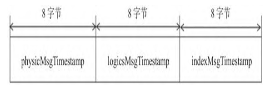

- physicMsgTimestamp：CommitLog文件刷盘时间点。
- logicsMsgTimestamp：ConsumeQueue文件刷盘时间点。
- indexMsgTimestamp：Index文件刷盘时间点。

## 实时更新ConsumeQueue与Index文件

​		因为ConsumeQueue文件、Index文件都是基于CommitLog文件构建的，所以当消息生产者提交的消息存储到CommitLog文件中时，ConsumeQueue文件、Index文件需要及时更新，否则消息无法及时被消费，根据消息属性查找消息也会出现较大延迟。RocketMQ通过开启一个线程ReputMessageServcie来准实时转发CommitLog文件的更新事件，相应的任务处理器根据转发的消息及时更新ConsumeQueue文件、Index文件

​		**DefaultMessageStore#start**

```java
public void start() throws Exception {

        lock = lockFile.getChannel().tryLock(0, 1, false);
        if (lock == null || lock.isShared() || !lock.isValid()) {
            throw new RuntimeException("Lock failed,MQ already started");
        }

        lockFile.getChannel().write(ByteBuffer.wrap("lock".getBytes()));
        lockFile.getChannel().force(true);
        {
            /**
             * 1. Make sure the fast-forward messages to be truncated during the recovering according to the max physical offset of the commitlog;
             * 2. DLedger committedPos may be missing, so the maxPhysicalPosInLogicQueue maybe bigger that maxOffset returned by DLedgerCommitLog, just let it go;
             * 3. Calculate the reput offset according to the consume queue;
             * 4. Make sure the fall-behind messages to be dispatched before starting the commitlog, especially when the broker role are automatically changed.
             */
            long maxPhysicalPosInLogicQueue = commitLog.getMinOffset();
            for (ConcurrentMap<Integer, ConsumeQueue> maps : this.consumeQueueTable.values()) {
                for (ConsumeQueue logic : maps.values()) {
                    if (logic.getMaxPhysicOffset() > maxPhysicalPosInLogicQueue) {
                        maxPhysicalPosInLogicQueue = logic.getMaxPhysicOffset();
                    }
                }
            }
            if (maxPhysicalPosInLogicQueue < 0) {
                maxPhysicalPosInLogicQueue = 0;
            }
            if (maxPhysicalPosInLogicQueue < this.commitLog.getMinOffset()) {
                maxPhysicalPosInLogicQueue = this.commitLog.getMinOffset();
                /**
                 * This happens in following conditions:
                 * 1. If someone removes all the consumequeue files or the disk get damaged.
                 * 2. Launch a new broker, and copy the commitlog from other brokers.
                 *
                 * All the conditions has the same in common that the maxPhysicalPosInLogicQueue should be 0.
                 * If the maxPhysicalPosInLogicQueue is gt 0, there maybe something wrong.
                 */
                log.warn("[TooSmallCqOffset] maxPhysicalPosInLogicQueue={} clMinOffset={}", maxPhysicalPosInLogicQueue, this.commitLog.getMinOffset());
            }
            log.info("[SetReputOffset] maxPhysicalPosInLogicQueue={} clMinOffset={} clMaxOffset={} clConfirmedOffset={}",
                maxPhysicalPosInLogicQueue, this.commitLog.getMinOffset(), this.commitLog.getMaxOffset(), this.commitLog.getConfirmOffset());
            this.reputMessageService.setReputFromOffset(maxPhysicalPosInLogicQueue);
            this.reputMessageService.start();

            /**
             *  1. Finish dispatching the messages fall behind, then to start other services.
             *  2. DLedger committedPos may be missing, so here just require dispatchBehindBytes <= 0
             */
            while (true) {
                if (dispatchBehindBytes() <= 0) {
                    break;
                }
                Thread.sleep(1000);
                log.info("Try to finish doing reput the messages fall behind during the starting, reputOffset={} maxOffset={} behind={}", this.reputMessageService.getReputFromOffset(), this.getMaxPhyOffset(), this.dispatchBehindBytes());
            }
            this.recoverTopicQueueTable();
        }

        if (!messageStoreConfig.isEnableDLegerCommitLog()) {
            this.haService.start();
            this.handleScheduleMessageService(messageStoreConfig.getBrokerRole());
        }

        this.flushConsumeQueueService.start();
        this.commitLog.start();
        this.storeStatsService.start();

        this.createTempFile();
        this.addScheduleTask();
        this.shutdown = false;
    }
```

​		Broker服务器在启动时会启动ReputMessageService线程，并初始化一个非常关键的参数reputFromOffset，该参数的含义是ReputMessageService从哪个物理偏移量开始转发消息给ConsumeQueue
和Index文件。如果允许重复转发，将reputFromOffset设置为CommitLog文件的提交指针。如果不允许重复转发，将reputFromOffset设置为CommitLog文件的内存中最大偏移量

​		**DefaultMessageStore#run**

```java
	public void run() {
            DefaultMessageStore.log.info(this.getServiceName() + " service started");

            while (!this.isStopped()) {
                try {
                    int interval = DefaultMessageStore.this.getMessageStoreConfig().getFlushIntervalConsumeQueue();
                    this.waitForRunning(interval);
                    this.doFlush(1);
                } catch (Exception e) {
                    DefaultMessageStore.log.warn(this.getServiceName() + " service has exception. ", e);
                }
            }

            this.doFlush(RETRY_TIMES_OVER);

            DefaultMessageStore.log.info(this.getServiceName() + " service end");
        }
```

​		ReputMessageService线程每执行一次任务推送，休息1ms后继续尝试推送消息到Consume Queue和Index文件中，消息消费转发由doReput()方法实现。

​		**DefaultMessageStore#doReput**

```java
private void doReput() {
            if (this.reputFromOffset < DefaultMessageStore.this.commitLog.getMinOffset()) {
                log.warn("The reputFromOffset={} is smaller than minPyOffset={}, this usually indicate that the dispatch behind too much and the commitlog has expired.",
                    this.reputFromOffset, DefaultMessageStore.this.commitLog.getMinOffset());
                this.reputFromOffset = DefaultMessageStore.this.commitLog.getMinOffset();
            }
            for (boolean doNext = true; this.isCommitLogAvailable() && doNext; ) {

                if (DefaultMessageStore.this.getMessageStoreConfig().isDuplicationEnable()
                    && this.reputFromOffset >= DefaultMessageStore.this.getConfirmOffset()) {
                    break;
                }

                SelectMappedBufferResult result = DefaultMessageStore.this.commitLog.getData(reputFromOffset);
                if (result != null) {
                    try {
                        this.reputFromOffset = result.getStartOffset();

                        for (int readSize = 0; readSize < result.getSize() && doNext; ) {
                            DispatchRequest dispatchRequest =
                                DefaultMessageStore.this.commitLog.checkMessageAndReturnSize(result.getByteBuffer(), false, false);
                            int size = dispatchRequest.getBufferSize() == -1 ? dispatchRequest.getMsgSize() : dispatchRequest.getBufferSize();

                            if (dispatchRequest.isSuccess()) {
                                if (size > 0) {
                                    DefaultMessageStore.this.doDispatch(dispatchRequest);

                                    if (BrokerRole.SLAVE != DefaultMessageStore.this.getMessageStoreConfig().getBrokerRole()
                                        && DefaultMessageStore.this.brokerConfig.isLongPollingEnable()) {
                                        DefaultMessageStore.this.messageArrivingListener.arriving(dispatchRequest.getTopic(),
                                            dispatchRequest.getQueueId(), dispatchRequest.getConsumeQueueOffset() + 1,
                                            dispatchRequest.getTagsCode(), dispatchRequest.getStoreTimestamp(),
                                            dispatchRequest.getBitMap(), dispatchRequest.getPropertiesMap());
                                    }

                                    this.reputFromOffset += size;
                                    readSize += size;
                                    if (DefaultMessageStore.this.getMessageStoreConfig().getBrokerRole() == BrokerRole.SLAVE) {
                                        DefaultMessageStore.this.storeStatsService
                                            .getSinglePutMessageTopicTimesTotal(dispatchRequest.getTopic()).incrementAndGet();
                                        DefaultMessageStore.this.storeStatsService
                                            .getSinglePutMessageTopicSizeTotal(dispatchRequest.getTopic())
                                            .addAndGet(dispatchRequest.getMsgSize());
                                    }
                                } else if (size == 0) {
                                    this.reputFromOffset = DefaultMessageStore.this.commitLog.rollNextFile(this.reputFromOffset);
                                    readSize = result.getSize();
                                }
                            } else if (!dispatchRequest.isSuccess()) {

                                if (size > 0) {
                                    log.error("[BUG]read total count not equals msg total size. reputFromOffset={}", reputFromOffset);
                                    this.reputFromOffset += size;
                                } else {
                                    doNext = false;
                                    // If user open the dledger pattern or the broker is master node,
                                    // it will not ignore the exception and fix the reputFromOffset variable
                                    if (DefaultMessageStore.this.getMessageStoreConfig().isEnableDLegerCommitLog() ||
                                        DefaultMessageStore.this.brokerConfig.getBrokerId() == MixAll.MASTER_ID) {
                                        log.error("[BUG]dispatch message to consume queue error, COMMITLOG OFFSET: {}",
                                            this.reputFromOffset);
                                        this.reputFromOffset += result.getSize() - readSize;
                                    }
                                }
                            }
                        }
                    } finally {
                        result.release();
                    }
                } else {
                    doNext = false;
                }
            }
        }
```

1. 返回reputFromOffset偏移量开始的全部有效数据（CommitLog文件）。然后循环读取每一条消息

2. 从result返回的ByteBuffer中循环读取消息，一次读取一条，创建Dispatch Request对象。DispatchRequest类图如下图所示，如果消息长度大于0，则调用doDispatch()方法。最终将分别调用CommitLogDispatcherBuildConsumeQueue（构建消息消费队列）、CommitLogDispatcherBuildIndex（构建索引文件）

   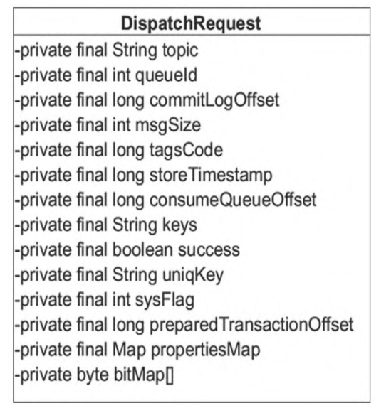

   - String topic：消息主题名称。
   - int queueId：消息队列ID。
   - long commitLogOffset：消息物理偏移量。
   - int msgSize：消息长度。
   - long tagsCode：消息过滤tag哈希码。
   - long storeTimestamp：消息存储时间戳。
   - long consumeQueueOffset：消息队列偏移量。
   - String keys：消息索引key。多个索引key用空格隔开，例如key1 key2。
   - boolean success：是否成功解析到完整的消息。
   - String uniqKey：消息唯一键。
   - int sysFlag：消息系统标记。
   - long preparedTransactionOffset：消息预处理事务偏移量。
   - Map propertiesMap：消息属性。
   - byte bitMap[]：位图

### 根据消息更新ConsumeQueue文件

​		消息消费队列转发任务实现类为CommitLogDispatcherBuildConsumeQueue，内部最终将调用
putMessagePositionInfo()方法

​		**DefaultMessageStore#putMessagePositionInfo**

```java
public void putMessagePositionInfo(DispatchRequest dispatchRequest) {
        ConsumeQueue cq = this.findConsumeQueue(dispatchRequest.getTopic(), dispatchRequest.getQueueId());
        cq.putMessagePositionInfoWrapper(dispatchRequest);
    }
```

1. 根据消息主题与队列ID，先获取对应的ConsumeQueue文件，其逻辑比较简单，因为每一个消息主题对应一个ConsumeQueue目录，主题下每一个消息队列对应一个文件夹，所以取出该文件夹最后的ConsumeQueue文件即可

   **ConsumeQueue#putMessagePositionInfo**

   ```java
   public long getOffsetInQueueByTime(final long timestamp) {
           MappedFile mappedFile = this.mappedFileQueue.getMappedFileByTime(timestamp);
           if (mappedFile != null) {
               long offset = 0;
               int low = minLogicOffset > mappedFile.getFileFromOffset() ? (int) (minLogicOffset - mappedFile.getFileFromOffset()) : 0;
               int high = 0;
               int midOffset = -1, targetOffset = -1, leftOffset = -1, rightOffset = -1;
               long leftIndexValue = -1L, rightIndexValue = -1L;
               long minPhysicOffset = this.defaultMessageStore.getMinPhyOffset();
               SelectMappedBufferResult sbr = mappedFile.selectMappedBuffer(0);
               if (null != sbr) {
                   ByteBuffer byteBuffer = sbr.getByteBuffer();
                   high = byteBuffer.limit() - CQ_STORE_UNIT_SIZE;
                   try {
                       while (high >= low) {
                           midOffset = (low + high) / (2 * CQ_STORE_UNIT_SIZE) * CQ_STORE_UNIT_SIZE;
                           byteBuffer.position(midOffset);
                           long phyOffset = byteBuffer.getLong();
                           int size = byteBuffer.getInt();
                           if (phyOffset < minPhysicOffset) {
                               low = midOffset + CQ_STORE_UNIT_SIZE;
                               leftOffset = midOffset;
                               continue;
                           }
   
                           long storeTime =
                               this.defaultMessageStore.getCommitLog().pickupStoreTimestamp(phyOffset, size);
                           if (storeTime < 0) {
                               return 0;
                           } else if (storeTime == timestamp) {
                               targetOffset = midOffset;
                               break;
                           } else if (storeTime > timestamp) {
                               high = midOffset - CQ_STORE_UNIT_SIZE;
                               rightOffset = midOffset;
                               rightIndexValue = storeTime;
                           } else {
                               low = midOffset + CQ_STORE_UNIT_SIZE;
                               leftOffset = midOffset;
                               leftIndexValue = storeTime;
                           }
                       }
   
                       if (targetOffset != -1) {
   
                           offset = targetOffset;
                       } else {
                           if (leftIndexValue == -1) {
   
                               offset = rightOffset;
                           } else if (rightIndexValue == -1) {
   
                               offset = leftOffset;
                           } else {
                               offset =
                                   Math.abs(timestamp - leftIndexValue) > Math.abs(timestamp
                                       - rightIndexValue) ? rightOffset : leftOffset;
                           }
                       }
   
                       return (mappedFile.getFileFromOffset() + offset) / CQ_STORE_UNIT_SIZE;
                   } finally {
                       sbr.release();
                   }
               }
           }
           return 0;
       }
   ```

2. 依次将消息偏移量、消息长度、tag哈希码写入ByteBuffer，并根据consume-QueueOffset计算ConsumeQueue中的物理地址，将内容追加到ConsumeQueue的内存映射文件中（本操作只追加，不刷盘），ConsumeQueue的刷盘方式固定为异步刷盘。

### 根据消息更新Index文件

​		哈希索引文件转发任务实现类为CommitLogDispatcherBuildIndex

​		**CommitLogDispatcherBuildIndex#dispatch**

```java
class CommitLogDispatcherBuildIndex implements CommitLogDispatcher {

        @Override
        public void dispatch(DispatchRequest request) {
            if (DefaultMessageStore.this.messageStoreConfig.isMessageIndexEnable()) {
                DefaultMessageStore.this.indexService.buildIndex(request);
            }
        }
    }
```

​		如果messsageIndexEnable设置为true，则调用IndexService#buildIndex构建哈希索引，否则忽略本次转发任务

​		**IndexService#buildIndex**

```java
	public void buildIndex(DispatchRequest req) {
        IndexFile indexFile = retryGetAndCreateIndexFile();
        if (indexFile != null) {
            long endPhyOffset = indexFile.getEndPhyOffset();
            DispatchRequest msg = req;
            String topic = msg.getTopic();
            String keys = msg.getKeys();
            if (msg.getCommitLogOffset() < endPhyOffset) {
                return;
            }

            final int tranType = MessageSysFlag.getTransactionValue(msg.getSysFlag());
            switch (tranType) {
                case MessageSysFlag.TRANSACTION_NOT_TYPE:
                case MessageSysFlag.TRANSACTION_PREPARED_TYPE:
                case MessageSysFlag.TRANSACTION_COMMIT_TYPE:
                    break;
                case MessageSysFlag.TRANSACTION_ROLLBACK_TYPE:
                    return;
            }

            if (req.getUniqKey() != null) {
                indexFile = putKey(indexFile, msg, buildKey(topic, req.getUniqKey()));
                if (indexFile == null) {
                    log.error("putKey error commitlog {} uniqkey {}", req.getCommitLogOffset(), req.getUniqKey());
                    return;
                }
            }

            if (keys != null && keys.length() > 0) {
                String[] keyset = keys.split(MessageConst.KEY_SEPARATOR);
                for (int i = 0; i < keyset.length; i++) {
                    String key = keyset[i];
                    if (key.length() > 0) {
                        indexFile = putKey(indexFile, msg, buildKey(topic, key));
                        if (indexFile == null) {
                            log.error("putKey error commitlog {} uniqkey {}", req.getCommitLogOffset(), req.getUniqKey());
                            return;
                        }
                    }
                }
            }
        } else {
            log.error("build index error, stop building index");
        }
    }
```

1. 获取或创建Index文件并获取所有文件最大的物理偏移量。如果该消息的物理偏移量小于Index文件中的物理偏移量，则说明是重复数据，忽略本次索引构建
2. 如果消息的唯一键不为空，则添加到哈希索引中，以便加速根据唯一键检索消息
3. 构建索引键，RocketMQ支持为同一个消息建立多个索引，多个索引键用空格分开

## ConsumeQueue与Index文件恢复