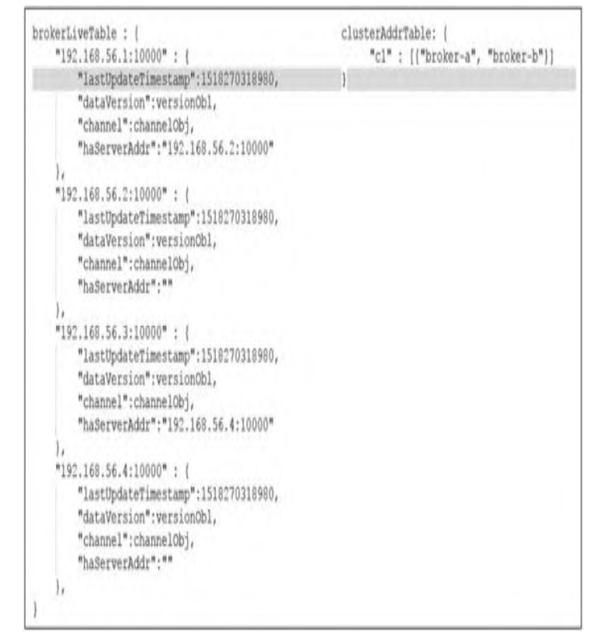

---

typora-copy-images-to: assets
typora-root-url: ./
---

> 《RocketMQ技术内幕 RocketMQ架构设计与实现原理 第二版》

# 前言
- 勘误：https://blog.csdn.net/prestigeding/article/details/85233529
## IDEA获取RocketMQ源码工程
1. 打开IDEA，选择`Projects from Version Control`，网址为https://github.com/apache/rocketmq.git
2. 这里以OpenJDK 8和Maven构建，这里调试的是rocketmq 4.6.0的代码，可以签出为新的study分支`git checkout -b study rocketmq-all-4.6.0`
3. 执行Maven命令clean install，下载并编译依赖
	- 注意：如果是自己在终端执行maven命令，则需暂时将JAVA_HOME环境变量设置为JDK8的路径
	- 跳过单元测试的编译命令`mvn clean install -DskipTests`或`mvn clean install -Dmaven.test.skip=true`
## IDEA调试RocketMQ源码
1. **启动NameServer**
	
	1. 展开namesrv模块，找到NamesrvStartup.java启动类
	
	2. 设置一些环境变量
	
	   ```
	   ROCKETMQ_HOME 即工程的根目录
	   ```
	
	3. 在RocketMQ运行主目录中创建conf、logs、store文件夹。
	
	4. 从RocketMQ distribution部署目录中将broker.conf、logback_broker.xml、logback_namesrv.xml等文件复制到conf目录中，按需修改logback_broker.xml、logback_namesrv.xml文件中日志文件的目录，broker.conf文件目录内容如代码
	
	   ```
	   brokerClusterName=DefaultCluster
	   brokerName=broker-a
	   brokerId=0
	   #nameServer地址，分号分割
	   namesrvAddr=127.0.0.1:9876
	   deleteWhen=04
	   fileReservedTime=48
	   brokerRole=ASYNC_MASTER
	   flushDiskType=ASYNC_FLUSH
	   # 存储路径
	   storePathRootDir=/mnt/sda2/Projects/RocketMQ/rocketmq-source-code/namesrv/store
	   #CommitLog存储路径
	   storePathCommitLog=/mnt/sda2/Projects/RocketMQ/rocketmq-source-code/namesrv/store/commitlog
	   # 消费队列存储路径
	   storePathConsumeQueue=/mnt/sda2/Projects/RocketMQ/rocketmq-source-code/namesrv/store/consumequeue
	   # 消息索引存储路径
	   storePathIndex=/mnt/sda2/Projects/RocketMQ/rocketmq-source-code/namesrv/store/index
	   #checkpoint文件存储路径
	   storeCheckpoint=/mnt/sda2/Projects/RocketMQ/rocketmq-source-code/namesrv/store/checkpoint
	   #abort文件存储路径
	   abortFile=/mnt/sda2/Projects/RocketMQ/rocketmq-source-code/namesrv/store/abort
	   ```
	
	5. 在IntelliJ IDEA Debug中运行NamesrvStartup，并输出“The Name Server boot success. Serializetype=JSON”
	
2. **启动Broker**

  1. 展开Broker模块，鼠标右键执行BrokerStartup.java，会提示需要配置ROCKETMQ_HOME。在idea右上角选中DebugConfigurations，在弹出的界面中选择arguments选项卡，配置-c属性，指定broker配置文件的路径

  2. 以Debug模式运行BrokerStartup.java，查看${ROCKET_HOME}/logs/broker. log文件，未报错则表示Broker启动成功

    > 这里其实与你的配置有关，不一定是这里说明的路径

3. 使用RocketMQ提供的实例验证消息发送与消息消费

  1. 修改org.apache.rocketmq.example.quickstart.Producer示例程序，设置消息生产者的NameServer地址

    ```java
    /*
     * Licensed to the Apache Software Foundation (ASF) under one or more
     * contributor license agreements.  See the NOTICE file distributed with
     * this work for additional information regarding copyright ownership.
     * The ASF licenses this file to You under the Apache License, Version 2.0
     * (the "License"); you may not use this file except in compliance with
     * the License.  You may obtain a copy of the License at
     *
     *     http://www.apache.org/licenses/LICENSE-2.0
     *
     * Unless required by applicable law or agreed to in writing, software
     * distributed under the License is distributed on an "AS IS" BASIS,
     * WITHOUT WARRANTIES OR CONDITIONS OF ANY KIND, either express or implied.
     * See the License for the specific language governing permissions and
     * limitations under the License.
     */
    package org.apache.rocketmq.example.quickstart;
    
    import org.apache.rocketmq.client.exception.MQClientException;
    import org.apache.rocketmq.client.producer.DefaultMQProducer;
    import org.apache.rocketmq.client.producer.SendResult;
    import org.apache.rocketmq.common.message.Message;
    import org.apache.rocketmq.remoting.common.RemotingHelper;
    
    /**
     * This class demonstrates how to send messages to brokers using provided {@link DefaultMQProducer}.
     */
    public class Producer {
        public static void main(String[] args) throws MQClientException, InterruptedException {
    
            /*
             * Instantiate with a producer group name.
             */
            DefaultMQProducer producer = new DefaultMQProducer("please_rename_unique_group_name");
            producer.setNamesrvAddr("127.0.0.1:9876");
            /*
             * Specify name server addresses.
             * <p/>
             *
             * Alternatively, you may specify name server addresses via exporting environmental variable: NAMESRV_ADDR
             * <pre>
             * {@code
             * producer.setNamesrvAddr("name-server1-ip:9876;name-server2-ip:9876");
             * }
             * </pre>
             */
    
            /*
             * Launch the instance.
             */
            producer.start();
    
            for (int i = 0; i < 1; i++) {
                try {
    
                    /*
                     * Create a message instance, specifying topic, tag and message body.
                     */
                    Message msg = new Message("TopicTest" /* Topic */,
                        "TagA" /* Tag */,
                        ("Hello RocketMQ " + i).getBytes(RemotingHelper.DEFAULT_CHARSET) /* Message body */
                    );
    
                    /*
                     * Call send message to deliver message to one of brokers.
                     */
                    SendResult sendResult = producer.send(msg);
    
                    System.out.printf("%s%n", sendResult);
                } catch (Exception e) {
                    e.printStackTrace();
                    Thread.sleep(1000);
                }
            }
    
            /*
             * Shut down once the producer instance is not longer in use.
             */
            producer.shutdown();
        }
    }
    ```

    运行示例程序，查看运行结果，如果输出结果类似如下所示，则表示消息发送成功

    ```
    SendResult [sendStatus=SEND_OK, msgId=FE8000000000000038ABE5FFFED4CBD2001518B4AAC219B9B5640000, offsetMsgId=AC11000100002A9F0000000000000000, messageQueue=MessageQueue [topic=TopicTest, brokerName=broker-a, queueId=0], queueOffset=0]
    23:53:21.077 [NettyClientSelector_1] INFO  RocketmqRemoting - closeChannel: close the connection to remote address[172.17.0.1:10911] result: true
    23:53:21.079 [NettyClientSelector_1] INFO  RocketmqRemoting - closeChannel: close the connection to remote address[127.0.0.1:9876] result: true
    ```

  2. 修改org.apache.rocketmq.example.quickstart.Consumer示例程序，设置消息消费者的NameServer地址

    ```java
    /*
     * Licensed to the Apache Software Foundation (ASF) under one or more
     * contributor license agreements.  See the NOTICE file distributed with
     * this work for additional information regarding copyright ownership.
     * The ASF licenses this file to You under the Apache License, Version 2.0
     * (the "License"); you may not use this file except in compliance with
     * the License.  You may obtain a copy of the License at
     *
     *     http://www.apache.org/licenses/LICENSE-2.0
     *
     * Unless required by applicable law or agreed to in writing, software
     * distributed under the License is distributed on an "AS IS" BASIS,
     * WITHOUT WARRANTIES OR CONDITIONS OF ANY KIND, either express or implied.
     * See the License for the specific language governing permissions and
     * limitations under the License.
     */
    package org.apache.rocketmq.example.quickstart;
    
    import java.util.List;
    import org.apache.rocketmq.client.consumer.DefaultMQPushConsumer;
    import org.apache.rocketmq.client.consumer.listener.ConsumeConcurrentlyContext;
    import org.apache.rocketmq.client.consumer.listener.ConsumeConcurrentlyStatus;
    import org.apache.rocketmq.client.consumer.listener.MessageListenerConcurrently;
    import org.apache.rocketmq.client.exception.MQClientException;
    import org.apache.rocketmq.common.consumer.ConsumeFromWhere;
    import org.apache.rocketmq.common.message.MessageExt;
    
    /**
     * This example shows how to subscribe and consume messages using providing {@link DefaultMQPushConsumer}.
     */
    public class Consumer {
    
        public static void main(String[] args) throws InterruptedException, MQClientException {
    
            /*
             * Instantiate with specified consumer group name.
             */
            DefaultMQPushConsumer consumer = new DefaultMQPushConsumer("please_rename_unique_group_name_4");
    		consumer.setNamesrvAddr("127.0.0.1:9876");
            /*
             * Specify name server addresses.
             * <p/>
             *
             * Alternatively, you may specify name server addresses via exporting environmental variable: NAMESRV_ADDR
             * <pre>
             * {@code
             * consumer.setNamesrvAddr("name-server1-ip:9876;name-server2-ip:9876");
             * }
             * </pre>
             */
    
            /*
             * Specify where to start in case the specified consumer group is a brand new one.
             */
            consumer.setConsumeFromWhere(ConsumeFromWhere.CONSUME_FROM_FIRST_OFFSET);
    
            /*
             * Subscribe one more more topics to consume.
             */
            consumer.subscribe("TopicTest", "*");
    
            /*
             *  Register callback to execute on arrival of messages fetched from brokers.
             */
            consumer.registerMessageListener(new MessageListenerConcurrently() {
    
                @Override
                public ConsumeConcurrentlyStatus consumeMessage(List<MessageExt> msgs,
                    ConsumeConcurrentlyContext context) {
                    System.out.printf("%s Receive New Messages: %s %n", Thread.currentThread().getName(), msgs);
                    return ConsumeConcurrentlyStatus.CONSUME_SUCCESS;
                }
            });
    
            /*
             *  Launch the consumer instance.
             */
            consumer.start();
    
            System.out.printf("Consumer Started.%n");
        }
    }
    
    ```

    运行消息消费者程序，如果输出类似如下所示消息，则表示消息消费成功

    ```
    Consumer Started.
    ConsumeMessageThread_1 Receive New Messages: [MessageExt [queueId=0, storeSize=225, queueOffset=0, sysFlag=0, bornTimestamp=1693929200997, bornHost=/192.168.31.72:34790, storeTimestamp=1693929201030, storeHost=/172.17.0.1:10911, msgId=AC11000100002A9F0000000000000000, commitLogOffset=0, bodyCRC=613185359, reconsumeTimes=0, preparedTransactionOffset=0, toString()=Message{topic='TopicTest', flag=0, properties={MIN_OFFSET=0, MAX_OFFSET=1, CONSUME_START_TIME=1693929338539, UNIQ_KEY=FE8000000000000038ABE5FFFED4CBD2001518B4AAC219B9B5640000, CLUSTER=DefaultCluster, WAIT=true, TAGS=TagA}, body=[72, 101, 108, 108, 111, 32, 82, 111, 99, 107, 101, 116, 77, 81, 32, 48], transactionId='null'}]] 
    ```

## RocketMQ源码的目录结构

​		RocketMQ源码组织方式基于Maven模块组织，RocketMQ核心目录说明如下

- acl：权限控制模块。
- broker：broker模块（broker启动进程）。
- client：消息客户端，包含消息生产者和消息消费者相关类。
- common：公共包。
- dev：开发者信息（非源码）。
- distribution：打包分发目录（非源码）。
- example：RocketMQ示例代码。
- filter：消息过滤相关基础类。
- logappender：日志实现相关类。
- logging：自主实现日志相关类。
- namesrv：NameServer实现相关类（NameServer启动进程）。
- openmessaging：消息开放标准，已发布。
- remoting：远程通信模块，基于Netty。
- srvutil：服务器工具类。
- store：消息存储实现相关类。
- style：checkstyle相关实现。
- test：测试相关类。
- tools：工具类，监控命令相关实现类。

## RocketMQ的设计理念和设计目标

### 设计理念

​		RocketMQ设计基于主题的发布与订阅模式，其核心功能包括消息发送、消息存储和消息消费，整体设计追求简单和性能高效，主要体现在如下3个方面。

​		首先，NameServer的设计极其简单，摒弃了业界常用的将ZooKeeper作为信息管理的“注册中心”，而是自研NameServer实现元数据的管理（topic路由信息等）。从实际需求出发，topic路由信息无须在集群之间保持强一致，而是追求最终一致性，并且能容忍分钟级的不一致。正是基于这种特性，RocketMQ的NameServer集群之间互不通信，这样极大地降低了NameServer实现的复杂度，对网络的要求也降低了不少，性能相比较ZooKeeper还有了极大的提升。

​		其次是高效的I/O存储机制。RocketMQ追求消息发送的高吞吐量，RocketMQ的消息存储文件被设计成文件组的概念，组内单个文件大小固定，方便引入内存映射机制，所有主题的消息存储按顺序编写，极大地提升了消息的写性能。同时为了兼顾消息消费与消息查找，引入了消息消费队列文件与索引文件。

​		最后是容忍存在设计缺陷，适当将某些工作下放给RocketMQ使用者。消息中间件的实现者经常会遇到一个难题：如何保证消息一定能被消息消费者消费，并且只消费一次？

​		RocketMQ的设计者给出的解决办法是不解决这个难题，而是退而求其次，只保证消息被消费者消费，在设计上允许消息被重复消费。这样极大地简化了消息中间件的内核，使得实现消息发送高可用变得非常简单和高效，消息重复问题由消费者在消息消费时实现幂等

### 设计目标

​		作为一款消息中间件，RocketMQ需要解决如下问题

- **架构模式**：RocketMQ与大部分消息中间件一样，采用发布订阅模式，主要参与组件包括：消息发送者、消息服务器（消息存储）、消息消费和路由发现。

- **顺序消息**：所谓顺序消息，就是消息消费者按照消息达到消息存储服务器的顺序消费。RocketMQ可以严格保证消息有序。

- **消息过滤**：消息过滤是指在消息消费时，消息消费者可以对同一主题下的消息按照规则只消费自己感兴趣的消息。RocketMQ消息过滤是由服务端和消费端共同完成的。

- **消息存储**：消息中间件的一个核心实现是消息的存储，对于消息存储一般有如下两个维度的考量：消息堆积能力和消息存储性能。RocketMQ追求消息存储的高性能，引入内存映射机制，所有主题的消息按顺序存储在同一个文件中。同时为了避免消息在消息存储服务器中无限地累积，引入了消息文件过期机制与文件存储空间报警机制。

- **消息高可用性**：通常影响消息可靠性的有以下几种情况

  - Broker异常崩溃。
  - 操作系统崩溃。
  - 机器断电，但是能立即恢复供电。
  - 机器无法开机（可能是CPU、主板、内存等关键设备损坏）。
  - 磁盘设备损坏

  对于前3种情况，RocketMQ在同步刷盘模式下可以确保不丢失消息，在异步刷盘模式下，会丢失少量消息。后2种情况属于单点故障，一旦发生，该节点上的消息会全部丢失。如果开启了异步复制机制，RoketMQ能保证只丢失少量消息。

- **消息到达（消费）低延迟**：RocketMQ在消息不发生堆积时，以长轮询模式实现准实时的消息推送模式。

- **确保消息必须被消费一次**：RocketMQ通过消息消费确认机制（ACK）确保消息至少被消费一次，因为ACK消息有可能出现丢失等情况，RocketMQ无法做到消息只被消费一次，所以有重复消费的可能。

- **回溯消息**：回溯消息是指消息消费端已经消费成功，根据业务要求，需要重新消费消息。RocketMQ支持按时间向前或向后回溯消息，时间维度可精确到毫秒。

- **消息堆积**：消息中间件的主要功能是异步解耦，必须能应对前端的数据洪峰，提高后端系统的可用性，这必然要求消息中间件具备一定的消息堆积能力。RocketMQ使用磁盘文件存储消息（内存映射机制），并且在物理布局上为多个大小相等的文件组成逻辑文件组，可以无限循环使用。RocketMQ消息存储文件并不是永久存储在消息服务器端的，而是提供了过期机制，默认保留3天。

- **定时消息**：定时消息是指消息发送到Broker后，不能被消息消费端立即消费，而是要到特定的时间点或者等待特定的时间后才能被消费。因为如果要支持任意精度的定时消息消费，就必须在消息服务端对消息进行排序，这势必带来很大的性能损耗，所以RocketMQ不支持任意进度的定时消息，只支持特定延迟级别。

- **消息重试机制**：RocketMQ支持消息重试机制。消息重试是指在消息消费时如果发生异常，消息中间件支持消息重新投递。

# RocketMQ路由中心NameServer

## NameServer架构设计

​		消息中间件的设计思路一般是基于主题的订阅发布机制，消息生产者（Producer）发送某一主题的消息到消息服务器，消息服务器负责该消息的持久化存储，消息消费者（Consumer）订阅感兴趣的主题，消息服务器根据订阅信息（路由信息）将消息推送给消费者（推模式）或者消息消费者主动向消息服务器拉取消息（拉模式），从而实现消息生产者与消息消费者的解耦。为了避免因消息服务器的单点故障导致的整个系统瘫痪，通常会部署多台消息服务器共同承担消息的存储。那么消息生产者如何知道消息要发往哪台消息服务器呢？如果某一台消息服务器宕机了，生产者如何在不重启服务的情况下感知呢？

​		NameServer就是为了解决上述问题而设计的，**RocketMQ的逻辑部署如下图**


​		Broker消息服务器在启动时向所有NameServer注册，消息生产者在发送消息之前先从NameServer获取Broker服务器的地址列表，然后根据负载算法从列表中选择一台消息服务器发送消息。NameServer与每台Broker服务器保持长连接，并间隔10s检测Broker是否存活，如果检测到Broker宕机，则从路由注册表中将其移除，但是路由变化不会马上通知消息生产者

- 这是为了降低NameServer实现的复杂性，因此需要在消息发送端提供容错机制来保证消息发送的高可用性

​		NameServer本身的高可用性可通过部署多台NameServer服务器来实现，但彼此之间互不通信。虽然NameServer服务器之间在某一时刻的数据并不会完全相同，但对消息发送不会造成重大影响，无非就是
短暂造成消息发送不均衡，这也是RocketMQ NameServer设计的一个亮点。

​		**NameServer核心架构设计如下图**


​		**消息客户端与NameServer、Broker的交互设计要点如下**

- Broker每隔30s向NameServer集群的每一台机器发送心跳包，包含自身创建的topic路由等信息
- 消息客户端每隔30s向NameServer更新对应topic的路由信息。
- NameServer收到Broker发送的心跳包时会记录时间戳。
- NameServer每隔10s会扫描一次brokerLiveTable（存放心跳包的时间戳信息），如果在120s内没有收到心跳包，则认为Broker失效，更新topic的路由信息，将失效的Broker信息移除。

## NameServer启动流程

​		NameServer启动类是org.apache.rocketmq.namesrv.NamesrvStartup，重点关注NameServer相关启动参数

### 首先来解析配置文件

​		需要填充NamesrvConfig、NettyServerConfig属性值

```java
		final NamesrvConfig namesrvConfig = new NamesrvConfig();
        final NettyServerConfig nettyServerConfig = new NettyServerConfig();
        nettyServerConfig.setListenPort(9876);
        if (commandLine.hasOption('c')) {
            String file = commandLine.getOptionValue('c');
            if (file != null) {
                InputStream in = new BufferedInputStream(new FileInputStream(file));
                properties = new Properties();
                properties.load(in);
                MixAll.properties2Object(properties, namesrvConfig);
                MixAll.properties2Object(properties, nettyServerConfig);

                namesrvConfig.setConfigStorePath(file);

                System.out.printf("load config properties file OK, %s%n", file);
                in.close();
            }
        }

        if (commandLine.hasOption('p')) {
            InternalLogger console = InternalLoggerFactory.getLogger(LoggerName.NAMESRV_CONSOLE_NAME);
            MixAll.printObjectProperties(console, namesrvConfig);
            MixAll.printObjectProperties(console, nettyServerConfig);
            System.exit(0);
        }
```

​		先创建NamesrvConfig（NameServer业务参数）、NettyServerConfig（NameServer网络参数），然后在解析启动时把指定的配置文件或启动命令中的选项值填充到NamesrvConfig、NettyServerConfig对象中。

​		**参数来源有如下两种方式**

- -c configFile通过-c命令指定配置文件的路径。
- 使用“--属性名 属性值”命令，例如 --listenPort 9876。

#### NamesrvConfig属性

```java
    private String rocketmqHome = System.getProperty(MixAll.ROCKETMQ_HOME_PROPERTY, System.getenv(MixAll.ROCKETMQ_HOME_ENV));
    private String kvConfigPath = System.getProperty("user.home") + File.separator + "namesrv" + File.separator + "kvConfig.json";
    private String configStorePath = System.getProperty("user.home") + File.separator + "namesrv" + File.separator + "namesrv.properties";
    private String productEnvName = "center";
    private boolean clusterTest = false;
    private boolean orderMessageEnable = false;
```

- **rocketmqhome**：RocketMQ主目录，通过-Drocketmq.home.dir=path或设置环境变量ROCKETMQ_HOME可以配置RocketMQ的主目录。
- **kvConfigPath**：NameServer存储KV配置属性的持久化路径
- **configStorePath**：NameServer默认配置文件路径。NameServer启动时如果要通过配置文件配置NameServer启动属性，请使用-c选项。
- **orderMessageEnable**：是否支持顺序消息，默认是不支持。

#### NettyServerConfig属性

```java
	private int listenPort = 8888;
    private int serverWorkerThreads = 8;
    private int serverCallbackExecutorThreads = 0;
    private int serverSelectorThreads = 3;
    private int serverOnewaySemaphoreValue = 256;
    private int serverAsyncSemaphoreValue = 64;
    private int serverChannelMaxIdleTimeSeconds = 120;

    private int serverSocketSndBufSize = NettySystemConfig.socketSndbufSize;
    private int serverSocketRcvBufSize = NettySystemConfig.socketRcvbufSize;
    private boolean serverPooledByteBufAllocatorEnable = true;
	private boolean useEpollNativeSelector = false;
```

- **listenPort**：NameServer监听端口，该值默认会被初始化为9876。
- **serverWorkerThreads**：Netty业务线程池线程个数。
- **serverCallbackExecutorThreads**：Netty public任务线程池线程个数。Netty网络会根据业务类型创建不同的线程池，比如处理消息发送、消息消费、心跳检测等。如果该业务类型（RequestCode）未注册线程池，则由public线程池执行。
- **serverSelectorThreads**：I/O线程池线程个数，主要是NameServer、Broker端解析请求、返回相应的线程个数。这类线程主要用于处理网络请求，先解析请求包，然后转发到各个业务线程池完成具体的业务操作，最后将结果返回给调用方。
- **serverOnewaySemaphoreValue**：send oneway消息请求的并发度（Broker端参数）。
- **serverAsyncSemaphoreValue**：异步消息发送的最大并发度（Broker端参数）。
- **serverChannelMaxIdleTimeSeconds**：网络连接最大空闲时间，默认为120s。如果连接空闲时间超过该参数设置的值，连接将被关闭。
- **serverSocketSndBufSize**：网络socket发送缓存区大小，默认为64KB。
- **serverSocketRcvBufSize**：网络socket接收缓存区大小，默认为64KB。
- **serverPooledByteBufAllocatorEnable**：ByteBuffer是否开启缓存，建议开启。
- **useEpollNativeSelector**：是否启用Epoll I/O模型，Linux环境下建议开启。

​		**在启动NameServer时，可以先使用./mqnameserver -c configFile -p命令打印当前加载的配置属性**

### 根据启动属性创建NamesrvController实例并初始化

​		NameServerController实例为NameServer核心控制器，**NamesrvController#Initialize代码片段**

```java
    public boolean initialize() {

        this.kvConfigManager.load();

        this.remotingServer = new NettyRemotingServer(this.nettyServerConfig, this.brokerHousekeepingService);

        this.remotingExecutor =
            Executors.newFixedThreadPool(nettyServerConfig.getServerWorkerThreads(), new ThreadFactoryImpl("RemotingExecutorThread_"));

        this.registerProcessor();

        this.scheduledExecutorService.scheduleAtFixedRate(new Runnable() {

            @Override
            public void run() {
                NamesrvController.this.routeInfoManager.scanNotActiveBroker();
            }
        }, 5, 10, TimeUnit.SECONDS);

        this.scheduledExecutorService.scheduleAtFixedRate(new Runnable() {

            @Override
            public void run() {
                NamesrvController.this.kvConfigManager.printAllPeriodically();
            }
        }, 1, 10, TimeUnit.MINUTES);

        if (TlsSystemConfig.tlsMode != TlsMode.DISABLED) {
            // Register a listener to reload SslContext
            try {
                fileWatchService = new FileWatchService(
                    new String[] {
                        TlsSystemConfig.tlsServerCertPath,
                        TlsSystemConfig.tlsServerKeyPath,
                        TlsSystemConfig.tlsServerTrustCertPath
                    },
                    new FileWatchService.Listener() {
                        boolean certChanged, keyChanged = false;
                        @Override
                        public void onChanged(String path) {
                            if (path.equals(TlsSystemConfig.tlsServerTrustCertPath)) {
                                log.info("The trust certificate changed, reload the ssl context");
                                reloadServerSslContext();
                            }
                            if (path.equals(TlsSystemConfig.tlsServerCertPath)) {
                                certChanged = true;
                            }
                            if (path.equals(TlsSystemConfig.tlsServerKeyPath)) {
                                keyChanged = true;
                            }
                            if (certChanged && keyChanged) {
                                log.info("The certificate and private key changed, reload the ssl context");
                                certChanged = keyChanged = false;
                                reloadServerSslContext();
                            }
                        }
                        private void reloadServerSslContext() {
                            ((NettyRemotingServer) remotingServer).loadSslContext();
                        }
                    });
            } catch (Exception e) {
                log.warn("FileWatchService created error, can't load the certificate dynamically");
            }
        }

        return true;
    }
```

​		加载KV配置，先创建NettyServer网络处理对象，然后开启两个定时任务，在RocketMQ中此类定时任务统称为心跳检测。

- 定时任务1：NameServer每隔10s扫描一次Broker，移除处于未激活状态的Broker。
- 定时任务2：NameServer每隔10min打印一次KV配置。

### 注册JVM钩子函数并启动服务器

​		以便监听Broker、消息生产者的网络请求

```java
		public static NamesrvController start(final NamesrvController controller) throws Exception {

        if (null == controller) {
            throw new IllegalArgumentException("NamesrvController is null");
        }

        boolean initResult = controller.initialize();
        if (!initResult) {
            controller.shutdown();
            System.exit(-3);
        }

        Runtime.getRuntime().addShutdownHook(new ShutdownHookThread(log, new Callable<Void>() {
            @Override
            public Void call() throws Exception {
                controller.shutdown();
                return null;
            }
        }));

        controller.start();

        return controller;
    }
```

​		这里主要是向读者展示一种常用的编程技巧，如果代码中使用了线程池，一种优雅停机的方式就是注册一个JVM钩子函数，在JVM进程关闭之前，先将线程池关闭，及时释放资源。

## NameServer路由注册、故障剔除

​		NameServer的主要作用是为消息生产者和消息消费者提供关于topic的路由信息，那么NameServer就需要存储路由的基础信息，并且能够管理Broker节点，包括路由注册、路由删除等功能

### 路由元信息

​		NameServer的路由实现类是org.apache.rocketmq.namesrv.routeinfo.RouteInfoManager。先看一下NameServer到底存储了哪些信息。

​		**RouteInfoManager路由元数据**

```java
    private final HashMap<String/* topic */, List<QueueData>> topicQueueTable;
    private final HashMap<String/* brokerName */, BrokerData> brokerAddrTable;
    private final HashMap<String/* clusterName */, Set<String/* brokerName */>> clusterAddrTable;
    private final HashMap<String/* brokerAddr */, BrokerLiveInfo> brokerLiveTable;
    private final HashMap<String/* brokerAddr */, List<String>/* Filter Server */> filterServerTable;
```

- **topicQueueTable**：topic消息队列的路由信息，消息发送时根据路由表进行负载均衡。
- **brokerAddrTable**：Broker基础信息，包含brokerName、所属集群名称、主备Broker地址。
- **clusterAddrTable**：Broker集群信息，存储集群中所有Broker的名称。
- **brokerLiveTable**：Broker状态信息，NameServer每次收到心跳包时会替换该信息。
- **filterServerTable**：Broker上的FilterServer列表，用于类模式消息过滤。类模式过滤机制在4.4及以后版本被废弃

​		**QueueData、BrokerData、BrokerLiveInfo类图如下**


​		RocketMQ基于订阅发布机制，一个topic拥有多个消息队列，一个Broker默认为每一主题创建4个读队列和4个写队列。多个Broker组成一个集群，BrokerName由相同的多台Broker组成主从架构，brokerId=0代表主节点，brokerId>0表示从节点。BrokerLiveInfo中的lastUpdateTimestamp存储上次收到Broker心跳包的时间。

​		**RocketMQ 2主2从数据结构如下**


​		

**对应运行时的内存结构分别如下**




### 路由注册

​		RocketMQ路由注册是通过Broker与NameServer的心跳功能实现的。Broker启动时向集群中所有的NameServer发送心跳语句，每隔30s向集群中所有的NameServer发送心跳包，NameServer收到Broker心跳
包时会先更新brokerLiveTable缓存中BrokerLiveInfo的lastUpdateTimestamp，然后每隔10s扫描一次brokerLiveTable，如果连续120s没有收到心跳包，NameServer将移除该Broker的路由信息，同时关闭Socket连接。

#### Broker发送心跳包

​		**Broker发送心跳包（BrokerController#start）**

```java
    public void start() throws Exception {
        if (this.messageStore != null) {
            this.messageStore.start();
        }

        if (this.remotingServer != null) {
            this.remotingServer.start();
        }

        if (this.fastRemotingServer != null) {
            this.fastRemotingServer.start();
        }

        if (this.fileWatchService != null) {
            this.fileWatchService.start();
        }

        if (this.brokerOuterAPI != null) {
            this.brokerOuterAPI.start();
        }

        if (this.pullRequestHoldService != null) {
            this.pullRequestHoldService.start();
        }

        if (this.clientHousekeepingService != null) {
            this.clientHousekeepingService.start();
        }

        if (this.filterServerManager != null) {
            this.filterServerManager.start();
        }

        if (!messageStoreConfig.isEnableDLegerCommitLog()) {
            startProcessorByHa(messageStoreConfig.getBrokerRole());
            handleSlaveSynchronize(messageStoreConfig.getBrokerRole());
            this.registerBrokerAll(true, false, true);
        }

        this.scheduledExecutorService.scheduleAtFixedRate(new Runnable() {

            @Override
            public void run() {
                try {
                    BrokerController.this.registerBrokerAll(true, false, brokerConfig.isForceRegister());
                } catch (Throwable e) {
                    log.error("registerBrokerAll Exception", e);
                }
            }
        }, 1000 * 10, Math.max(10000, Math.min(brokerConfig.getRegisterNameServerPeriod(), 60000)), TimeUnit.MILLISECONDS);

        if (this.brokerStatsManager != null) {
            this.brokerStatsManager.start();
        }

        if (this.brokerFastFailure != null) {
            this.brokerFastFailure.start();
        }


    }
```

​		**BrokerOuterAPI#registerBrokerAll**

```java
	public List<RegisterBrokerResult> registerBrokerAll(
        final String clusterName,
        final String brokerAddr,
        final String brokerName,
        final long brokerId,
        final String haServerAddr,
        final TopicConfigSerializeWrapper topicConfigWrapper,
        final List<String> filterServerList,
        final boolean oneway,
        final int timeoutMills,
        final boolean compressed) {

        final List<RegisterBrokerResult> registerBrokerResultList = Lists.newArrayList();
        List<String> nameServerAddressList = this.remotingClient.getNameServerAddressList();
        if (nameServerAddressList != null && nameServerAddressList.size() > 0) {

            final RegisterBrokerRequestHeader requestHeader = new RegisterBrokerRequestHeader();
            requestHeader.setBrokerAddr(brokerAddr);
            requestHeader.setBrokerId(brokerId);
            requestHeader.setBrokerName(brokerName);
            requestHeader.setClusterName(clusterName);
            requestHeader.setHaServerAddr(haServerAddr);
            requestHeader.setCompressed(compressed);

            RegisterBrokerBody requestBody = new RegisterBrokerBody();
            requestBody.setTopicConfigSerializeWrapper(topicConfigWrapper);
            requestBody.setFilterServerList(filterServerList);
            final byte[] body = requestBody.encode(compressed);
            final int bodyCrc32 = UtilAll.crc32(body);
            requestHeader.setBodyCrc32(bodyCrc32);
            final CountDownLatch countDownLatch = new CountDownLatch(nameServerAddressList.size());
            // 遍历所有NameServer 列表
            for (final String namesrvAddr : nameServerAddressList) {
                brokerOuterExecutor.execute(new Runnable() {
                    @Override
                    public void run() {
                        try {
                            RegisterBrokerResult result = registerBroker(namesrvAddr,oneway, timeoutMills,requestHeader,body);
                            // 向 NameServer 注册
                            if (result != null) {
                                registerBrokerResultList.add(result);
                            }

                            log.info("register broker[{}]to name server {} OK", brokerId, namesrvAddr);
                        } catch (Exception e) {
                            log.warn("registerBroker Exception, {}", namesrvAddr, e);
                        } finally {
                            countDownLatch.countDown();
                        }
                    }
                });
            }

            try {
                countDownLatch.await(timeoutMills, TimeUnit.MILLISECONDS);
            } catch (InterruptedException e) {
            }
        }

        return registerBrokerResultList;
    }
```

​		该方法遍历NameServer列表，Broker消息服务器依次向NameServer发送心跳包，**BrokerOuterAPI#registerBroker（网络发送代码）**

```java
	private RegisterBrokerResult registerBroker(
        final String namesrvAddr,
        final boolean oneway,
        final int timeoutMills,
        final RegisterBrokerRequestHeader requestHeader,
        final byte[] body
    ) throws RemotingCommandException, MQBrokerException, RemotingConnectException, RemotingSendRequestException, RemotingTimeoutException,
        InterruptedException {
        RemotingCommand request = RemotingCommand.createRequestCommand(RequestCode.REGISTER_BROKER, requestHeader);
        request.setBody(body);

        if (oneway) {
            try {
                this.remotingClient.invokeOneway(namesrvAddr, request, timeoutMills);
            } catch (RemotingTooMuchRequestException e) {
                // Ignore
            }
            return null;
        }

        RemotingCommand response = this.remotingClient.invokeSync(namesrvAddr, request, timeoutMills);
        assert response != null;
        switch (response.getCode()) {
            case ResponseCode.SUCCESS: {
                RegisterBrokerResponseHeader responseHeader =
                    (RegisterBrokerResponseHeader) response.decodeCommandCustomHeader(RegisterBrokerResponseHeader.class);
                RegisterBrokerResult result = new RegisterBrokerResult();
                result.setMasterAddr(responseHeader.getMasterAddr());
                result.setHaServerAddr(responseHeader.getHaServerAddr());
                if (response.getBody() != null) {
                    result.setKvTable(KVTable.decode(response.getBody(), KVTable.class));
                }
                return result;
            }
            default:
                break;
        }

        throw new MQBrokerException(response.getCode(), response.getRemark());
    }
```

​		**分析发送心跳包的具体逻辑**，首先封装请求包头（Header）。

1. brokerAddr：broker地址。
2. brokerId：brokerId=0表示主节点，brokerId>0表示从节点。
3. brokerName：broker名称。
4. clusterName：集群名称。
5. haServerAddr：主节点地址，初次请求时该值为空，从节点向NameServer注册后返回。
6. requestBody
   - topicConfigWrapper，主题配置，topicConfigWrapper内部封装的是TopicConfig Manager中的topicConfigTable，内部存储的是Broker启动时默认的一些topic，如MixAll.SELF_TEST_TOPIC、
     MixAll.DEFAULT_TOPIC（AutoCreateTopic-Enable=true）、MixAll.BENCHMARK_TOPIC、MixAll.OFFSET_MOVED_EVENT、BrokerConfig#brokerClusterName、BrokerConfig#brokerName。
     Broker中topic默认存储在${Rocket_Home}/store/confg/topics.json中。
   - filterServerList，消息过滤服务器列表。

​		RocketMQ网络传输基于Netty，本书不具体剖析网络实现细节，在这里介绍一下网络跟踪方法。对于每一个请求，RocketMQ都会定义一个RequestCode。在服务端会有相应的网络处理器（processor包中），只须整库搜索RequestCode，即可找到相应的处理逻辑。

> 对Netty感兴趣的读者，可以参考笔者发布的文章（https://blog.csdn.net/prestigeding/article/details/53977445）。

#### NameServer处理心跳包

​		org.apache.rocketmq.namesrv.processor.DefaultRequestProcessor是网络处理器解析请求类型，如果请求类型为RequestCode.REGISTER_BROKER，则请求最终转发到RouteInfoManager#registerBroker

​		**RouteInfoManager#registerBroker clusterAddrTable的维护**

```java

	public RegisterBrokerResult registerBroker(
        final String clusterName,
        final String brokerAddr,
        final String brokerName,
        final long brokerId,
        final String haServerAddr,
        final TopicConfigSerializeWrapper topicConfigWrapper,
        final List<String> filterServerList,
        final Channel channel) {
        RegisterBrokerResult result = new RegisterBrokerResult();
        try {
            try {
                this.lock.writeLock().lockInterruptibly();

                Set<String> brokerNames = this.clusterAddrTable.get(clusterName);
                if (null == brokerNames) {
                    brokerNames = new HashSet<String>();
                    this.clusterAddrTable.put(clusterName, brokerNames);
                }
                brokerNames.add(brokerName);

                boolean registerFirst = false;

                BrokerData brokerData = this.brokerAddrTable.get(brokerName);
                if (null == brokerData) {
                    registerFirst = true;
                    brokerData = new BrokerData(clusterName, brokerName, new HashMap<Long, String>());
                    this.brokerAddrTable.put(brokerName, brokerData);
                }
                Map<Long, String> brokerAddrsMap = brokerData.getBrokerAddrs();
                //Switch slave to master: first remove <1, IP:PORT> in namesrv, then add <0, IP:PORT>
                //The same IP:PORT must only have one record in brokerAddrTable
                Iterator<Entry<Long, String>> it = brokerAddrsMap.entrySet().iterator();
                while (it.hasNext()) {
                    Entry<Long, String> item = it.next();
                    if (null != brokerAddr && brokerAddr.equals(item.getValue()) && brokerId != item.getKey()) {
                        it.remove();
                    }
                }

                String oldAddr = brokerData.getBrokerAddrs().put(brokerId, brokerAddr);
                registerFirst = registerFirst || (null == oldAddr);

                if (null != topicConfigWrapper
                    && MixAll.MASTER_ID == brokerId) {
                    if (this.isBrokerTopicConfigChanged(brokerAddr, topicConfigWrapper.getDataVersion())
                        || registerFirst) {
                        ConcurrentMap<String, TopicConfig> tcTable =
                            topicConfigWrapper.getTopicConfigTable();
                        if (tcTable != null) {
                            for (Map.Entry<String, TopicConfig> entry : tcTable.entrySet()) {
                                this.createAndUpdateQueueData(brokerName, entry.getValue());
                            }
                        }
                    }
                }

                BrokerLiveInfo prevBrokerLiveInfo = this.brokerLiveTable.put(brokerAddr,
                    new BrokerLiveInfo(
                        System.currentTimeMillis(),
                        topicConfigWrapper.getDataVersion(),
                        channel,
                        haServerAddr));
                if (null == prevBrokerLiveInfo) {
                    log.info("new broker registered, {} HAServer: {}", brokerAddr, haServerAddr);
                }

                if (filterServerList != null) {
                    if (filterServerList.isEmpty()) {
                        this.filterServerTable.remove(brokerAddr);
                    } else {
                        this.filterServerTable.put(brokerAddr, filterServerList);
                    }
                }

                if (MixAll.MASTER_ID != brokerId) {
                    String masterAddr = brokerData.getBrokerAddrs().get(MixAll.MASTER_ID);
                    if (masterAddr != null) {
                        BrokerLiveInfo brokerLiveInfo = this.brokerLiveTable.get(masterAddr);
                        if (brokerLiveInfo != null) {
                            result.setHaServerAddr(brokerLiveInfo.getHaServerAddr());
                            result.setMasterAddr(masterAddr);
                        }
                    }
                }
            } finally {
                this.lock.writeLock().unlock();
            }
        } catch (Exception e) {
            log.error("registerBroker Exception", e);
        }

        return result;
    }
```

1. 路由注册需要加写锁，防止并发修改RouteInfoManager中的路由表。首先判断Broker所属集群是否存在，如果不存在，则创建集群，然后将broker名加入集群Broker集合

2. 维护BrokerData信息，首先从brokerAddrTable中根据broker名尝试获取Broker信息，如果不存在，则新建BrokerData并放入brokerAddrTable，registerFirst设置为true；如果存在，直接替换原先的Broker信息，registerFirst设置为false，表示非第一次注册

3. 如果Broker为主节点，并且Broker的topic配置信息发生变化或者是初次注册，则需要创建或更新topic路由元数据，并填充topicQueueTable，其实就是为默认主题自动注册路由信息，其中包含MixAll.DEFAULT_TOPIC的路由信息。当消息生产者发送主题时，如果该主题未创建，并且BrokerConfig的autoCreateTopicEnable为true，则返回MixAll.DEFAULT_TOPIC的路由信息

   ```java
   	private void createAndUpdateQueueData(final String brokerName, final TopicConfig topicConfig) {
           QueueData queueData = new QueueData();
           queueData.setBrokerName(brokerName);
           queueData.setWriteQueueNums(topicConfig.getWriteQueueNums());
           queueData.setReadQueueNums(topicConfig.getReadQueueNums());
           queueData.setPerm(topicConfig.getPerm());
           queueData.setTopicSynFlag(topicConfig.getTopicSysFlag());
   
           List<QueueData> queueDataList = this.topicQueueTable.get(topicConfig.getTopicName());
           if (null == queueDataList) {
               queueDataList = new LinkedList<QueueData>();
               queueDataList.add(queueData);
               this.topicQueueTable.put(topicConfig.getTopicName(), queueDataList);
               log.info("new topic registered, {} {}", topicConfig.getTopicName(), queueData);
           } else {
               boolean addNewOne = true;
   
               Iterator<QueueData> it = queueDataList.iterator();
               while (it.hasNext()) {
                   QueueData qd = it.next();
                   if (qd.getBrokerName().equals(brokerName)) {
                       if (qd.equals(queueData)) {
                           addNewOne = false;
                       } else {
                           log.info("topic changed, {} OLD: {} NEW: {}", topicConfig.getTopicName(), qd,
                               queueData);
                           it.remove();
                       }
                   }
               }
   
               if (addNewOne) {
                   queueDataList.add(queueData);
               }
           }
       }
   ```

   根据topicConfig创建QueueData数据结构，然后更新topicQueueTable

4. 更新BrokerLiveInfo，存储状态正常的Broker信息表，BrokeLiveInfo是执行路由删除操作的重要依据

5. 注册Broker的过滤器Server地址列表，一个Broker上会关联多个FilterServer消息过滤服务器。如果此Broker为从节点，则需要查找该Broker的主节点信息，并更新对应的masterAddr属性。

​		**设计亮点**：NameServer与Broker保持长连接，Broker的状态信息存储在brokerLiveTable中，NameServer每收到一个心跳包，将更新brokerLiveTable中关于Broker的状态信息以及路由表（topicQueueTable、brokerAddrTable、brokerLiveTable、filterServer-Table）。更新上述路由表（HashTable）使用了锁粒度较少的读写锁，允许多个消息发送者并发读操作，保证消息发送时的高并发。同一时刻NameServer只处理一个Broker心跳包，多个心跳包请求串行执行。

​		这也是读写锁经典的使用场景，更多关于读写锁的信息，可以参考http://blog.csdn.net/prestigeding/article/details/53286756

### 路由删除

​		Broker每隔30s向NameServer发送一个心跳包，心跳包中包含BrokerId、Broker地址、Broker名称、Broker所属集群名称。如果Broker宕机，NameServer无法收到心跳包，此时NameServer如何剔除失效的Broker

​		NameServer会每隔10s扫描一次brokerLiveTable状态表，如果BrokerLive的lastUpdateTimestamp时间戳距当前时间超过120s，则认为Broker失效，移除该Broker，关闭与Broker的连接，同时更新topicQueueTable、brokerAddrTable、brokerLiveTable、filterServerTable。

​		**RocketMQ有两个触发点来触发路由删除操作**

- NameServer定时扫描brokerLiveTable，检测上次心跳包与当前系统时间的时间戳，如果时间戳大于120s，则需要移除该Broker信息。
- Broker在正常关闭的情况下，会执行unregisterBroker指令。

​		因为不管是何种方式触发的路由删除，删除方法是一样的，都是从topicQueueTable、brokerAddrTable、brokerLiveTable、filterServerTable中删除与该Broker相关的信息，所以RocketMQ用这两种方式维护路由信息时会抽取公共代码

​		**以第一种方式为例展开分析**

​		**RouteInfoManager#scanNotActiveBroker**

```java
	public void scanNotActiveBroker() {
        Iterator<Entry<String, BrokerLiveInfo>> it = this.brokerLiveTable.entrySet().iterator();
        while (it.hasNext()) {
            Entry<String, BrokerLiveInfo> next = it.next();
            long last = next.getValue().getLastUpdateTimestamp();
            if ((last + BROKER_CHANNEL_EXPIRED_TIME) < System.currentTimeMillis()) {
                RemotingUtil.closeChannel(next.getValue().getChannel());
                it.remove();
                log.warn("The broker channel expired, {} {}ms", next.getKey(), BROKER_CHANNEL_EXPIRED_TIME);
                this.onChannelDestroy(next.getKey(), next.getValue().getChannel());
            }
        }
    }
```

​		scanNotActiveBroker在NameServer中每10s执行一次。逻辑也很简单，先遍历brokerLiveInfo路由表（HashMap），检测BrokerLiveInfo的LastUpdateTimestamp上次收到心跳包的时间，如果超过120s，则认为该Broker已不可用，然后将它移除并关闭连接，最后删除与该Broker相关的路由信息

​		**RouteInfoManager#onChannelDestroy**

```java
	public void onChannelDestroy(String remoteAddr, Channel channel) {
        String brokerAddrFound = null;
        if (channel != null) {
            try {
                try {
                    this.lock.readLock().lockInterruptibly();
                    Iterator<Entry<String, BrokerLiveInfo>> itBrokerLiveTable =
                        this.brokerLiveTable.entrySet().iterator();
                    while (itBrokerLiveTable.hasNext()) {
                        Entry<String, BrokerLiveInfo> entry = itBrokerLiveTable.next();
                        if (entry.getValue().getChannel() == channel) {
                            brokerAddrFound = entry.getKey();
                            break;
                        }
                    }
                } finally {
                    this.lock.readLock().unlock();
                }
            } catch (Exception e) {
                log.error("onChannelDestroy Exception", e);
            }
        }

        if (null == brokerAddrFound) {
            brokerAddrFound = remoteAddr;
        } else {
            log.info("the broker's channel destroyed, {}, clean it's data structure at once", brokerAddrFound);
        }

        if (brokerAddrFound != null && brokerAddrFound.length() > 0) {

            try {
                try {
                    this.lock.writeLock().lockInterruptibly();
                    this.brokerLiveTable.remove(brokerAddrFound);
                    this.filterServerTable.remove(brokerAddrFound);
                    String brokerNameFound = null;
                    boolean removeBrokerName = false;
                    Iterator<Entry<String, BrokerData>> itBrokerAddrTable =
                        this.brokerAddrTable.entrySet().iterator();
                    while (itBrokerAddrTable.hasNext() && (null == brokerNameFound)) {
                        BrokerData brokerData = itBrokerAddrTable.next().getValue();

                        Iterator<Entry<Long, String>> it = brokerData.getBrokerAddrs().entrySet().iterator();
                        while (it.hasNext()) {
                            Entry<Long, String> entry = it.next();
                            Long brokerId = entry.getKey();
                            String brokerAddr = entry.getValue();
                            if (brokerAddr.equals(brokerAddrFound)) {
                                brokerNameFound = brokerData.getBrokerName();
                                it.remove();
                                log.info("remove brokerAddr[{}, {}] from brokerAddrTable, because channel destroyed",
                                    brokerId, brokerAddr);
                                break;
                            }
                        }

                        if (brokerData.getBrokerAddrs().isEmpty()) {
                            removeBrokerName = true;
                            itBrokerAddrTable.remove();
                            log.info("remove brokerName[{}] from brokerAddrTable, because channel destroyed",
                                brokerData.getBrokerName());
                        }
                    }

                    if (brokerNameFound != null && removeBrokerName) {
                        Iterator<Entry<String, Set<String>>> it = this.clusterAddrTable.entrySet().iterator();
                        while (it.hasNext()) {
                            Entry<String, Set<String>> entry = it.next();
                            String clusterName = entry.getKey();
                            Set<String> brokerNames = entry.getValue();
                            boolean removed = brokerNames.remove(brokerNameFound);
                            if (removed) {
                                log.info("remove brokerName[{}], clusterName[{}] from clusterAddrTable, because channel destroyed",
                                    brokerNameFound, clusterName);

                                if (brokerNames.isEmpty()) {
                                    log.info("remove the clusterName[{}] from clusterAddrTable, because channel destroyed and no broker in this cluster",
                                        clusterName);
                                    it.remove();
                                }

                                break;
                            }
                        }
                    }

                    if (removeBrokerName) {
                        Iterator<Entry<String, List<QueueData>>> itTopicQueueTable =
                            this.topicQueueTable.entrySet().iterator();
                        while (itTopicQueueTable.hasNext()) {
                            Entry<String, List<QueueData>> entry = itTopicQueueTable.next();
                            String topic = entry.getKey();
                            List<QueueData> queueDataList = entry.getValue();

                            Iterator<QueueData> itQueueData = queueDataList.iterator();
                            while (itQueueData.hasNext()) {
                                QueueData queueData = itQueueData.next();
                                if (queueData.getBrokerName().equals(brokerNameFound)) {
                                    itQueueData.remove();
                                    log.info("remove topic[{} {}], from topicQueueTable, because channel destroyed",
                                        topic, queueData);
                                }
                            }

                            if (queueDataList.isEmpty()) {
                                itTopicQueueTable.remove();
                                log.info("remove topic[{}] all queue, from topicQueueTable, because channel destroyed",
                                    topic);
                            }
                        }
                    }
                } finally {
                    this.lock.writeLock().unlock();
                }
            } catch (Exception e) {
                log.error("onChannelDestroy Exception", e);
            }
        }
    }
```

1. 申请写锁。根据brokerAddress从brokerLiveTable、filterServerTable中移除Broker相关的信息
2. 维护brokerAddrTable。遍历HashMap<String brokerName , BrokerData> brokerAddrTable，从BrokerData的HashMap<Long brokerId , String broker address > brokerAddrs中，找到具体的Broker，从BrokerData中将其移除。如果移除后在BrokerData中不再包含其他Broker，则在brokerAddrTable中移除该brokerName对应的条目
3. 根据BrokerName，从clusterAddrTable中找到Broker并将其从集群中移除。如果移除后，集群中不包含任何Broker，则将该集群从clusterAddrTable中移除
4. 根据BrokerName，遍历所有主题的队列，如果队列中包含当前Broker的队列，则移除，如果topic只包含待移除Broker的队列，从路由表中删除该topic
5. 释放锁，完成路由删除

### 路由发现

​		RocketMQ路由发现是非实时的，当topic路由出现变化后，NameServer不主动推送给客户端，而是由客户端定时拉取主题最新的路由。根据主题名称拉取路由信息的命令编码为GET_ROUTEINTO_BY_TOPIC。


- **orderTopicConf**：顺序消息配置内容，来自kvConfig。
- List queueDatas：topic队列元数据。
- List brokerDatas：topic分布的broker元数据。
- HashMap filterServerTable：Broker上过滤服务器的地址列表。

​		NameServer路由发现实现类为DefaultRequestProcessor#getRouteInfoByTopic，**DefaultRequestProcessor#getRouteInfoByTopic**

```java
	public RemotingCommand getRouteInfoByTopic(ChannelHandlerContext ctx,
        RemotingCommand request) throws RemotingCommandException {
        final RemotingCommand response = RemotingCommand.createResponseCommand(null);
        final GetRouteInfoRequestHeader requestHeader =
            (GetRouteInfoRequestHeader) request.decodeCommandCustomHeader(GetRouteInfoRequestHeader.class);

        TopicRouteData topicRouteData = this.namesrvController.getRouteInfoManager().pickupTopicRouteData(requestHeader.getTopic());

        if (topicRouteData != null) {
            if (this.namesrvController.getNamesrvConfig().isOrderMessageEnable()) {
                String orderTopicConf =
                    this.namesrvController.getKvConfigManager().getKVConfig(NamesrvUtil.NAMESPACE_ORDER_TOPIC_CONFIG,
                        requestHeader.getTopic());
                topicRouteData.setOrderTopicConf(orderTopicConf);
            }

            byte[] content = topicRouteData.encode();
            response.setBody(content);
            response.setCode(ResponseCode.SUCCESS);
            response.setRemark(null);
            return response;
        }

        response.setCode(ResponseCode.TOPIC_NOT_EXIST);
        response.setRemark("No topic route info in name server for the topic: " + requestHeader.getTopic()
            + FAQUrl.suggestTodo(FAQUrl.APPLY_TOPIC_URL));
        return response;
    }
```

1. 调用RouterInfoManager的方法，从路由表topicQueueTable、brokerAddrTable、filterServerTable中分别填充TopicRouteData中的List<QueueData>、List<BrokerData>和filterServer地址表。
2. 如果找到主题对应的路由信息并且该主题为顺序消息，则从NameServer KVConfig中获取关于顺序消息相关的配置填充路由信息。如果找不到路由信息Code，则使用TOPIC_NOT_EXISTS，表示没有找到对应的路由。

## 本章小结


​		NameServer路由发现与删除机制就介绍到这里了，我们会发现这种设计存在这样一种情况：NameServer需要等Broker失效至少120s才能将该Broker从路由表中移除，如果在Broker故障期间，消息生产者根据主题获取到的路由信息包含已经宕机的Broker，就会导致消息发送失败。那么这种情况怎么办，岂不是消息发送不是高可用的
